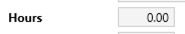

Ovo što ćete sada videti je najmanji mogući primer lošeg UX:

<!--more-->

Očigledno se traži unos (proteklog) vremena. I tu je kraj logici. Kako unosim minute? Broj nagoveštava upotrebu decimalnog sistema. Dakle, vrednost od `1.5` je jedan sat i 30 minuta. A koliko je 50 minuta decimalno?

Zamisli sada da koristiš ovu formu svaki dan. Uf.

Ovo otvara druga pitanja. Da li je moguće da posle 50-tak godina revolucije softvera mi i dalje nemamo jasne i uobičajene obrasce za komunikaciju vizuelnim interfejsom? Zašto je standardizacija UI teška?

UX nije samo pitanje _udobnosti_. UX je **sredstvo komunikacije**. I bolje bi bilo našem softveru da ga razumemo. Vreme je.