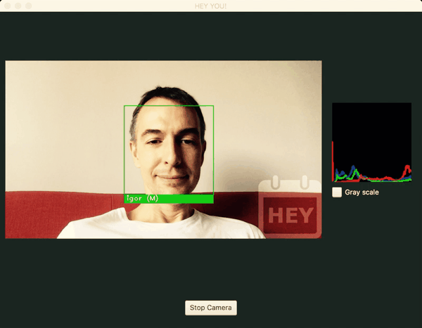

Izazova radi (i treniranja nespavanja), zadao sam sebi zadatak: prepoznati osobe u realnom vremenu na snimku koji dolazi uživo sa kamere, samo na osnovu običnih, svakodnevnih fotografija (da ne kažem... selfija). Bonus poeni se dobijaju za dodatnu klasifikaciju; na pr.: detekciju pola.

<!--more-->

Da krenemo.

## Vitamin C++

Pretragom se brzo pronalazi biblioteka [OpenCV](https://opencv.org) koja rešava većinu traženih problema. Reč je o zrelom kodu, koji se naveliko koristi, od mobilnih uređaja do specijalizovanih sistema. Jedina nezgodacija je to što je biblioteka pisana u C++, pa zahteva da se instalira lokalno. Srećom, nudi _wrappere_ za Python i Javu.

Korisnici OSX koji koriste `brew` (ima li nekog ko ne?) imaju mogućnost da lako instaliraju OpenCV. Međutim, moramo da ga rekompajliramo lokalno, kako bi napravili i JNI _wrappere_. To je izvodljivo editovanjem `brew` formule. Ali... nije dovoljno.

Naime, OpenCV dolazi sa dodatnim modulima, poznatim kao `opencv_contrib` moduli. Jedan od dodatnih modula je i "face" modul, koji služi za prepoznavanje lica. Uobičajena OpenCV konfiguracija dodatnih modula generiše _wrapper_ samo za Python, ali ne i za Javu. Zato nije moguće koristiti `brew` , već se OpenCV instalacija (kompajliranje, kreiranje _native_ biblioteka i Java jar-a) mora odraditi ručno.

Eh, stari dobri (c)make... ceo postupak je [ovde](https://github.com/igr/hey-you/blob/master/build_opencv.sh).

## Detekcija lica

Detekcija lica (_face detection_) je proces pronalaženja jednog ili više ljudskih lica na slici. Uz OpenCV dolazi i primer koji radi upravo navedeno.

Suština koda je upotreba klase `CascadeClassifier`. Očekivano, potrebno je prvo istrenirati ovaj klasifajer. OpenCV dolazi s nekoliko već istreniranih modela koji se mogu podeliti u dve grupe: `LBP` i `HAAR`. Reč je, prosto, o različitim algoritmima za analizu slike i detekciju oblika. Za `LBP` postoji svega nekoliko (od koga je jedan detekcija mačjih lica!), dok za `HAAR` dolazi više od dvadeset istreniranih modela: nekoliko koji prepoznaju lice, modeli za prepoznavanja očiju i nosa, sve do prepoznavanja ruskih saobraćajnih tablica. Kod je vrlo jednostavan:

```java
faceCascade = new CascadeClassifier();
faceCascade.load("haarcascade_frontalface_alt2.xml");
Imgproc.cvtColor(frame, frame, Imgproc.COLOR_BGR2GRAY);
Imgproc.equalizeHist(frame, frame);
faceCascade.detectMultiScale(
	frame,
	detectedFacesRectangulars,
	1.1, 1,
	Objdetect.CASCADE_DO_CANNY_PRUNING,
	new Size(minSize, minSize), frame.size());
```

Izabrao sam `HAAR` model za koji sam ustanovio da radi bolje (po osećaju). Ulazna slika sa kamere (`frame`) se konvertuje u crno-belu sliku i još dodatno prilagođava radi tačnije detekcije. Rezultat detekcije je lista pravouganika (`detectedFacesRectangulars`) koji oivičuju detektovana lica.

Zahvaljući postojećem primeru, sve se ovo brzo iskodira.

**Rezultat**: detekcija lica radi vrlo dobro u realnom vremenu i u raznim svetlosnim uslovima (dan, noć). Ponekad postoji problem sa pozadinom koja nije uniformna, pa se kao lice prepozna nešto što to nije.

## Prepoznavanje lica

Prepoznavanje lica (_face recognition_) je proces identifikacije detektovanog lica na slici, tj. određivanje kome ono pripada. U okviru dodatnih OpenCV modula postoji `FaceRecognizer` interfejs i tri njegove implementacije, algoritma za poređenje treniranog modela i detektovanog lica.

Prvo o algoritmima:

  * Eigenfaces - za dobru detekciju zahteva preko 300 ulaza za trening, jednostavan za implementaciju, preciznost je 90%, ali zavisi od puno uslova: orijentacija, skaliranje i sl. utiču na rezultat i potrebno je dosta pretprocesiranja da bi se uopšte dostigla ovolika preciznost.
  * Fisherfaces - radi nešto bolje i stabilniji se ponaša pri različitim intezitetima osvetljenja; kompleksniji je algoritam.
  * Local Binary Patterns Histogram - radi na drugačijem principu: posmatra svaku sliku iz trening dataseta ponaosob (dok prethodna dva algoritma posmatraju ceo dataset odjednom); ponaša se najbolje u realnim uslovima. Zahteva bar desetak različitih slika lica osobe da bi ju je prepoznao.

Očigledno je da je za prepoznavanje potrebno istrenirati model. U tu svrhu sam uzeo desetak svojih frontalnih fotografija, namerno snimljenih u različitim uslovima i tokom dužeg vremenskog razdoblja. Želeo sam da simuliram realne uslove koje svako od nas ima na svom telefonu. Sam trening modela je jednostavan. Za svakog pojedinca sam izabrao desetak fotografija, propustio ih kroz detektor lica, nađena lica zatim "isekao" sa originalne fotke i pohranio u `faceRecognizer`.

Jednom istreniran, prepoznavanje detektovanoh lica (`face`) se svodi na:

```java
Imgproc.cvtColor(face, face, Imgproc.COLOR_BGR2GRAY);
Imgproc.resize(face, face, TRAIN_FACE_IMAGE_SIZE);

int[] label = {0};
double[] confidence = {0};
faceRecognizer.predict(face, label, confidence);
```

Rezultat detekcije je labela kojom se identifikuje osoba i tačnost prepoznavanja (nisam uspeo da shvatim kako tačnost radi).

**Rezultat**: za razliku od detekcije lice, prepoznavanje ne radi baš tako dobro. Najveći problem su tkzv. "false positives" kada algoritam pogrešno identifikuje lica; na pr. moje lice prepozna kao lice nekog drugog. Bolje bi bilo da uopšte ne identifikuje korisnika nego da daje netačne rezultate. Naravno, set fotki uzetih za trening modela verovatno nije baš najbolji i mogao bi sadržati više fotografija; to bi možda pomoglo. Pokazalo se da algoritam radi tačnije danju, tj. na dnevnom svetlu.

## Detekcija pola

Svi vole bonus poene:) Za razliku od prethodna dva slučaja, ovde se najviše programiralo. Ideja je da se na osnovu pripremljenih fotografija muškaraca i žena napravi tkzv. "weighted" slika, koja sumira sve postojeće - kao da se, laički rečeno, pravi srednja vrednost svih fotki. Detektovano lice sa kamere se poredi sa ove dve "usrednjene" slike i bira se kojoj više odgovara. Za ulazni set je korišćen [AT&T baza lica](http://www.cl.cam.ac.uk/research/dtg/attarchive/facedatabase.html) (postoji [još baza lica](http://www.face-rec.org/databases), naravno).

Sam kod nije nešto interesantan; više predstavlja istraživanje kako OpenCV radi.

**Rezultat**: algoritam nije preteran precizan, zavisi od osvetljenja; iako je ulazni dataset dobar. Primetio sa češće greši sa muškim licima (ili je to slučaj samo sa mnom).

## La La primer



## Dalja unapređenja

  * uvrstiti detekcija očiju i usta (trivijalno);
  * na osnovu pozicije očiju, rotirati detektovano lice tako da se oči nađu vodoravno, pre nego što se nastavi sa daljim procesiranjem;
  * probati sa većim i boljim skupom ulaznih podataka;
  * rešiti problem "false positive". Za sada nemam jasnu ideju kako, no detektovane oči bi mogle da pomognu;
  * smisliti objašnjenje zašto držim fotke glumca Rajana u telefonu, a da ne zvučim... čudno.

[Sors je dosutpan](https://github.com/igr/hey-you).