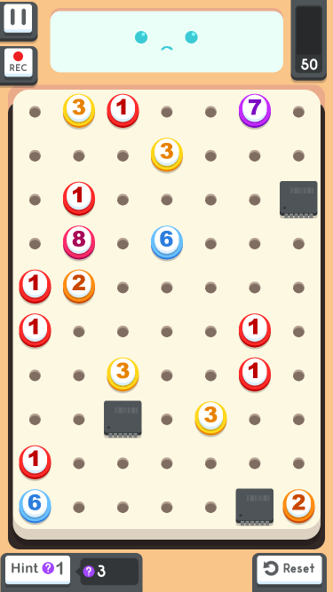
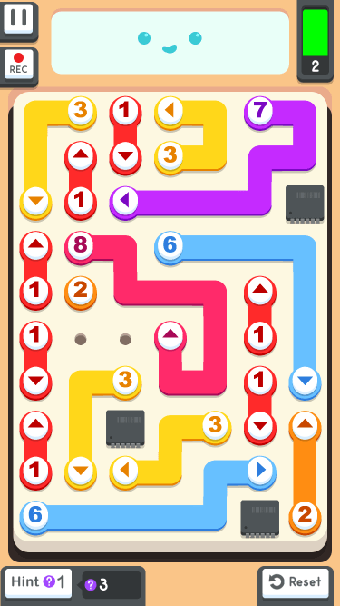

Ovo je kratak primer optimizacije _brutal-force_ pristupa korišćenog za rešavanje logičkog problema - igrice "[Little Broken Robots](http://littlebrokenrobots.com)".

<!--more-->

Izazov je napisati program koji rešava logičke probleme. S vremena na vreme, koliko već ono dopušta, dohvatim neku simpatičnu logički igricu i pokušam da je rešim programski. To je drugačija vrsta programiranja, koja se ne sreće svaki dan u praksi.

## Problem

Tabla sa poljima sadrži izvestan broj tokena. Svaki token je označen brojem, koji predstavlja koliko polja on može da "pokrije". Cilj igrice je da se pokrije cela tabla, tako da se iskoristi svaki token, a da ne ostane ni jedno slobodno polje. Naravno, putanje tokena se ne mogu preklapati. Ponekada tabla sadrži polja koja moraju da se ignorišu.

Primer jednog problema:



i korak do njegovog rešenja:



## Ideja rešenja

Najprostiji pristup je _brtual-force_, prosto korišćenje siline jačine kompjutera da proba sve mogućnosti i nađe rešenje. Rešenje delim na dva algoritma:

### 1. Odredi sve putanje za svaki token

Prvi korak je da za svaki token odredim sve moguće putanje:

```
10. započni drvo
20. za svaki list idi: GORE, DOLE, LEVO, DESNO
30. ukloni preklapanja putanje sa samom sobom
40. GOTO 20
```

### 2. Iscrtaj putanje za sve tokene

A zatim:

```
10. za svaki token iscrtaj jednu putanju
20. ako se putanje preklapaju na tabli, GOTO 10
30. ako ima slobodnog polja, GOTO 10
40. rešenje
```

## Primena algoritma

Da bi uopšte imao ideju koliko ima mogućnosti, programom se lako dolazi do toga da je broj mogućih putanja za token vrednosti `8` koje se ne preklapaju `5916` (algoritam #1). Na polju koji ima 3 tokena, iteracija svih putanja (algortam #2) izgleda ovako:

```
T1 | T2 | T3
--------------
 1    1    1
 1    1    2
     ...
 1    1    5916
 1    2    1
 1    2    2
     ...
 2    1    1
     ...
```

Koji trenutka kasnije, program izbaci ispravno rešenje.

## Skaliranje

Ok, hajde sada da primenim algoritam na primer sa početka teksta, u kome ima značajno više tokena u igri. Trebaće samo malo više vremena da se dođe do rešenja, zar ne?

Da. Malo više. Kao u... "nikada". Jer je broj iteracija ovoliki:

```
30979159172252806466764800
```

tj. negde oko `3 * 10^26`. Neće da može.

## Optimizacija #1

Očigledno, nema smisla da crtam baš _sve_ moguće putanje za svaki token. Algoritam #2 se može unaprediti tako da odbaci sve putanje koje nisu validne:

+ koje izlaze van table,
+ koje prelaze preko zabranjenog polja

Drugim rečima, da iscrtam sve putanje koje mogu da stanu na tablu, a da potom detektujem da li se one preklapaju.

Klik-klak, unosim izmenu, pokrenem kod i.... opet čekam. Ovaj put bih možda i za života dočekao rešenje jer je broj kombinacija sledeći:

```
736394232420000
```

tj. `7.3 * 10^15`. Značajno manje, ali i dalje puno - toliko da računar ne uspava da pronađe rešenje u razumno kratkom roku.

## Optimizacija #2

Potrebno je još optimizacije algoritma #2. Umesto da crtam sve validne putanje za svaki token, pa onda radim proveru ispravnosti rešenja; sada odmah radim detekciju validnosti putanje dok se ona iscrtava:

```
10. uzimi token
20. iscrtaj jednu njegovu putanju
30. putanja nije validna? uzmi sledeću putanju tokena; GOTO 20
40. putanja je validna? idi na sledeći token; GOTO 20
```

Ovim simuliram zapravo kako bi i čovek sam to radio: mi ne bi crtali sve putanje, već samo validne, koje se ne preklapaju.

Još jedna optimizacija je ovde moguća - ukoliko krenem od tokena sa većim brojem, time u startu pokrivam više polja table, pa se ranije detektuju preklopljenje putanje.

Ove optimizacije daju sledeći broj prolaza:

```
108774113
```

što je reda veličine `10^9` - e to je već nešto što računar može da reši za dovoljno kratko vreme.

## Zaključak

Iskreno, nema ovde nešto pametno zaključiti. Optimizacijama se dovijamo da smanjimo broj iteracija.