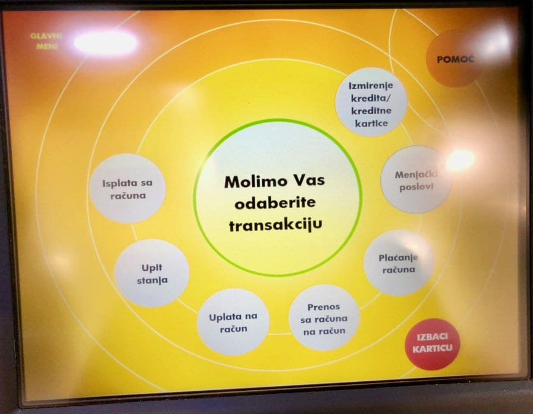

Tehnologija prožima, sve više. Sve je više uređaja i ekrana; to je neminovnost. Postoji momentum za bržim razvojem, kraćim razvojnim ciklusima, stalno novim softverom koji opslužuje sve te stalno nove ekrane.

Iako ubrzanje razvoja ima neminovne posledice po kvalitet, to me ne uznemirava. Računam da nam predstoji evolucija u načinu razvoja; mi ipak manje-više kodiramo kao pre 30 godina. Kako bilo, čak i da ne bude evolucije, sistemi već danas teže da budu decentralizovani, lako zamenjivi, skalabilni; rešenja se naziru.

Ono što me čini nespokojnim je druga (tačnije: prva) strana: korisnički interfejs: _korisničko iskustvo_. Plašim se da korisnički interfejs i iskustvo dramatično zaostaju za rastom tehnologije. To znači da nećemo imati sve one interfejse koje viđamo po filmovima (blade runner, altered carbon, 2001...). Stvari će, nažalost, biti drugačije.

Ovo o čemu pišem se već događa. Od [pogreške](https://medium.freecodecamp.org/why-typography-matters-especially-at-the-oscars-f7b00e202f22) na dodeli Oskara, do [aktiviranja uzbune](https://gizmodo.com/did-design-really-cause-hawaiis-ballistic-missile-threa-1822417863) na Havajima. Čini mi se da se _komunikacija_ stavlja u drugi plan, iznova i iznova.

No ne moramo ići do Los Anđelesa ili biti na Havajima da bi iskusili nepraktičan interfejs. Nedavno je izmenjen ekran na ATM automatima jedne domaće banke:

Ovaj ekran je pogrešan na toliko puno načina...

Tok moje komunikacije sa ovim ekranom je _obeshrabrujući_: počnem da ga skeniram redom, s leva na desno, tražeći reč "podizanje" ili "novac", pošto želim da, jelte, podignem novac (najčešća radnja na automatima). Kada prođem krug skeniranja, vraćam se na početak, ovaj put čitajući sa pažnjom, da bih shvatio da je "isplata sa računa" zapravo ono što želim. I tako svaki put. Ovaj ekran stvara nelagodu i nesigurnost u izbor.

Da li je ovo zaista najbolje rešenje? Zašto nisu upotrebljeni piktogrami, boje, tipografija, veličine da jasnije komuniciraju sa korisnicima!? Da li su analizirani korisnički obrazaci korišćenja automata?

I važno - nije ovde reč o estetici. Već o _komunikaciji_. Koja je ovde potpuno pogrešna.

Za dalji napredak - potrebno je da uočavamo i unapređujemo UX svuda oko nas. Jer je potrebno - neophodno - da komuniciramo. I to ne samo sa mašinama.
