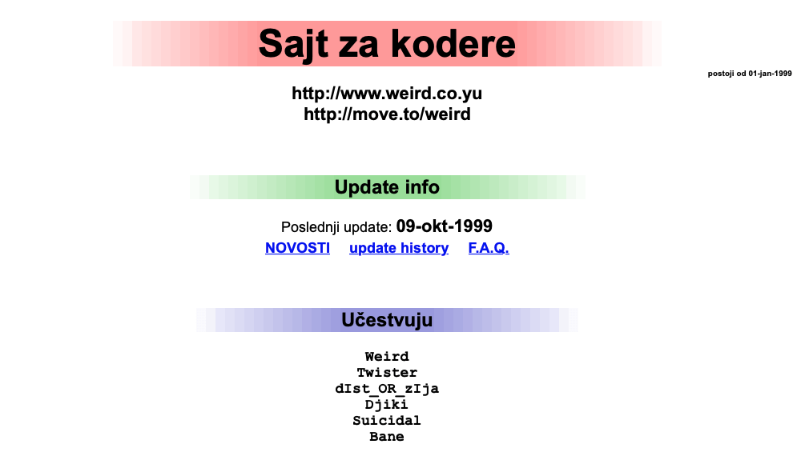
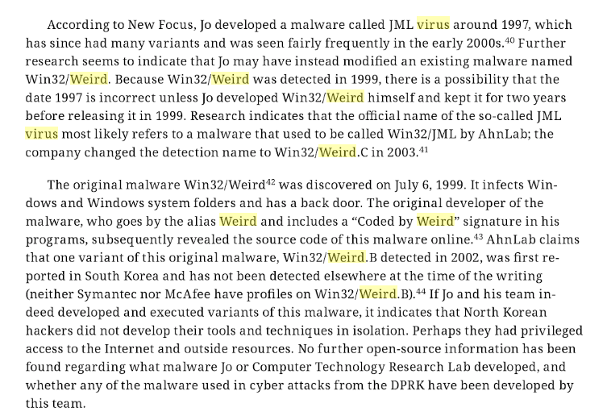

Zamalo sam bio izbačen sa fakulteta zbog lošeg koda.

Krajem devedesetih je moglo sve samo ne lagodno živeti. Kažu da si ono što kodiraš, pa je možda to izgovor za ono što mi je okupiralo `33.6 kbps` modem u to vreme: reverzno inženjerstvo i sigurnost Windows-a. Narodski rečeno: krekovanje softverskih zaštita i pisanje virusa.

Pre nego što budem obešen na digitalni stub srama i paušalno oporežen u ime svih, izjavljujem: nisam nikada svesno radio na štetu drugoga; u pitanju je bio lični izazov i neutaživa znatiželja. Svaki maliciozni kod je imao svoj antipod: dokumentaciju, otvoreni kod i program za čišćenje. Odličan sam primerak sjajnog Apple-ovog proizvoda **iDiot**, te sam i tih devedesetih stvorio i održavao nekakav "Sajt za kodere" (na Tripodu:), sve u nameri da delimo kod, učimo jedni od drugih, postajemo bolji ljudi i slične budalaštine:

Virusi su izazov jer koriste OS na način kako nije predviđen. Naravno, tu je i onaj epski David-vs-Golijat momenat, gde se ti, mali, anemični koder rveš sa celim Majkrosoftom. Kako god, uplivah u te vode (10x to _Fravia_), te nastade **Kuang2**. (Ukoliko niste čitali _Neuromancer_-a, šta jbt čekate?!)

## Familija

Kuang2 je familija tri različita virusa, jer iDiotima jedan nije dovoljan.

Prvi je bio kradljivac dial-up lozinke. U to doba internet se konzumirao preko modema, a lozinka je bila sačuvana negde u Windowsu. Ovaj trojanac je znao da pročita tu lozinku, čekao da se žrtva zakači na net i potom slao sve podatke konekcije na prethodno ukodiranu email adresu. Lepota je u tome da čak i kada žrtva ustanovi da nešto nije u redu, te promeni svoju lozinku, trojanac detektuje izmenu i pošalje nove podatke prvom prilikom. Prilično pokvareno.

**Kuang2 theVirus** je pravi virus koji je ujedno i backdoor. Tadašnji backdoor trojanci (SubSeven...) su bili veliki, tromi, tupavi i - samo trojanci. Zato odlučih da napravim minimalni backdoor, ali koji će biti pravi virus. Pomenuto čedo se, kao i svaki zdravi virus, raširi po _svim_ izvršnim fajlovima, promeni kernel, pa kada se Windows sledeći put startuje (hvala Windows timu što se restartovao često:) podigne server na portu `17300`. Pri tome je bio velik samo `10 KB`! Da, praktično ova stranica koju čitate ima više bajtova :) Broj domaćih internet projvajdera je ograničen i znali smo opsege IP adresa koje su koristili, te se prostim IP skeniranjem porta dolazi do žrtava. Backdoor je imao svoj klijentski deo kojim se kači na server, tj. na žrtvu, i od tog trenutka računar žrtve postaje otvorena knjiga. Pristup svim fajlovima i njihovo preuzimanje, upload (npr. gore pomenutog trojanca), startovanje programa... sve se dešava bez znanja žrtve. I svašta još nešto. Mogu da zamislim iznenađenje kada ti u pola noći računar izbaci CD fioku, otvori Notepad, ispiše misterioznu poruku bez ikakvog značenja i isključi se sam od sebe :) Ok, i nije toliko smešno.

Poslednji član familije je bio keylogger. Prati sve što se kuca i šalje periodično na mejl. On se najmanje koristio.

## Zgode i nezgode

Malo je reći da je bilo svakavih situacija. Zanimljivo je da uopšte i _nisam_ koristio ove viruse, osim da tu i tamo ukradem po koji sat interneta kad se ostane bez studentskog džeparca. Prijalo mi je upoznavanje sa jednom od najvećih koderskih grupa te epohe, **29A**, te sam dobio priliku da objave moj tekst u četvrtom izdanju njihovog e-magazina. Bio sam u kontaktu s jednim kreatorom virusa koji je, prema njegovim rečima, završio u zatvoru kada ga je FBI uhvatila da diluje legalni softver. Zabavan je bio i intervju o etičkoj strani hakerisanja, iako su moji odgovori bili utopistički naivni. Dobar drugar Vanja je tokom našeg upoznavanja jednom pričao o "tamo nekom virusu" koga je koristio; iznenađenja je bilo obostrano kada smo ustanovili ko je autor :)

Sledeća vinjeta je tek zanimljiva. Pre desetak godina, pretragom iniciranom setnim emocijama, nabasam na elektronsku knjigu koju je objavila CIA, a bavi se sajber aktivnostima Severne Koreje. Tu pronalazim sledeći pasus:

Ako niste to već do sada zaključili, dozvolite da se predstavim: `Weird` beše moj alias.

## SMIP

Nekako u celoj toj priči dođem i do SMIP-a. Bili su zaraženi sa oba virusa: pronašao sam gomile dokumenata na računarima, nešto što je ličilo na web sajt, šta sve ne. Sve to me nije nešto posebno zanimalo, kao što pomenuh, mahom nisam zloupotrebljavao Kuange. Sa SMIP-om je bilo neobično to da su uvek imali puno sati modemskog interneta, koga je fino koristio jedan moj drugar... sve do trenutka kada je propustio da posebnim prefiksom izostavi beleženje telefonskog broja sa koga se povezuje na provajdera. Ups.

Ubrzo je usledio kratak i strog poziv na viđanje. Ne mogu reći da mi je bilo svejedno. Trebalo je da se nađem s nekim iz SMIP-a, na Trgu republike, da porazgovaramo o... prekršaju.

Inače, SMIP je skraćenica za: Savezno Ministarstvo Inostranih Poslova.

I tako, upoznah se sa ministrima. Saznah da su svi bili prilično ljuti zbog svega, iako i sami snose (veliki) deo krivice. Navodno sam imao sreće: kada se sve to dešavalo dekan ETF-a nije bio u kancelariji, pa me stoga nisu vanredno odstranili sa fakulteta; dan nakon toga bes se stišao i odlučili su se za manje restriktivne mere. Usledilo je par odlazaka u "centralu", gde sam uglavnom izigravao neukog studenta, što sam verovatno i bio. Bilo je tu i sastanaka gde mi je predočeno da treba oformiti "grupu hakera" koja će ići u npr. Nemačku, i da - pazi sad ovo - postoje virusi koji ti zavvvvrte hard disk te on eksplodira! Zamislite sada tu apstraktnu scenu: sedeti u SMIP-u u kancelariji nekoga koga nemaš baš često prilike da vidiš uživo, gde svi krajnje ozbiljno razmenjuju ovakve šarene informacije; na kraju ne znaš da li je sve to lucidno smešno ili otužno.

No sve se ubrzo završilo propadanjem naše tadašnje države.

## Aftermath

Patetiku na stranu i na razočarenje čitaoca, nemam čime pametno da zaključim. Na neki mali način sam pobedio sebe, jer se učilo na sada nezamisliv način, iz švercovanih dvorazrednih knjiga, kodova sa sumnjivih sajtova i beskrajnim, upornim isprobavanjem. To, i da iDiot odlično radi i u najnovijoj verziji.
