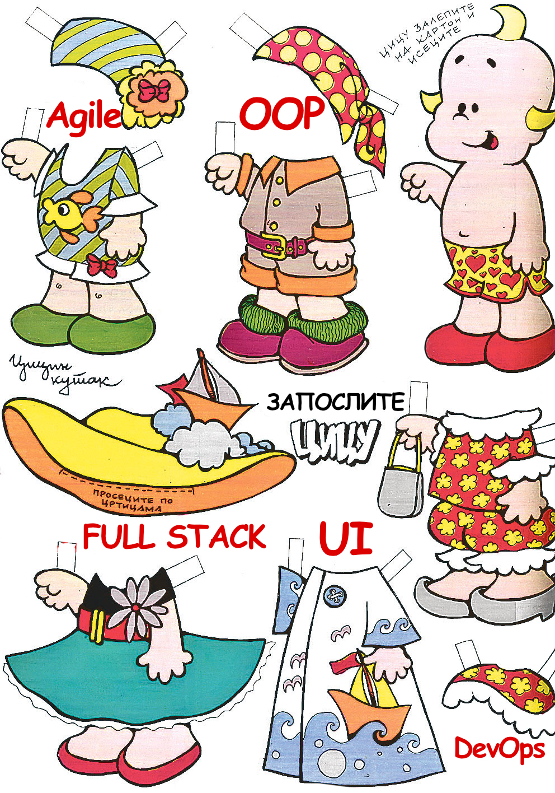

\- Dobar dan, Cico. Javili ste se za poziciju Kavlin++ programera?

\- Dobar dan; da.

\- Napišite program koji štampa ceo broj `n` veći od `2` tako da je `a^n + b^n = c^n`.

\- Sastavi algoritam za rekurzivni obilazak Milerovog-BS stabla, te implementaciju koristeći bar 10 dizajn paterna i 5 najnovijih frejmvorka.

\- I, konačno, opišite koncizno kako vidite sebe u sledećih 1825 dana, a analizu dajte po sedmičnim segmentima.

\- Ovaj... a čime bih se tačno bavila ako dobijem posao?

\- Prekucavali bi tekst iz Excel-a u kod: važan projekat za Kamioni&Avioni firmu, njihov gazda ima veliki ručni časovnik. Tražimo samo najbolje! Nego, da li ste završili zadatke?

## Inter-frustro-vjui

"Laki nam je malo nervozan", pomisliće neko o autoru teksta - i biće zamalo u pravu. Čini mi se da stvar sa intervjuima izmiče kontroli. Potreba za kadrom je velika, a time raste potreba za efikasnijim filtriranjem. Nažalost, 'efikasnije' često znači samo 'brže', a svim znamo šta je kuso.

Lično negodovanje počinje od ranih dana - na jednom od prvih intervjua, stavljen sam pred tuđi računar i dat mi je zadatak sa, kako sam to kasnije saznao, finala nekog od međunarodnih takmičenja u programiranju. Pa, ti, momče, izvoli i reši. Sva sreća pa mi nisu rekli odakle potiče zadatak; u suprotnom bih se blokirao na 'Hello World'. Farsa je to što sam za tu firmu radio svega par dana - potpuno smo bili u disbalansu sa vrednostima. Na kraju dana niko nije dobio.

Ako bi napravili paralelu sa razvojem softvera, mozgolomke su isto što i _stress_ test. Takvim testom ne validirate ispravnost programa, već ponašanje pod opterećenjem. Psiholozi, čak, vezuju ovakva pitanja sa, bez šale, _narcizom_ i _sadizmom_ ispitavača. U prilog ide i činjenica da su firme, poznate po glavolomkama, a koje drže do sebe, promenile pristup u razgovorima za posao. Glavolomke su tako 2010-ta: to što si pronašao desetocifreni prost broj, ili razumeš fiziku umanjenja tela i blendera (?), zapravo ne znači ništa.

S druge strane, jagma je za kadrom. Firma nema vremena da analizira tvoj GitHub account i mudrolije u kodu. Želi da što pre odbaci nerelavantne kandidate. Potpuno razumljivo. No hajka ne treba da bude opravdanje za nametanje pravila; već izazov za neke nove, bolje, kvalitetnije - **razgovore**. A ne ispitivanja.

## Znanje na metar

"Zapošljavam te zbog onoga što **znaš**" je možda najveća greška koju pravimo.

Ne razumemo još uvek ni šta tačno znači 'znanje'. Šta više, ne vidim da iko pravi razliku između sledećih svojstava:

+ znanje (_knowledge_) - kolekcija informacija i činjenica stečenih kroz edukaciju ili iskustvo.
+ mudrost (_wisdom_) - vrlina davanja dobrih procena na osnovu znanja; sposobnost razaznavanja (_discern_). Mudrost je izbor upotrebe znanje.
+ razumevanje (_understanding_) - shvatanje znanja i odluka; realizacija odluka. Stavlja u akciju mudrost i znanje. Razvijamo razumevanje dok praktikujemo to zašta se zalažemo.
+ uvid (_insight_) - kapacitet za sticanjem ispravnog i dalekosežnog razumevanja znanja i odluka. Sposobnost da znanje, odluke i akcije učine načinom življenja. Konstanto delanje.

"Znati" je pasivna osobina. "Učiti" je aktivna. "Uraditi" takođe. "Znati + Uraditi" je slabije od "Naučiti + Uraditi". Prvo je stagnacija, a drugo progres.

A opet, ispitivanja za posao su opsednuta sposobnošću za _ponavljanjem_. Ne uspevamo da izađemo iz tog banalnog, reproduktivnog modusa: koliko Kongo izvozi banana? Kako glasi definicija poliformizma? Napiši Blub-Glup algoritam za sortiranje!

Zanimljivo je značenje reči `ponavljanje` izvedeno preko sinonima:

> понављање
> (значење изведено преко синонима) фиг. литанија фиг., фам. давеж фам., рег. банта рег., рет. инкомодација рет., смарање фам., смор фам., посличарење рег., смарачина фам., гњаважа, гњављење, узнемиравање, дављење фам., досада, масажа фиг., сметање

Da li je to ono što tražiš od kandidata?

Pošto ne razumemo šta tražimo, nemamo prave metrike da to izmerimo. Godine rada nas dele na stereotipe. Ključne reči nas razdvajaju na polove. Algoritamsko razmišljanje i brzina kucanja nas svrstava u nivoe. Znanje, znanje, znanje, meri, meri, meri, seci.

Ne znamo tačno šta, ali meri.

Zašto se toliko dele saveti i pitanja za intervjue? Zar samo to po sebi nije dovoljno da uruši smisao načina ispitivanja? Napiši ovo. Uradi ono. Daj šapu, šeni. Meri, meri, meri. Nisam video da je neko dobio gotov kod i zahtev da ga - razume i unapredi. Da ga očisti, debaguje, formira testove... Ono što će, zapravo, da radi veći deo vremena na poslu. A svi se, kobajagi, slažemo da je dobar kod onaj koji se razume. Slažemo se, kobajagi, da je važno izdvajati u module, enkapsulirati, labavo uvezati. Važnije je, izgleda, da uradiš u trenutku, nego da razumeš i primeniš.

Zašto su ispitivanja jednosmerna? Fer intervju je onaj u kojem su obe strane pitane na isti način. Ako Cicu pitaš za rešenje Fermaove teoreme, ona ima pravo da te pita za Goldbahovu sumnju: svaki paran broj veći od `2` je zbir dva prosta broja. Izvol'te, ispitivači, kod u ruke. Razgovor je dvosmerna komunikacija. Ispitivanje nije komunikacija.

Stvari postaju kompleksnije kada se u igru uključe predrasude. Kako ne postoje jasne metrike znanja, na kraju se oslanjamo na 'osećaj u stomaku', tj. predosećaj. A on - zanimljivo - isto mora da se vežba. Da, predosećaj je nešto što se može istrenirati; podložan je predrasudama. Jedna od duhovitijih je to da se ćelavi ljudi smatraju boljim liderima. Zato pravac frizer; zahvalite mi posle. Za to vreme: kako merenje znanja osloboditi predrasuda?

## Cica ide na dejt

Kako onda da smileno izmerimo kandidata? Pitanje od 10^6 dolara. Svako ima svoj odgovor.

Možda prvo treba da promenimo prizvuk slogana: "nudimo posao, tražimo ljude". Mi ne nudimo posao. Mi tražimo partnera. Nekog ko će raditi _sa_ nama, a ne _za_ nas; i poštovati slične _vrednosti_. To je i moj _pitch_: ako misliš da mogu da ti pomognem da gradimo vrednosti, sjajno. Nekome odgovaram. Mnogima verovatno ne; ne znam dovoljno šta njima treba. Neko bi me zato prozvao šarlatanom zbog mog neznanja (pa kako to, bože, ne zna?), a manji broj drugih bi to videli kao ono što i jeste: _nepodudaranje_.

Da bih formalizovali ovo što sam napisao, opet bežim u analogiju sotverskog razvoja. Postoji koncept _trait_-a: malih, izolovanih osobina koju tip može da sadrži (nasledi). Na sličan način bi mogli definisati kandidata koga tražimo: kao skup osobina koje nam odgovaraju. Ne tražiš nekoga ko 5 godina koristi Javu. To nije osobina; to je samo statistika.

Treba ti neko ko je _gladan_ i poseduje _želju da (se) poboljša_.

Pola u šali, nosio sam se mišlju da napravim servis: "Date Your Job". Slično kao i sa sajtovima za upoznavanje, tako bi se mogli pronaći Cica i Firma preklapanjem njihovih _trait_-ova, osobina. Često razmišljam: ako bi obe strane što jasnije definisale osobine, onda bi poklapanje bilo delotvornije. I razgovori za posao više razgovori.

A sad, zaposlite Cicu!

