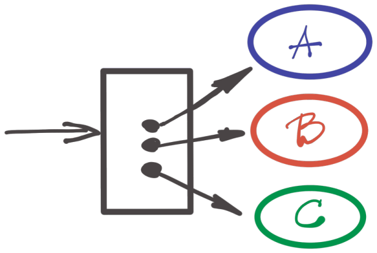
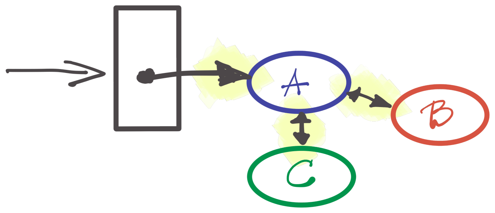

Programer Mirko je napisao sledeći kod:

```java
deleteBook(bookId);
```

U čemu je pogrešio?

Nedostaje da se 1) obriše slika naslovnice sa zajedničkog skladišta, 2) pošalje analitička poruka, 3) provere prava pristupa, da li baš ta knjiga sme biti obrisana od strane korisnika i 4) pošalje mejl organizaciji ukoliko više nema knjiga sa istim naslovom.

Mirko, naravno, nije pogrešio usled nepoznavanja tehnologija ili programiranja. Jednostavno, u trenutku pisanja koda nije imao sve informacije. Možda je nov na projektu, ili nema dokumentacije, nema dovoljno testova, ne poznaje domen... sve uobičajeni izgovori kojima zataškavamo nedostatak kvaliteta.

Programer Slavko priskače u pomoć (sudo-kod):

```java
if (!userMayDeleteBook(userId, bookId)) throw new Ex();
deleteBook(bookId);
s3.deleteFile(user.getOrg().getId() + '/' + book.getId());
sendAnalyticMessage(book, user, BOOK_DELETE_EVENT);
if (bookRepo.countBooksByTitle(book.getTitle() == 0) {
  var email = new NoBooksEmailTemplate(book.getIsbn());
  sendEmailToOrganization(user.getOrg(), email);
}
```

Problem rešen; Mirko i Slavko odlaze na zasluženu partiju stonog fudbala.

## Nova nada

Gornji kod je _loš_. Eto, rekao sam, a da nisam ni opsovao.

Odlična je ilustracija onoga što je pogrešno u načinu kako programiramo. Ako bi trebalo da mu damo ime, bilo bi: **imperativ**. Našim kodom vlada imperija imperativa, diše zvučno kroz crnu masku i svakodnevno ubire nove programerske žrtve.

Razumljiv je razlog otkuda dolazi imperativno programiranje. Način kako saopštavamo zahteve, pričamo i mislimo o njima je - imperativan. Naš mozak tako funkcioniše, sposoban da se fokusiran na jednu stvar u jednom trenutku; te mu gode algoritamski koraci, jedan za drugim. Problem, je, međutim, kada se imperativan način razmišljanja prelije u kod i nastane... _ono_ gore. Dodaj nedostatak vremena, hitnju na projektu, neefikasnu komunikaciju i dobija se ono što nazivam **paprikaš kod** (da se druži sa špageti kodom).

Kako izgleda kod koji nije paprikaš, izazivaju me Mirko i Slavko. Kako drugačije napisati isti kod, a da nije u pitanju samo sintaksna promena?

Drago mi je što ste pitali. Evo ovako:

```java
deleteBook(bookId);
```

Štaaaaaaaa?

Iako je zicer, ne pričam o funkcionalnom programiranju. Njime se imperativan kod može zameniti... pa, manje-imperativnim kodom. Funkcionalno je alat, ali ne i rešenje. Često uopšte i nemamo taj alat, jer Java.

U primeru imamo nekoliko komponenti: slanje mejla, provera prava, brisanje entiteta... Paprikaš kod ih sve vrlo rano povezuje, za vreme kompajliranja (_compile-time_). Biznis pravila su upisana na mestu korišćenja; te čvrsto povezuju sve komponente koje učestvuju u njima.

Drugim rečima, imperativan kod kaže:

1. uradi `A`
2. uradi `B`
3. uradi `C`

To sve nekako izgleda ovako:



U nedostatku boljeg termina, alternativa o kojoj pričam nazivam **opisno** (deklarativno?) programiranje. Izgleda ovako:

+ `A` proizvodi `a`
+ kada se desi `b`, uradi `B`
+ kada se desi `c`, uradi `C`
+ spoji `a` na `b`
+ spoji `a` na `c`

Štaaaaaaaa?

Svaka komponenta definiše poruke koje prozivodi i na koje reaguje. Termin 'poruke' ne treba shvatiti kao događaje (_events_), već kao funkcije. Događaji su samo način prenošenja poruka. Tako komponenta za slanje mejla (na pr. `B`) može da prima poruku o potrebi slanja odgovarajućeg sadržaja. Međutim, `B` ne zna kada ovu poruku treba poslati. Zanimljivo, komponenta `A` takođe ne zna da treba slati mejl, niti je svesna da postoji `B`. Komponenta `B`, dalje, ne poznaje iste poruke koje se šalju `A`: brisanje knjige u `A` nije ono što `B` (slanje mejla) uopšte razume. Konačno, korisnikova akcija rezultuje samo slanjem poruke komponenti `A` i ne treba da je se tiču ostale komponente.

Gde onda pišemo `if A then B`? U _konektorima_ (opet nemam bolji termin). To su objekti koji opisuju isključivo interakciju između dve i samo dve komponente i rade adaptaciju poruka. Postojanje konektora takođe implicira API koji ima i (uobičajene) ulazne - ali i izlazne poruke. Skup svih konektora predstavlja _opis_ sistema. Opis sistema je, zapravo, program.

To sve nekako izgleda sada ovako:



Ovakva postavka podseća na _event-driven_ programiranje; no ovde bih razdvojio način slanja poruka od arhitekture. Drugim rečima, trebalo bi da je moguće iskodirati sinhroni program na ovaj način. Asinhrona komunikacija bi bila samo vrsta implementacije, a ne neophodnost.

## Imperativ uzvraća udarac

Osobinu koja ovakva arhitektura deli sa funkcionalnim programiranjem je neophodnost definisanja interakcija i ponašanja komponenti, pre ranije nego kasnije. Sa imperativnim pristupom to nije slučaj; otuda još jedan razlog zašto nam je bliži: imperativno programirati se može početi odmah, a kasnije se dopunjavati.

Ovo sve je samo produžetak "clean" arhitekture, sada sa naglaskom na granice i interakciju između komponenti, a ne samo spoljnih delova sistema (baza, front...).

Opis bez konkretnog primera je donekle apstraktan, pa mu je time i vrednost manja. Bilo bi zanimljivo upustiti se u implementaciju: videti kako organizovati funkcije na smisleni način. Do tada, ostaje ovaj zapis bar kao mentalna programerska vežba; dok moj Github nezasito guta imperativni paprikaš od koda.
