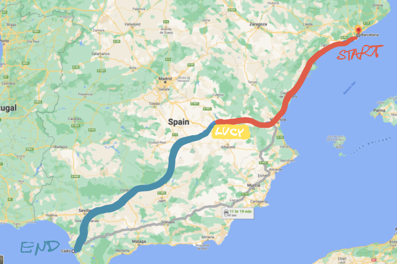
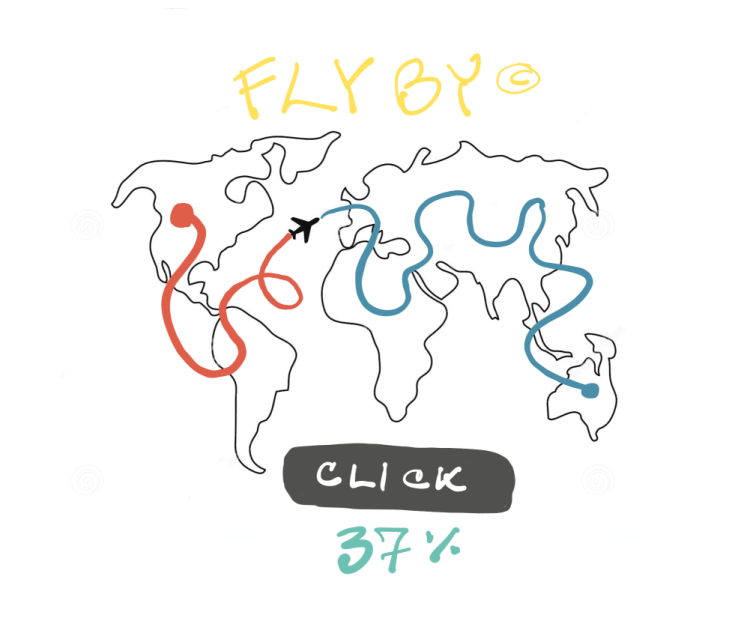
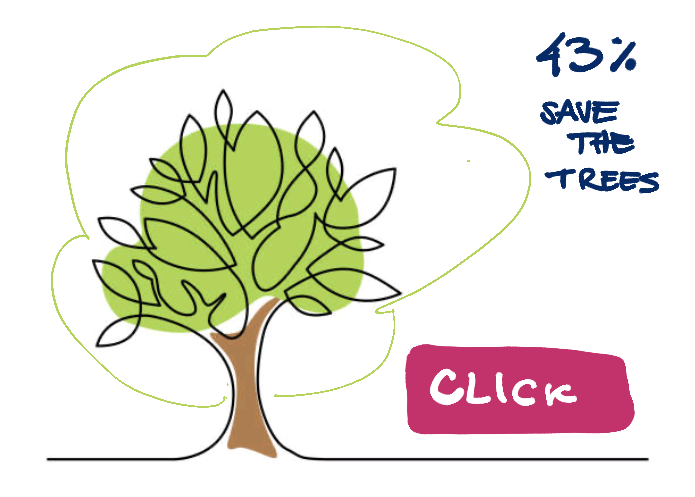
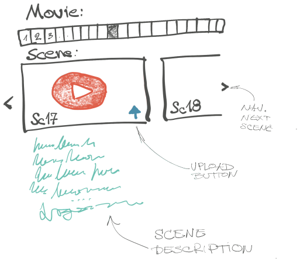

Nekoliko ideja za vikend projekte.

Imam s čim, nemam s kim :) Bacim u blog, pa idemo dalje.

## GoGoLog

**Praćenje progresa na mapi**

Bilo bi kul kada bi se progres dugotrajog zadatka mogao pratiti kao, na pr. put od Beograda do Rima (kopnom, ne vazdušnom linijom). Kako smo bliži ostvarenju cilja, tako se pomera i naš virtuelni položaj na putu po mapi, a put do destinacije se smanjuje. Umesto dosadne, jednodimenzionalne vrednosti progresa (NN procenata), progres postaje ono što zapravo delom i jeste - putovanje.

Ovo nije sportska aplikacija. Dovoljno je izabrati početnu i krajnju destinaciju, kao i koliko je dužina jediničnog napretka za bilo kakav cilj. Na primer, cilj: pročitati `1000` stranica se može predstaviti kao put od Barselone do Cadiza. Kako napredujemo sa čitanjem, tako unosimo broj pročitanih strana, a one se mapiraju u pređenu kilometražu puta. Naravno, podržano je i praćenje sportskih ciljeva: akumulira se pređena kilometraža sa pametnog sata i polako nas pomera na putu od, na primer, Njujorka do San Franciska.

Tokom puta, aplikacija bi prikazivala interesantne detalje u vezi trenutne lokacije (vikipedija), javno dostupne fotografije okoline, kao i lokalne novosti, vremensku prognozu i sl. Sve da učini osećaj "putovanja" pravim.

Napredna (plaćena) verzija bi podržavala interakciju sa drugim korisnicima koji su u blizini (bliže ili dalje); prijatelje koji bi navijali za vas pored puta itd. Sponzori bi mogli da postavljaju "bilborde" u regionima, povremeno tokom puta (ukoliko je to izvor prihoda).

## Click 4 Goal

**Kliktanjem reklame u dobre svrhe**

Kompanija dostavlja vizuelno primamljivu reklamu. Reklama mora da zauzima samo jednu stranu i mora da ima animaciju koja oslikava progres od `0` do `100%`. Na kompaniji je da bude kreativna: to može biti flaša koja se polako puni, avion koji preleće svet, drvo koje lista i sl.

Posetioci dolaze na sajt, trenutno aktivnu reklamu. Tu se nalazi jedno i samo jedno dugme: "Click". Svaki put kada se dugme klikne, ukupni progres napreduje. Kompanija kupuje klikove; na primer 10k klikova može da bude 1000 USD.

Jednom kada se dostigne 100%, kompletna uplata firme odlazi u prethodno dogovorenu humanitarnu organizaciju (minus neophodni troškovi održavanja).

Ideja je 1) da se reklame upotrebe za dobre svrhe 2) reklame budu iskrene: ne pojavljuju se tamo gde ih ne želimo i eksplicitno kupuju naše vreme, umesto da nam ga kradu bez našeg pristanka.

## Social Movie

**Svako je filmska zvezda**

Reč je o igranom filmu u kome glumi svako ko želi - jednu ulogu može da igra mnogo glumaca.

Filmski scenario se deli na scene, kako je to već uobičajeno. Svaka scena opisuje kako treba biti snimljena, šta se nalazi u njoj, kako se akteri ponašaju, šta rade i šta izgovaraju. Ukratko, opisano je sve šta treba biti snimljeno.

Na sajtu se ceo film postavlja kao niz scena. Korisnik jednostavno bira scenu koju želi da odigra. Uzima telefon ili kameru, snima sebe ili svoju ekipu; pa to pohrani na sajt. I to je sve :)

Pored velike slobode u realizaciji snimanja scene, postoji jedan zahtev: akteri moraju da imaju jasno vidljive oznake koje ih međusobno razlikuju. Zavisno od scenarija, jedan od aktera, na primer, mora da nosi kapu i bude u plavoj majici, drugi mora da ima šal oko vrata i tome slično. To je neophodno da bi lakše ispratili tok radnje.

Posetioci mogu da glasaju za najbolje snimljene scene, pošto se može snimati koliko god puta, svako ko to poželi.

Na kraju, scene se povezuju i ceo film se montira. Dodaje se muzika, malo post-produkcije i - to je to. Social Movie je spreman (nemam bolji naziv.)

## Bonus

+ **Hiveer** - većina sadržaja koja nam se danas dostavlja je izabrana od strane nekakvog algoritma. Hiveer je odgovor na to - kolektor i ručni filter sadržaja. Ulaz za Hiveer je bilo koji web sadržaj koji pratite: instagram, linkedin, novosti, filmovi itd. Vaš zadatak je da sami pravite filter za sadržaj koji ne želite da vidite i koji vam je važan. Ova aktivnost zahteva posla, ali polazi od toga da je bolje da se konzumira manje, ali kvalitetnije. Rezultat je univerzalni feed koga ste vi sami napravili.

+ Must Talk - aplikacija u kojoj je fokus na aktivnom dopisivanju. U početku, obaveza je da dopisivanje bude intenzivno. Kako vreme odmiče, ova obaveza postaje manje stroga. Ako dopisivanje prestane, gubi se konekcija. Ideja je da se zaista potrudi na upoznavanju i razumevanju sagovornika. Da, može da se koristi i za dejting :)

+ Supr-Life - brend koji slavi nesavršenost: [supr.life](https://supr.life). Limitirani broj blesavih proizvoda i aktivnosti.
