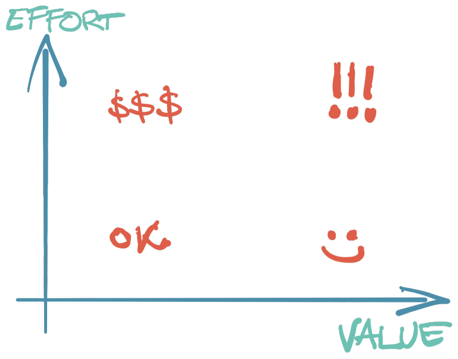

Da li je prijava na sistem use-case?

Neko kaže - nije. Prijavljivanje na sistem nije poslovna logika. Ako pravite softver za banku, najmanje vas zanima prijava. Umesto toga, zanimaju vas prenosi novca, računi, transakcije, izveštaji.

Neko kaže - jeste. Korisnik svakako mora da se prijavi. Prijava je u vezi sa sigurnošću; za sistem koji barata novcem to je svakako važan detalj.

----

Šta god da je, neko to mora otkucati 🤷‍♀️.

Iako jeste važno zvati stvari svojim imenom, gornja rasprava je samo jednodimenzionalna, pa otuda i nebitna.

Korisnički zahtev - drugim rečima: ono šta treba napraviti - čine dve dimenzije:

- _vrednosna_: koliko deo proizvoda učestvuje u ukupnoj vrednosti i koliko vredi krajnjem korisniku.
- _operativna_: potreban napor za implementaciju dela proizvoda.

Odmah možemo i da ustanovimo matricu težine zahteva:

Nije neka mudrost:

+ `OK` su tkzv. "brze pobede". Uradi i zaboravi.
+ `:)` je sjajna oblast. Ne dolazi sama od sebe, potrebno je dosta napora uložiti pre toga. Čini mi se da je zadatak razvoja da se dođe u ovu oblast, kako bi vrednost što lakše nastajala.
+ `$$$` nije nužno loša oblast. Neki zahtevi ne donose puno, kompleksni su, ali su neophodni. Kada se radi MVP, ovu oblast bi trebalo izbegavati.
+ `!!!` je opasna oblast. Verujem da je treba izbegavati. Ne znači da se ta funkcionalnost neće raditi, već je treperuća lampica koja upozorava da nešto možda nije kako treba, te je potrebna dalja analiza: podeliti zadatak na manje, bolje razumeti, nova iteracija...

Važno: reč je o _relativnom_ odnosu napora i vrednosti. Ova skala nije za upoređivanje dva korisnička zahteva, nego mera svakog ponaosob.

Ono što razdvaja gornje soljenje pameti od pameti je kako uporediti dve ortogonalne dimenzije; naročito kako kvantifikovati vrednost? Dok za napor možemo i nešto da smislimo (broj potrebnih dana, brzina razvoja), za merenje vrednost nema mnogo pomoći - ili bar ne znam za njih. Ukoliko postoji, to manje govori o mojoj neupućenosti (iako je na mestu), koliko da su razvojni procesi takvi da neka slična informacija nikada nija došla do mene, što ima težinu zbog nemalog broja različitih okruženja u kojima sam radio.

Kako bilo, siguran sam da postoji bar nekakav model od koga možemo krenuti. Ako je ceo proizvod 100% vrednosti onda svaka funkcionalost predstavlja nekakav udeo. Kako upoređujemo dve vrednosti?

Da li je neophodna? Ukoliko ne bi postojala, da li korisnici i dalji mogu da koriste proizvod? Koliko često je funkcionalnost u aktivnoj upotrebi? Ako ne bi radila kako treba (usled greške), koliko bi to oštetilo korisnike i/ili firmu? Koliko je komplikovana za korišćenje? Koliko je jasna/nejasna vrednost? Koliki je domet vrednosti (broj korisnika u sistemu, broj interakcija)? Kako bilo, metrika vrednosti mora neprestano da se osvežava, iznova meri, upoređuje, kako odmiče razvoj.

Time je tek prvi deo jednačine gotov. Sledi drugi: upoređivanje sa naporom. Da li 11 jedinica napora odgovara 7 jedinicama vrednosti? Koliko sati je jedan dram?

Neće nikada postojati egzaktna formula procene. Svaki projekat je neponovljivi univerzum za sebe. Možda bi bilo bi kul da pričamo više o tome?
