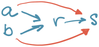
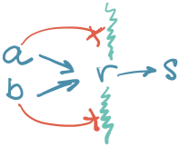
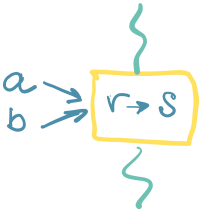

Razmišljanja programera.

Posmatramo jednu kompajbilnu jedinicu - kod koji se zajedno komapjlira u jedan artefakt.

Imamo funkciju `s()`. To je nekakav ne-trivijalan upit na bazi. Postoji zbog frejmvorka koji, na primer, daje mapiranje SQL rezultata u tipove. Važno: nije neophodno da je `s` upit ka bazi.

Imamo servisne funkcije `a()` i `b()` koje interno pozivaju `s()`.

Graf poziva izgleda:

----

Upit u `s()` zahteva dodatni aplikativni kod. Pravimo funkciju `r()` koja poziva `s()` i dodaje potrebnu logiku. Nije moguće samo proširiti `s()` usled korišćenih biblioteka.

Menjamo `a()` i `b()` da pozivaju `r()` umesto `s()`.

Graf poziva izgleda:

----

Šta je problem?

Problem je što su i `r()` i `s()` dostupne u isto vreme u kontekstu iste kompajbilne jedinice. Hajde da na graf poziva dodamo graf mogućih poziva funkcije `s()`:

Crvenom su označani pozivi `s()` koji zaobilaze `r()`. U pitanju su **greške**.

> Ukoliko postoji mogućnost greške, ona će se sigurno dogoditi. Programiranje je proces koji nastoji da umanji mogućnost greške 1) u razvojnom procesu i 2) tokom izvršavanja sistema.

----

Očigledano da `s()` treba sakriti od "pogleda" ostatka sistema, osim od `r()`.

Deklarisanje vidljivosti u programskim jezicima nije baš sjajna; korišćenje frameworka često zahteva da većina toga bude `public` kako bi oni dohvatili stvari.

Drugi način je da se `s()` odvoji u zasebnu kompajbilnu jedinicu, kojoj može da pristupa samo `r()`. To je nemoguće, jer sve što vidi `r()` to vide i `a()` i `b()` (deo su istog konteksta). Dakle, `r()` i `s()` se odvajaju, a `r()` je dostupan samo preko svog API interfejsa:

----

**Pretpostavka**: U programu će _vrlo verovatno_ zatrebati posebna logika zbog koje smo uveli `r()`. Retko kada je dovoljno imati samo funkcije `s()`.

**Konsekvenca**: moramo odvojiti _sve_ `s()` funkcije kako ne bi bile vidljive ostatku programa. Veći deo, verovatno, neće imati posebnu dodatnu logku, te ćemo za njih praviti trivijalne wrappere u `r()`. Tamo gde zatreba, `r()` će biti proširen dodatnom logikom.

**Mana**: moramo pisati trivijalne wrappere za nemali broj `s()`; odlazi vreme, dosadno je.

----

Da li vam je ovaj tok razmišljanja razuman (ukoliko je pretpostavka tačna)?

Ako je tako, zašto onda ne bi od samog početka projekta razdvajali `s()` od `a()`? Šta uštedimo time što to ne radimo?

Dosadno vs. ispravno: ili ćemo prihvatiti vrednost ispravnog, ili ćemo naći način da ga dostignemo na manje "dosadan" način. (A šta tačno znači 'dosadno'? Da li je pisanje testova dosadno? Dokumentacije? Analiza sistema?) Možda je problem u programskom jeziku koji ne ume da deklariše wrappere elegantnije? Možda možemo da generišemo kod?

----

Elegantnije rešenje bi bilo da odvojimo `s()` na takav način da ga možemo zameniti sa `r()`; polimorfizam.

Često nije moguće zbog korišćenih frejmvorka.

## Demistifikacije

"Koliko često menjate bazu u toku razvoja?" je pitanje koje se često koristi u pežorativnom smislu dovodeći u pitanju razlog postojanja opisanog sloja. Prava namena nikada nije da menjamo bazu, već pretpostavljamo da upiti `s()` nisu atomski, dovoljni.

----

Moduli != granice. Modulima se razdvaja kod u zasebne celine, ali ne znači da jedan modul predstavlja (biznis) kontekst. Jedan kontekst može da omeđava više modula.

----

Moduli != Clean Architecture, Hex Architecture.

Ne vidim potrebu da se crtaju krugovi i heksagrami. Moduli se uvezuju kako se uvezuju, mrežno; i to je sve. Važnije od modula je gde su granice (boundaries).

## Bonus: SF

Hajde da se razmaštamo. Hajde da prihvatimo da je OK pisati kod koji ostavlja mesta ljudskoj grešci; sigurno je skuplje praviti ispravan kod nego onaj u kome se greške dozvoljavaju i ispravljaju _nekada_.

Ako imamo nekakav (pravi, tipizirani, a ne script) kod, onda:

+ možemo izvući graf poziva iz statičke analize (nije kompletan)
+ znamo koje funkcije mogu da se komponuju (nadovežu)
+ imamo runtime "rendgenski" snimak tokova podataka i poziva funkcija.
+ znamo gde su ulazi i izlazi
+ znamo gde su fizičke granice: procesi, mreža
+ znamo kako su podaci rasportranjeni

Reč je o nekakvom naprednom grafu poziva, u kome su čvorovi funkcije. Liči da bi mogla da se napravi slobodna kategorija sa navedenom postavkom: objekat je funkcija, relacija je postojanje poziva. To je različito od teorije kategorija kako se sada primenjuje u programskim jezicima. Udaljio sam se sad od teme.

Naš sistem bi bio _samo-regulišući_. U njega bi samo ugurali kod, a sistem bi sam sebe analizirao - i **menjao** - tokom rada.

Na primer, ako primeti da iz `a()` se zove `s()`, a postoji _duži_ put (jer duže znači da se radi više), sistem bi mogao da sam bira poziv na `r()`. Gledao bi da između dva poziva ne postoji više načina kako da se dođe od jednog do drugog. Ne samo da bi prepoznao grešku, već bi mogao da je i sanira.

Sistem bi mogao da zna gde se sve menjaju podaci i da broj tih lokacija smanji. Sistem bi mogao da prepozna moguće race-conditions i _sam_ uključi lokovanje pristupa. Sistem bi mogao da napravi novi čvor (dakle, funkciju) koji grupiše nekoliko identičnih poziva sa različitih mesta u jednu tačku. Broj poziva preko fizičkih granica bi se tako umanjivao. Sistem bi mogao da pronalazi setove funkcija za koje postoji nekakva zakonitost:

+ slojevi se dobijaju grupisanjem funkcija koje su na istoj udaljenosti od ulaza.
+ vertikalni slojevi se dobijaju grupisanjem svih poziva koji završavaju u istom izlazu (na pr. u tabeli `books`.)

Mogao bi da postoji način da opišemo pravila grupisanja, tokova i, uopšte, sistema. šbbkbb.
