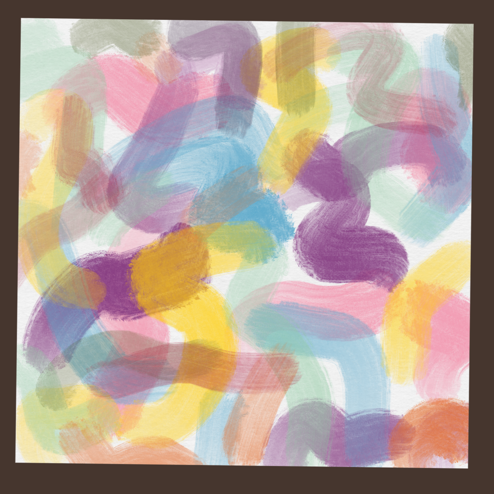
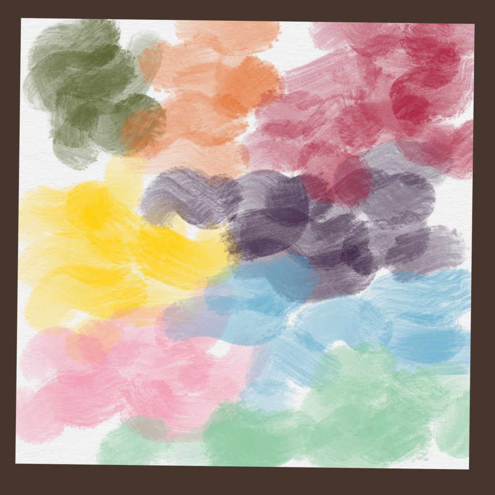
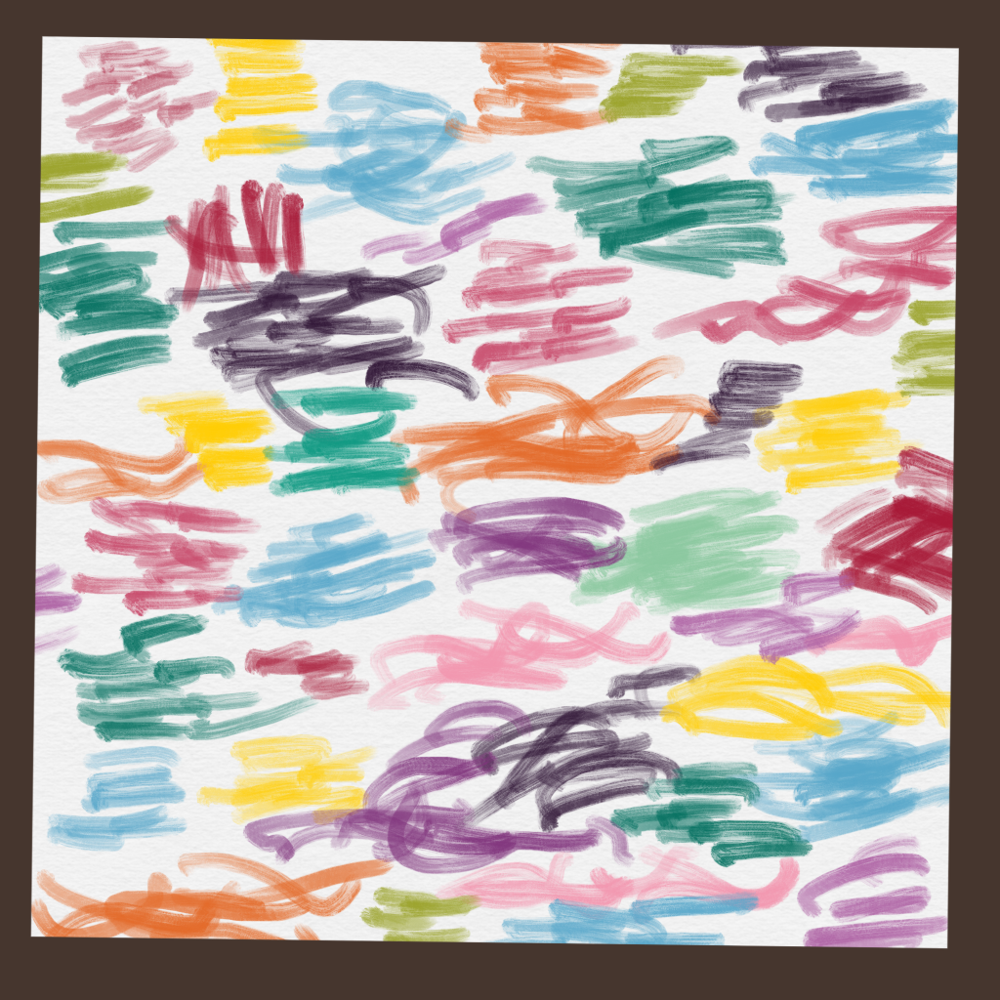
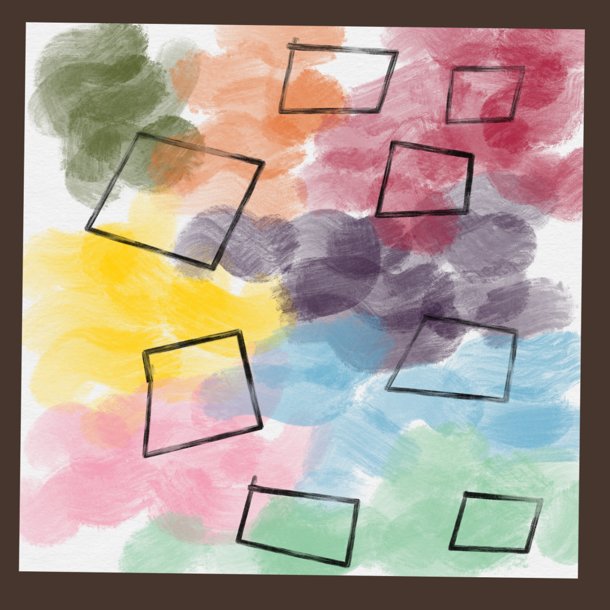
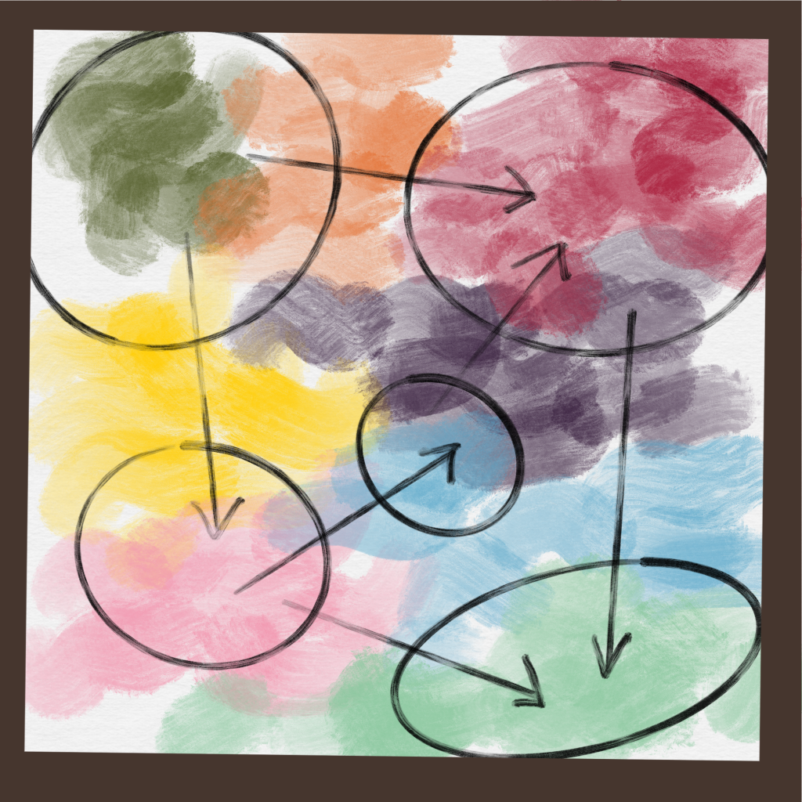
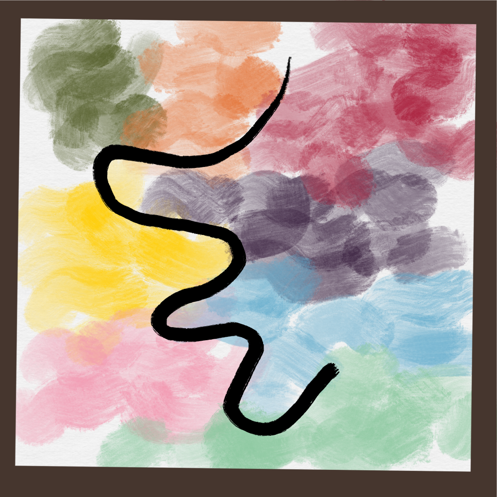

...postavljene su slike na temu "Razvoj softvera".

## /1

> Kodni Haosi

_Softverski sistem se tiče apstrakcija. Kako sistem raste, one krenu da se prepliću. Ukoliko se ne povede računa, apstrakcije se neraskidivo uvežu._

## /2

> Ispravnost, tačnost

_Dobro naštimovan softverski sistem ima razdvojene apstrakcije._

## /3

> Usitnjavanje

_Kada je apstrakcija dovoljno velika? Previše sitnih apstrakcija tvori previše pokretnih delova, takođe čine sistem tromim._

## /4

> OOPs

_OOP je promašen pokušaj definisanja apstrakcija._

## /5

> pozamanterija morfizama

_Funkcionalno programiranje se bavi samo kompozicijama funkcija._

## /6

> mikro svet

_Mikroservisna arhitektura pravi čvrstu topologiju ne nužno ispravnih granica_

## /7

> kičma događaja

_Da li je event-driven arhitektura najfleksibilnijih granica?_
