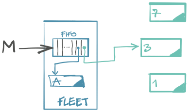
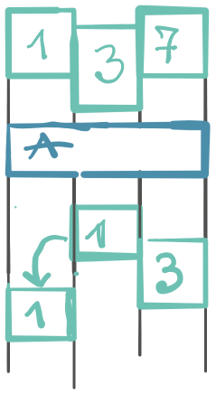

Kao da postoji nekakav zoološki vrt softverskog razvoja u kome se čuvaju egzotične životinje za koje smo čuli, ali ih retko posećujemo.

## Aktori

Kad bi vam rekao da su Aktori potekli iz naučnog polja vezanog za veštačku inteligenciju (AI), ne bi mi poverovali. Nakon rada D. Knuta koji načinje ideju, Hewitt je sa dva ko-autora 1973. predstavio novu arhitekturu koja se bavi ponašanjem i koja "nema ili joj ne trebaju `goto`, interrupti ili semafori" da bi postigla veliki nivo paralelizma. Rad nisam pročitao, ali sam zato napisao jednostavan Aktor sistem u Kotlinu po ugledu na dobro poznatu **Akku**, podrazumevanu implementaciju Aktora u Skali. Nisam hteo da izmišljam toplu vodu: ceo sistem je napisan prema Akka primerima iz dokumentacije.

Aktori su nezavisni objekti koji reaguju na primljene poruke po redosledu dolaska, menjaju svoje stanje i, eventualno, šalju poruke drugim aktorima.

I to je, praktično, sve šta rade. Ideja aktora je potpuna enkapsulacija _ponašanja_ - koje je ništa više nego mašina stanja (_state machine_). Kada je enkapsulacija ostvarena ne treba brinuti o lokovanju, jer svaki aktor/proces radi sa svojom mašinom stanja koja je nezavisna od ostalih. Svaki aktor ima svoj FIFO red: poštansko sanduče za poruke koje se obrađuju jedna za drugom; te nije potrebna dodatna sinhronizacija poruka.

Ispostavlja se da je jednostavno napisati Aktor sistem. Moja implementacija za one sa jeftinijim ulaznicama ima svega 3 fajla i ukupno oko 200 linija koda; nazvana je [Kuku](https://github.com/igr/kuku) (jer bi "Kaka" bilo previše.)

Aktori definišu _ponašanje_. Ponašanje je određeno trenutnim čvorom u mašini stanja aktora i određuje kako aktor reaguje na poruke. Na primer, `Counter` aktor ima ponašanje `brojim` koje na poruku `Increment` uvećava internu vrednost brojača (podatak), nekakvo unutrašnje stanje podataka aktora.

⚠️ Da ne bi opteretili pojam "stanje", hajde da koristimo termine "**ponašanje**" i "**podaci**" (ili "mašina stanja ponašanja" i "stanje podataka".) `Counter` ima samo jedno ponašanje (ono u kome broji), ali zato puno mogućih stanja podataka (izbrojanih vrednosti.)

Način kako rade aktori je elegantan: ponašanje je imutabilno i za pristiglu poruku se pravi novo ponašanje (ili se ostaje na istom), kojem se prosleđuju podaci kao argumenti. Upravo tako: podaci sa kojima aktor radi se sve vreme prenose kao argumenti ponašanja; nema nikakvog polja koje čuva podatke:

```kotlin
object Counter {
	sealed interface Command
	data class Increment(val by: Int) : Command
	data object Reset : Command

	fun behavior(value: Int): KuBehavior<Command> =
		receiveMessage { msg ->
			when (msg) {
				is Increment -> behavior(value + msg.by)
				is Reset -> behavior(0)
			}
	}
}
```

**Kuku** aktor sistem je mali i ne sadrži nikakvu magiju. Sanduče za poruke je ništa drugo do Kotlinov `Channel` koji se koristi za korutine. Upravo ovakva jednostavna arhitektura je pogodna da se sistem distribuira na više računara; sve šta nam je potrebno je kanal komunikacije.

## Šta možemo da naučimo od Aktora?

Paralelizam je teško implementirati. Ako je tako, što ga ne bi _izbegli_? Umesto komponenti koje rade paralelno nad zajedničkim stanjima podataka, hajde da imamo nezavisne komponente nad različitim podacima. U prvom, **tradicionalnom** pristupu, kada su podaci deljeni između procesa, moramo da se eksplicitno bavimo paralelizmom, kojekakvim strategijama lokovanja. U drugom slučaju, kada podaci nisu deljeni, ima mnogo toga manje o čemu treba voditi računa.

Mašina stanja ponašanja je vredan način za modelovanje programa. Sve i da ne koristimo aktore, nema razloga nemati mašinu stanja ponašanja. Ona uklanja gomilu `if` upita u kodu. Ovo nas vraća na početke, kada smo učili algoritme - sve češće pomislim da je `if`/`else` način razmišljanja neprirodan i da nanosi štetu našem softversko-inženjerskom razmišljanju i razvoju. O tome neki drugi put.

Sledeća lekcija je eventualna konzistentnost. Insistirati na drugačijem je besmisleno skupo - zahteva ponovno baratanje kojekakvim strategijama zaključavanja samo zbog fiktivnog zahteva da _sada_, baš ovog trenutka, sve mora biti konzistentno. To je protivu-prirodna praksa: "sada" je iluzija; informacija ima svoju brzinu prenosa u prirodi. Zašto onda insistirati na tome u programu? Da ponovim: program koji insistira na trenutnoj konzistenciji mora to da "plati" na drugim mestima, koja su (često nepotrebno) skuplja.

Aktori su glupi, mreže aktora su pametne. Ovo je suština sistema baziranih na aktorima. Često se porede sa trakom za proizvodnju, gde je svaki pojedinačni korak jednostavan, a rezultat može biti funkcionalno kompleksan. Arhitektura je dekompozicija sistema na granice i jednostavne celine, koje tek _zajedno_ ostvaraju funkcionalnost. Nema smisla imati sistem samo sa jednim aktorom.

## Da li je ovo OOP?

Alan Kay je više puta izjavio da su aktori najpribližniji onome kako je zamislio OOP. Da ponovimo: suština je u enkapsulaciji i komunikaciji porukama.

Pre nego što odemo dalje, neko može da se zapita: otkuda to da aktori nisu zaživeli u našim projektima? Jedan odgovor leži i u tome da je do neke 2015. godine moć hardvera eksponencijalno rasla (Murova opservacija) i da ga je pratila brzina procesora, koja se takođe uvećavala. To je ostavljalo po strani sve programerske paradigme, jer je za tradicionalnu trebalo samo "kupiti" nove čipove i program je postajao brži. Danas nije više takva situacija (cena izrade hardvera se takođe duplira, imamo oblake, dostižemo fizičku granicu, itd.); te je konačno došlo na naplatu razmišljanje o paralelizmu. Kasno? Konačno?

---

Smatram da je važno da razumemo šta je Alan zamislio; ne zbog toga da ustanovimo da li je u pravu, koliko do toga da prepoznamo kada se originalne ideje zamenjene nekakvim, ponekada i dijametralno suprotnim, polu-skuvanim stavovima.

Idemo dalje. Postoji nešto što me žulja kada razmišljam o Erlang/Akka aktorima u kontekstu OOP. Naime, programer je taj instancira aktore i ne postoji dalji formalizam oko toga šta oni predstavljaju niti red kako se izvršavaju. Aktori su u tom svetlu samo još jedan način paralelizacije od nekoliko dostupnih. Niko ti ne brani da aktiviraš koliko god instanci istog aktora koji rade sa istom tabelom u bazi i da potencijalno dođeš do sličnih problema koje bi imali i u tradicionalnoj arhitekturi.

Kada ovo uzmem u obzir, moj odgovor - nekoga ko je daleko od toga da je stručnjak za aktore - bi bio da oni ipak _nisu_ ono što bi OOP trebalo da bude.

Ali bi zato Traktori to mogli biti.

## Traktor

Moja razmišljanja o OOP zapravo nisu krenula od aktora. Krenula su od enkapsulacije stanja podataka i nastavila se kasnije kroz diskusije sa [Dejanom](https://www.linkedin.com/in/dejanmilicic/) (ugrabite njegova razmišljanja ukoliko dobijete priliku!)

Da iskoristimo isti primer. Imamo nekakav brojač, `Counter`. On ima svoje stanje podataka: vrednost brojača. Njegovo ponašanje je jednostavno: kada mu se kaže da uveća brojač, to i uradi. Kada mu se kaže da se resetuje, vrednost se vrati na nulu. Kako sve vreme zapravo rešavamo paralelizam, hajde da imamo puno ovakvih brojača: svaki ima svoje stanje podataka, svoji brojač.

`Counter` je jedan **Traktor**, trans-aktor, transformišući aktor: tako sam nazvao ove moje "aktore". Potrebno nam je novi naziv kako ne bi robovali već postojećim definicijama. Kako bilo, za sada ništa novo.

Idemo dalje. Za razliku od aktora koji nemaju posebnu vezu sa podacima osim da ih prenose, ovde _svaki traktor odgovara jednom podatku_. Zato svaki traktor ima svoju `adresu` - jedinstveni identifikator koji označava kom podataku pripada. To podseća na primarni ključ tabela u bazi. Za razliku od baze, jednu adresu može da opslužuje više instanci Traktora. Traktor ne mora nužno biti vezan za podatak iz baze; tj. njegova upotreba je šira od "mapiranja" na bazu.

Idemo dalje. Paralelizam je teška za implementaciju. Zašto onda ne prepustimo računaru da sam vodi računa o tome? Dva procesa koji se bave različitim podacima se mogu izvršiti paralelno. Ako rade nad istim podacima, neka rade jedan za drugim. I to je sve.

Sada je jasno zašto nam treba `adresa` - da bi razlikovati sa kojim stanjima podataka radimo. Uvodimo sledeće pravilo:

> Dva Traktora sa istom adresom ne mutiraju u isto vreme.

Da bi implementirali pravilo, potrebna nam je još jedna softverska apstrakcija koja će poslužiti kao nekakav orkestrator izvršavanja traktora.

Takvu komponetu samo nazvao **Fleet** (flota). Flota traktora je posebna komponenta koja:

+ vodi računa o životu traktora, sama odlučuje koje aktivira i koje gasi;
+ prima poruke i prosleđuje ih odgovarajućem traktoru;
+ vodi računa da dva traktora nikada ne izvršavaju mutabilne operacije u isto vreme;
+ odgovara na poruke koje su poslate floti.



Flota je takođe aktor sistem - i njoj se mogu proslediti poruke koje se tiču svih traktora (tj. podataka koji oni predstavljaju). Ukoliko su te operacije imutabilne, izvršavaju se paralelno sa drugim. Ukoliko je operacija mutabilna, ona uklanja sve (ili odgovarajuće) traktore u memoriji, kako bi se ponovo učitali sa novim stanjem podataka.

Za razliku od aktora, Traktor nema svoje sanduče; sanduče se sada nalazi u Floti i isto je za sve traktore i za flotu. Zahvaljući zajedničkom sandučetu, flota može da kontroliše redosled izvršavanja poruka i da garantuje da dva traktora sa istom adresom neće mutirati podatke u isto vreme.



Da pogledamo primer. Hajde da imamo `100` brojača koji će na slučajan način biti birani i inkrementirani:

```kotlin
val fleet = spawnFleet(...)
repeat(1_000_000) {
	val addr = TraktorAddress.of(Random.nextInt(100))
	fleet.tell(Counter.Inc(1) to address)
}
```

Želimo da pročitamo stanje baze, da se uverimo da je ukupna suma svih brojača ispravna. Šaljemo poruku floti za čitanje (query), koja je imutabilna:

```kotlin
fleet shout Counters.Checksum
```

Ovo je zanimljiv primer koji zahteva dodatnu pažnju. Uobičajeni način za čitanje podataka svih stanja podataka (svih redova u tabeli) je da se svaki traktor zapita za stanje. To je ekvivalentno učitavanju traktora u memoriju (ukoliko već nije učitan) i pojedinačno učitavanje podatka iz baze, zatim slanje podatka nazad. Ovo može biti skupo kada je broj podataka veliki. Zato dozvoljavam da flota sama odlučuje kako će da izvrši poruku i da, ako treba, sama kveruje bazu i vrati rezultat. Još nešto: reč je o imutabilnoj operaciji, pa se može izvršiti paralelno sa drugim operacijama.

Ukoliko želimo da resetujemo sva stanja podataka:

```kotlin
fleet shout Counters.Reset
```

Slično kao u prethodnom primeru, flota sama odlučuje kako će izvršiti poruku. Najednostavniji način je da se podaci direktno promene u bazi, te da se svi traktori ubiju, kako bi se ponovo učitali sa novim stanjem podataka. Kako je ovo mutabilna operacija (poruka), flota _sama_ reguliše redosled izvršavanja.

U primeru sam umesto baze koristio običnu memorijsku key-value mapu. Kao dokaz da paralelizam radi, dovoljno je bilo koristiti uobičajenu implementaciju, `HashMap`, a ne thread-safe varijantu, `ConcurentHashMap`, kako bi nalagao tradicionalni model programiranja. Drugim rečima, nije bilo konkurentnih izmena na podacima! Flota je sama vodila računa o tome, a ne moj program brojača!

---

Ovo je ukus OOP koji mi ima više smisla. Naravno, moguće je da potpuno grešim i mašim poentu: dok god se koncept Traktora ne implementira do kraja, nema načina da tvrdim da zaista ima smisla. Da je samo duži bio dan...

## Da li smo preuzeli deo odgovornosti baza?

Baze su sjajna tehnologija, koja je (kako mi izgleda) napredovala brže nego programske apstrakcije i arhitekture. Zato danas živimo ono što se najbolje može opisati kao "Database Obsession": baza diriguje celu arhitekturu sistema. Smatram da je to pogrešno. Baze su tu da čuvaju podatke, a ne da navode arhitekturu sistema.

Opisani Traktori oduzimaju deo funkcionalnosti baze koji se bavi paralelizmom i ostavljaju deo koji se bavi podacima. To radimo ne zato što baze ne rade kako treba, već iz drugih razloga:

1. rešavanje paralelnog pristupa na sloju baze je suviše _kasno_,
2. ukoliko je paralelizam rešen pre, u aplikativnom sloju, čak i pre samog izvšavanja procesa, otvara nam se ceo jedan novi horizont aplikativnih mogućnosti, a koje baze ne mogu da ponude.

## Ima li šta još?

Izneta ideja me proganja već neko vreme i morala da je da završi primerom. Trudio sam se da ne tražim Akka alternative, upravo da bih mogao sam da sažvaćem ideju do kraja. Kako se ispostavlja, nešto slično već postoji - reč je o potcenjenom Microsoftovom projektu "Orleans". On uvodi pojam Vrituelnih Aktora koji na sličan način postoje u memoriji i koji su kontrolisani od strane frejmvorka, a ne programera. Nisam stigao da se posvetim detaljima, ali sve što sam usput načuo o Orleansu liči na iznetu ideju gore.

Kada sistem sam kontroliše život (tr)aktora, ostavlja mogućnost za interesantne funkcije; kao što bi bilo raspoređivanje traktora koji češće komuniciraju zajedno na istu instancu, radi boljih performansi.

Ako se udubimo u problem, na koju god stranu da pogledamo uočava se jasan trend koji nagoveštava i naglašava vrednost postojanja _autonomnih programskih jedinica_ (aktora, traktora, virtualnih aktora, ćelija...) i _odbacivanja multi-threadinga_ kao nedovoljno dobre tehnike za paralelizam.

## Za kraj

[Github sors](https://github.com/igr/traktor).

Idemo dalje.
