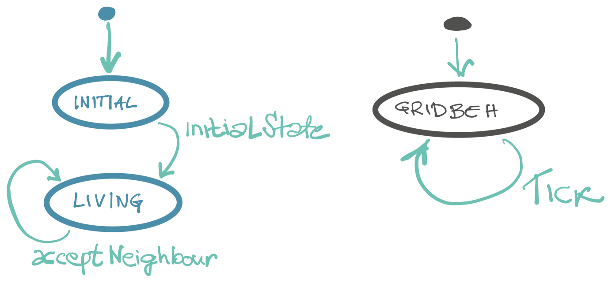
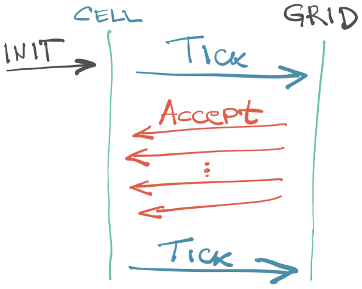

"Igra života" (Game of Life, GoL) je jednostavan automat koji ima živopisnu (igra reči:) istoriju. Reč je o dvodimenzionalnoj matrici u kojoj svaka ćelija može biti u jednom od dva stanja: živa ili mrtva. Stanja se boje crnom i belom, respektivno. Matrica progresira vremenom: nova generacija stanja ćelija se dobija od prethodnog prateći [jednostavna pravila](https://github.com/igr/exemplatory/tree/main/game-of-life). Svaka ćelija "umire" ukoliko je broj suseda ekstrem, veliki ili mali, a "preživljava" ukoliko je broj suseda umeren. Za detalje pogledati link, za znatiželju potražiti sadržaje na temu igre.

Probajte da isprogramirate GoL ili bar osmislite algoritam na papiru - problem je jednostavan, a zabavan.

Moje rešenje je u [Haskelu](https://github.com/igr/exemplatory/blob/main/game-of-life/haskell/app/Main.hs). Prilično je uobičajeno, bez iznenađenja. Pravi se matrica ćelija, funkcija za prelazak u sledeću generaciju, funkcija za prelazak u sledeće stanje ćelije, analizator stanja susednih ćelija...

A sada nešto sasvim drugačije.

## Svako za sebe

Hajde da napravimo takav GoL u kome bi ćelije svaka za sebe bile odgovorne za svoje stanje i radile nezavisno jedna od druge, u isto vreme?

Ovakav programski model je potpuno drugačiji od prethodnog primera. Ako su ćelije nezavisni _objekti_ (ko je to pomenuo OOP?), ne možemo garantovati konzistentnost podataka sve vreme. Drugim rečima, ćelije će progresirati stanja nedefinisanim redosledom, jer svaka radi za sebe. U jednom trentku će se sklopiti cela matrica za neku generaciju.

Ovaj model podseća - ili jeste - sistem aktora.

Kako su sazrele ideje o kojima sam nedavno pisao, napravio sam mali framework koji radi slično aktorima, a nastavlja se na prethodne ideje. Kako bilo, sam framework je sada nevažan; usmeravamo se na to kako je modeliran problem. Sve što treba znati je da se nezavisna jedinica posla naziva `Particle`, sa kojima se komunicira porukama, a da `Fleet` izvršava poruke i brine o `Particle` instancama.

## Ćelija

Ćelija ima svoje data stanje. Pamti se životni status ćelije u svakoj generaciji do sada. To je neophodno upravo zbog eventualnosti - ne znamo kada će ostale ćelije progresirati, pa je potrebno da čuvamo životne statuse bar dok se ne formiraju sve ćelije jedne generacije. Radi jednostavnosti, u primeru pamtimo sve prethodne statuse.

Stanju su pridružene funkcije koje brinu o progresiji: koji je novi status ćelije. Ćelija takođe mora da pamti i neke statičke podatke: broj suseda (ćelije na ivici nemaju isti broj suseda kao unutrašnje ćelije.)

Prelazimo na zanimljiviji deo, ponašanje (_behaviour_) ćelije. Ponašanje ćelije je nekakav workflow, mašina radnih stanja tj. mašina ponašanja. Koristim namerno različite termine pošto se "stanjem" mogu imenovati oba pojma: data-stanje ćelije i workflow stanje, tj. ponašanje ćelije.

U inicijalnom koraku ćelija očekuje samo jednu poruku: `InitialState`. Na početku programa smo dužni da svim ćelijama pošaljemo ovu poruku koja sadrži inicijalni životni status ćelije (da li je živa ili mrtva.)

Kada se status ćelije primeni (i sačuva), ćelija mora da obavesti svoje susede o novom životnom statusu. Ali, neko mora i da prati da li su sve ćelije iste generacija dobile statuse, kako bi znali da je generacija završena i spremna za prikaz.

To je novi `Particle`, koji se zove `Grid`. Postoji samo jedan za sve ćelije i njegova dužnost je da prati da li je cela matrica neke generacije spremna za prikaz. On prima nekakvu poruku nemaštovato nazvanu `Tick` i popunjava matricu životnih statusa ćelija. `Grid` takođe nastavlja workflow tako što obavesti sve susede ćelije da je status promenjen!

Ćelija prima poruku `AcceptNeighbourStatus` kojom jednostavno dobija statuse susednih ćelija, kako one progresiraju. Nije bitno koje su ćelije, samo je bitan status. Kada dođu sve poruke (jer znamo koliko suseda ima), ćelija je spremna da proregresira u novi status. Započinje nova generacija.

To sve nekako izgleda ovako:

a sekvence:

## Uporedba

Ideja cele vežbe je poređenje dve programska modela. Da sumiramo:

+ pravolinijski programski model, sa primerom u Haskelu; drži ćelije u matrici i proračunava životne statuse jedne po jedne ćelije generacije.
+ aktor model, svaka ćelija brine o sebi i obaveštava o svom statusu, takođe prima statuse susednih ćelija.

Prvo da uporedimo _funkcionalnost_. Iako oba rešenja daju isti rezultat, mogućnosti koda su različite. Aktor model dozvoljava praktično proizvoljan, nepravilan 2D oblik: sve dok znamo ko su susedi ćelije, program će raditi. Aktor model takođe (teorijski) dozvoljava da se obradi ogroman broj ćelija, jer ih je moguće distribuirati između mašina.

Međutim, eventual consistency aktor modela uvodi izvesnu kompleksnost: neophodno je _pamtiti_ prethodna stanja. Ćelija sama za sebe ne zna kada je matrica formirana, te mora da pamti svoja stanja. U primeru pamtimo _sve_ generacije, što je očito nepotrebno: onog trenutka kada je formirana generacija, podaci o njoj nam ne trebaju. Ovo čini da je primerni kod neupotrebljiv za bilo koju iole veću matricu, što nije slučaj sa pravolinijski modelom. Da bi i ovo ispravili, potrebno je dodatnog koda koji bi brisao istoriju ili je skladištio u bazu, kako bi oslobađao memoriju za nove generacije. Ili da se pamti samo koliko treba.

Ukratko: svako eventual consistency stanje inherentno zahteva dodatnu brigu.

Aktor model je bar zato oslobođen briga o lokovanju resursa. Kako svaki aktor (`particle`) vodi računa o sebi, nije potrebno posebno lokovati njegovo stanje. Stanje se prenosi porukama. Ako zatreba, moguće je ceo saobraćaj snimiti i kasnije ga reprodukovati. Moj framework omogućava i paralelno izvršavanje aktora, tako da ćelije progresiraju u isto vreme.

Konačno: aktor model nije blokirajući.

Verovatno se između redova uočava naklonost aktor rešenju. Ipak, ne može se zažmuriti na kompleksnost aktor modela - to nije nešto što bi uobičajen programer napisao "iz prve." To nužno ne znači da je pogrešno:) Za početak, potrebno je privikavanje, prelazak iz imperativnog na eventualno. Kratak trik koji to sumira je zamena "ako" sa "kada": ne razmišljamo više, na primer, "ako je matrica spremna", već "kada je matrica spremna." Dalje, kompleksnost aktor je takva da tera da se pokriju _svi_ slučajevi ponašanja, slično funkcionalnom programiranju: ne postoji način da se neko ponašanje slučajno zanemari.
