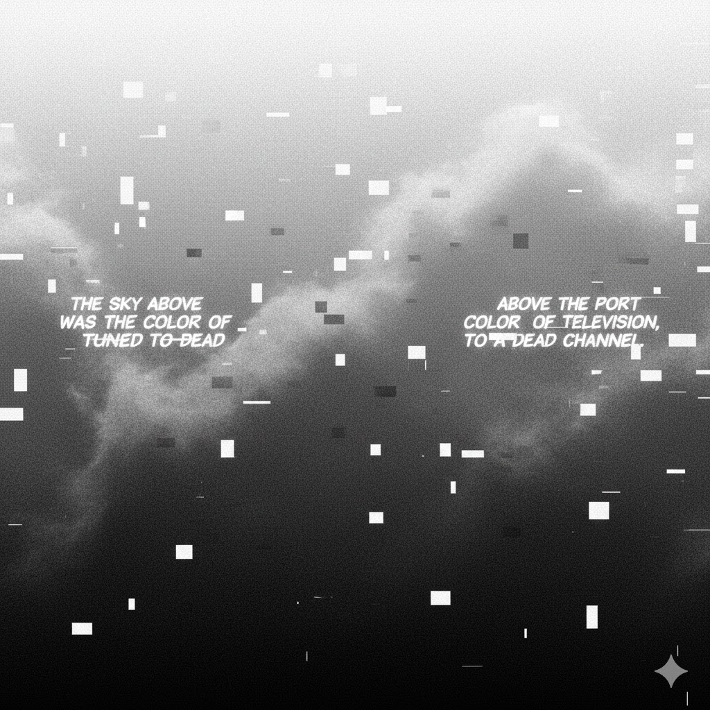

Full disclosure: I am not an artist, and I am not calling what I do art. Therefore, I will refer to what I create as a piece of "work."

I created this image recently:

This work was created using the [Kotlin programming language](https://github.com/igr/gart/). It is one of the works I have been creating for some time now. This way of creating is known as _algorithmic art_ or _generative art_ and has existed in many forms since the 1960s. Essentially, instead of a pen or a brush, you use algorithms to draw.

I shared the work above on Reddit, in the `r/Cyberpunk` feed, explaining that it is generative art and providing a link to the source code. Interestingly, there was a significant backlash, as people assumed it was AI generated, even though the post explicitly included the GitHub source. Just the notion of a "computer" was enough for some to dismiss the work and, perhaps more importantly, to view it from a different angle, one shaped by prejudice.

That reaction is understandable; I cannot deny that. However, it may also be a wrong one. One of the biggest impacts of AI is the loss of trust in genuine work. That part is on us. We never really fully appreciated honest work, did we?

I wanted to explore and better understand what happened here, hence this text. It is not an excuse, as I do not need one. I am fine with my work. I enjoy creating it, I enjoy programming, and I feel I can express myself this way.

Let me conclude this chapter with a message from a fellow redditor:

> I'm sorry people in a cyberpunk chat of all subs don't understand algorithmic art. as a fellow artist, I just want to recognize your image, it's good, clever, and a great text to choose as the base. it's really disheartening to see people just assume it's AI and come out firing

❤️

## Medium, Context and Intention

First, let's talk about the medium: this is generative code, driven by a (non-ML) algorithm and a fair amount of simple randomness. With this medium, you're inevitably somewhat limited, as you often can't know the exact output in advance. Still, by tweaking inputs and parameters in the code, you can navigate toward the result you have in mind. So while many parts are random, the outcome is not; and in this case, the result aligned with my original intention that I had envisioned in my mind when I started creating.

Off topic: every creative medium is limited. We cannot compare a marble sculpture with a canvas painting and complain that, for example, marble figures do not use color. While the medium should not be an excuse for the results, it must be taken into consideration when perceiving the work.

In this context, the code is my pen, and the screen is my canvas. I use the same basic primitives as any traditional artist: lines, dots, and shapes filled with color. That is all. Everything else must be intentional: the composition, the color relationships, and the message the work is trying to convey.

Let's not fool ourselves. Many times, I do not have a clear idea of what the final result will be. Often, I start with only a vague sense of the style I want to use or an algorithm I want to explore, and then I play with it. It is like doodling on paper, exploring ideas: a repetitive loop in which a human goes inward, searching for the right expression they want to reveal.

For example: the letter spacing is intentional. Yes, it is random, but the idea was to create a kind of physical interruption while reading the text aloud. I'm not sure how best to describe it, but if you've ever tried to speak while your throat is in pain, you'll know what I mean: an almost painful, foggy, ashy, dusty vocalization. It’s not meant to be gentle or stylish; quite the opposite. In the beginning, I just wanted to align the words on one side. I was more focused on the other parts of the work, so I postponed all text decisions for later. However, I did not like how the text looked when it was tidy and ordered. That felt like the opposite of cyberpunk entropy, right? I reached a point where I wanted to break the text, and after a couple of iterations, the result emerged as shown above.

## What about AI?

One could argue that there is no difference between using code and using a prompt. It is just a tool, the medium we are using, right? Why should we perceive the results differently?

There is one big difference: the initial spark, the idea, the urge, the message, in other words, the _act of creation_. If we approach AI with a prompt like "cyberpunk abstract representation of the first sentence of William Gibson’s book Neuromancer, black and white, noisy," this is **not** an act of creation. It is a vague prompt that leads to what I would call the _act of choosing_. The AI performs the imaginative and creative work for us. What remains is simply selecting the result we like.

This is similar to choosing which pictures to hang on your walls. That does not make you a _creator_, but a _curator_.

Nano Banana, after couple of tries:

AI can be used as part of a creative process only when it replaces tools, not the creative act itself. That is the distinguishing difference.

## Three Notes For Me, Myself and AI

Note one: I hate what AI tech bros did with copyright infringement. Large parts of the industry were built by casually scraping other people's work, treating years of human effort as free raw material. Consent was ignored, attribution was optional, and the damage to working creators was dismissed as an acceptable side effect of "progress." That is not innovation; it is extraction dressed up as inevitability.

Note two: AI may be viewed as a smart tool. _Smart tools require smart people_. It is our responsibility to understand a tool and the context before using it. Prompting for an outcome "in the style of Monet" without knowing anything about Monet's work is, to put it mildly, intellectually lazy and hypocritical.

Note three: AI bores me.
