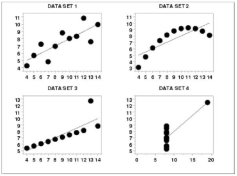
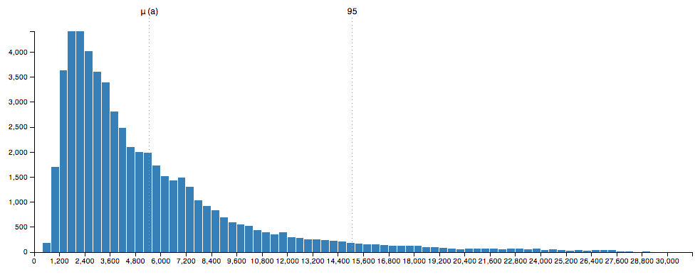
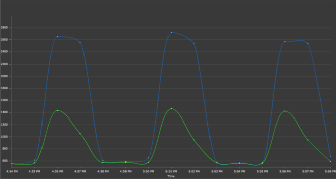

Puštanje u produkciju je za koji dan. Sve radi kao podmazano. Ostalo je još da izmeriš vreme odziva aplikacije na saobraćaj koji je klijent naveo u zahtevima. Koristiš najbolji alat za generisanje saobraćaja; beležiš vreme odziva transakcija u fajl. Nakon par sati, vraćaš se i izračunavaš srednje vreme odziva aplikacije. Ispod je vrednosti klijentovog zahteva. Zadovoljno potvrđuješ da je sve spremno.

<!--more-->

Dan nakon puštanja aplikacije u produkciju, ona prestaje da radi. Odziv je nemoguće veliki. Gde li si pogrešio, pitaš se?

## Prokletstvo sredine

Reč je o _srednjoj vrednosti_. Srednja vrednost **ne** oslikava udruženo ponašanje transakcija. Ako se bavimo analizom odziva sistema, gotovo nikada ne treba da se uzmemo u obzir srednju vrednost. Zapravo, mislim da je srednja vrednost jedna od najbanalnijih ocena skoro pa svakog uzorka, te svako merenje/istraživanje koje za rezultat isključivo nudi srednju vrednost ne uzimam za ozbiljno.

Sledi odmah i primer. Zamisli da radiš za 1000 dinara. A onda iz nekakve ankete saznaješ da je srednja plata u tvom regionu 1900 dinara. Grom i pakao! Šta je po sredi: ispostavlja se da nas devetoro radimo za 1000 dinara, a samo jedan, deseti učesnik, radi za 10,000 dinara. Srednja vrednost ovakvog uzorka je potpuno nerealna mera stvarnog stanja stvari.

Da li je onda standardna devijacija ta mera koja ima više smisla? Naravno da ne. Standardna devijacija je samo mera disperzije (raspršenosti) uzorka - oko njene srednje vrednosti. Najčešće pri tome _podrazumevamo_ normalnu raspodelu i koristimo pravilo [68-95-99.7](https://en.wikipedia.org/wiki/68–95–99.7_rule) za određivanje odstupanja. Što je greška. Jer, za početak, moramo da potvrdimo da je raspodela uzorka zaista normalna. Kada su u pitanju odzivi sistema kao što je web aplikacija, to gotovo uvek _nije_ slučaj. U sistemima u kojima nemamo normalnu raspodelu, srednja vrednost ne znači ono što očekujemo.

Evo još jednog primera. Sledeća četiri seta podataka imaju istu srednju vrednost i standardnu devijaciju:

Očigledno da je reč o potpuno različitim uzorcima.

## Percentililili

Percentili (_percentiles_) su realnija mera ocene ponašanja nekog uzorka, naročito za merenje performansi sistema. Definicija bi bila sledeća: percentil odgovara tački na distribuciji koja daje odgovarajući procenat rezultata do te tačke, uključujući i taj rezultat. Definišu se brojem od 0-100 (sličnost sa procentom je namerna). Nulti percentil je, dakle,  tačka ispod koje se ne nalazi ni jedan uzorak. Stoti percentil je tačka ispod koje se nalaze svi uzorci. 50-to percentil je i _medijana_, tj. tačka ispod koje se nalazi polovina izmerenih uzoraka. Za primer može da posluži sledeći histogram odziva aplikacije:

Prvo je očigledno da distribucija nije normalna - ovakav oblik krive je prirodniji. Srednja vrednost označena sa μ(a) je negde na 5 sekundi, 95-ti percentil je na nekih 15 sekundi. Drugim rečima, 95% transakcija se završi za 15 sekundi ili manje. Idealno, želimo da odziv bude što manji; to bi značilo da se 95-ti percentil pomeri u levu stranu što bliže srednjoj vrednosti.

Percentili nam govore o tome koliko su _konzistentni_ odzivi naše aplikacije. U sledećem primeru su nacrtani odzivi srednje vrednosti (zeleno) i 95-tog percentila (plavo):

Srednja vrednost vremena odziva uzorka ne prelazi 1400ms, dok 95-ti percentil dobacuje do 2600ms.

Šta nam to govori? Zavisi. Ako je za našu aplikaciju u redu da postoji veliki broj transakcija koje traju između 1.4 i 2.6 sekundi, onda treba da se pozabavimo samo najsporijim (5% koji traju duže od 2.6 sekundi). Međutim, ako je uslov da se transakcije moraju završiti za 1500ms, onda nas čeka još puno posla na optimizaciji sistema.

## Percentil na dan

Neka je medijana (50-ti percentil) na 500ms, a 90-ti na 1000ms. Ako se posle nekog vremena medijana poveća na 600ms, to znači da je 50% transakcija doživelo 20% degradacije u performansama. To bi trebalo popraviti. Dalje, često se u ovakvim slučajevima 80-ti ili 90-ti percentil ne menjaju. To znači da su spore konekcije ostale podjednako spore, a da su se brže konekcije usporile. Iz ovoga možemo da naučimo da nije dovoljno posmatrati samo jedan percentil, već uzajaman odnos više njih. U ovim slučajevima se može desiti da srednja vrednost ostane nepromenjena!

Neka se sada 98-i percentil uspori sa 1s na 1.5s, dok 95-ti percentil ostane stabilan na 900ms. To znači da je cela aplikacija stabilna, ali da je tih par već sporih transakcija postalo još sporije; to nije nešto što zahteva hitnu pažnju.

Aplikacija je spora? Meri i prati 90-ti percentil i optimizuj aplikaciju tako da se on smanji. Želiš da povećaš protok? Smanji 75-ti percentil, a prati da se 90-ti percentil ne pogorša.

Obrati pažnju na "dugačke repove". Često se aplikacije dobro ponašaju do 90-tog percentila, dok značajno uspore na 98-om percentilu, čak i za nekoliko redova veličine. Ove transakcije mogu pod određenim uslovima da dovedu do zagušenja, ukoliko se zadesi da se uzastopno pozivaju.

## Pažljivo!

Kao i sa svime, i sa percentilima se može preterati. Najčešća greška je da se računa srednja vrednost percentila - to, prosto, ne znači ništa. Ljudi često skladište merenja (na pr.: stanje sistema na svakih 5 sekundi) i teže da kasnije izračunavaju srednje vrednosti ovih rezultata. Najlakši način da pokažemo besmislenost ovog postupka su nulti i stoti percentil. Neka smo, dakle, merili, 100-ti percentil na svakih 5 sekundi tokom perioda od 5000 sekundi. Da li nam srednja vrednost skupa od 1000 izmerenih maksimuma može odgovoriti na pitanje koje je najveće vreme odziva? Ne, jer je najveće vreme odziva zapravo maksimum ovog skupa, a ne njegova srednja vrednost.

Sledeći problem je premali uzorak, na primer "prozor" od samo 500 transakcija pri saobraćaju od 1000 poziva u sekundi. Slično, računanje percentila pretpostavljajući normalnu raspodelu je takođe pogrešno (osim ukoliko se zaista ne ustanovi da je raspodela normalna, što često ovde nije slučaj).

## Alat

Bez dobrog alata nema ni dobrog merenja. Za _load test_ koristim [Gatling](http://gatling.io) - jedna od stvari u izveštajima je upravo prikaz percentila vremena odziva tokom trajanja testa. Više o Gatlingu nekom drugom prilikom.
