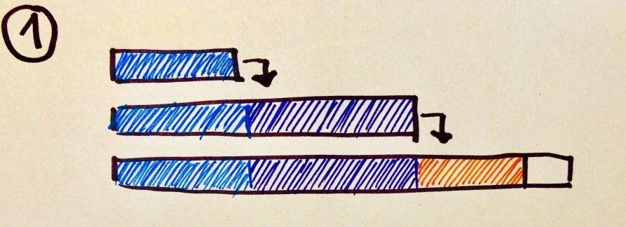
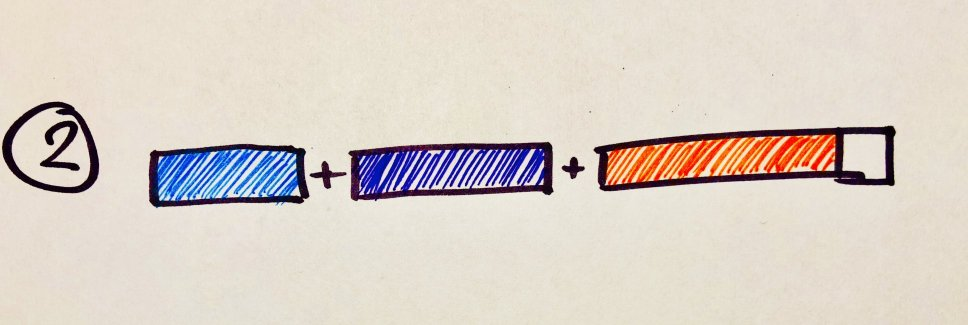

Način na koji rade dinamičke Java kolekcije kao što su `ArrayList` ili `ByteOutputArrayStream` je sledeći:

<!--more-->

  + alocira se inicijalni niz;
  + kada dođe do potrebe da se niz proširi, kreira se novi niz duple dužine, a prethodni sadržaj se prekopira;
  + na kraju, kada se od kolekcije zatraži njen sadržaj, kreira se konačni niz tačne dužine, a sadržaj korišćenog niza se prekopira u njega.

To se može predstaviti na ovaj način: 

Ono što mi je zasmetalo je to što se prilikom proširivanja niza sadržaj kopira više puta. Tako se ovde, na primer, inicijalni plavi deo kopira tri puta; sledeći ljubičasti dva i tako redom. Naravno, svaki put pri proširivanju se kopira ceo prethodni niz, ali ostaje činjenica da se jedan te isti memorijski sadržaj prenosi više puta sa jednog na drugo mesto.

Pomislio sam da možda postoji bolje rešenje od ovoga, koje neće prenositi blokove memorije pri proširenju. On bi radio ovako:

  + alocira se inicijalni niz;
  + kada dođe do potrebe za proširenjem, jednostavno se kreira novi, duplo veći niz. Pamti se ukupni ofset, a sve operacije se rade samo na novom, poslednjem nizu. Nizovi su praktično ulančani, nastavljaju se jedan na drugi.
  + Na kraju se kreira niz potrebne dužine, a sadržaj svih upotrebljenih nizova se kopira redom.

Nešto, dakle, ovako:

Sva memorija se sada kopira samo _jednom_, na kraju, kada se zatraži sadržaj kolekcije.

Po svemu sudeći, drugi način bi trebalo da daje bolje performanse. Zar ne?

## Misterija

Kada sam pustio **JMH** microbenchmark koji poredi drugi pristup sa prvim (oličen u klasi `ByteOutputArrayStream`), sačekalo me je iznenađenje. Drugi način je _uvek_ davao lošije rezultate! Razlika nije dramatična, ali nije ni zanemarljiva. To nisam očekivao: u najgorem slučaju performanse bi trebalo da su bar iste.

Vreme je za analizu.

Jasno je da je drugi način kompleksniji, jer se barata sa nizom nizova. Ovaj pomoćni niz se takođe alocira na početku. Prva optimizacija je da se pomoćni niz kreira tek pri prvom proširenju, što znači da to tog trenutka oba pristupa rade isto.

Međutim, drugi algoritam opet degradira posle prvog proširenja. Preciznije, prvi algoritam nije pokazivao isti stepen degradacije usled proširenja niza! Onda sam uočio sledeće u benchmarku prvog algoritma:

    # Warmup Iteration   1: 3296444.108 ops/s
    # Warmup Iteration   2: 2861235.712 ops/s
    # Warmup Iteration   3: 4909462.444 ops/s
    # Warmup Iteration   4: 4969418.622 ops/s
    # Warmup Iteration   5: 5009353.033 ops/s

Druga sesija "zagrevanja" je magična - JVM primenjuje optimizaciju i drastično ubrzava kod! To se ne dešava u drugom algoritmu. Optimizacija koju JVM primenjuje je rekompajliranje koda na najviši nivo, nivo 4. Inače, postoji JVM opcija koja ispisuje informacije o kompajliranju: `-XX:+PrintCompilation`.

Razlika dva algoritma sada je samo u načinu kako metoda za proširivanje radi. Probao sam da promenim kod tako da okinem isti stepen optimizacije JVM, ali je to davalo polovične rezultate: za jedne dužine niza drugi algoritam radi bolje, dok za druge radi sporije. Nisam uspeo da dođem do ujednačeno boljih rezultata za drugi algoritam.

## Hibridno rešenje

Iako na papiru stvari izgledaju da bi trebalo da se ponašaju drugačije, u stvarnosti se to ne dešava. Optimizacija koju radi JVM je tolika da dodatna kopiranja pri proširenju niza u prvom slučaju ne utiču na performanse. Zaista, te prve veličine memorija pri prvi proširivanjima su toliko male, da se benefiti drugog algoritma izgube u optimizaciji JVM.

Šta nam to govori? Da možda možemo da pribegnemo hibridnom rešenju: prvih nekoliko proširenja uradimo na način kao u prvom algoritmu, a tek kasnije pređemo na drugi algoritam. Kada kasnije? Kada veličina blokova koji se kopiraju bude tolika da potre optimizaciju JVMa.

Vreme je za pogađanje: kolika je veličina niza posle koje ima smisla prebaciti se na drugi algoritam? Dakle? 256 bajtova? 1024? 10 KB? 512 KB?

## Parti misterija

Pokazuje se da drugi algoritam ima smisla tek... mnogo kasnije. Negde oko 128 MB. Kako sada pa to? Pa... i ovo ima smisla (mada je lako praviti se generalom posle bitke): sa porastom dužine niza, broj proširivanja se smanjuje kako raste unutrašnji niz, te je i sam broj kopiranja mali. Kada konačna dužina niza pređe 128 MB, drugi algoritam krene da ispoljava svoje prednosti. Nažalost, i dalje ne sa ujednačenim performansama:

    128 MB
    fastBuffer    157810688  thrpt    2  126.644          ops/min
    outputStream  157810688  thrpt    2  124.815          ops/min
    256 MB
    fastBuffer    268435456  thrpt    2  84.519          ops/min
    outputStream  268435456  thrpt    2  55.932          ops/min
    400 MB
    fastBuffer    419430400  thrpt    2  35.836          ops/min
    outputStream  419430400  thrpt    2  48.079          ops/min
    512 MB
    fastBuffer    536870912  thrpt    2  41.725          ops/min
    outputStream  536870912  thrpt    2  28.819          ops/min

Šta je zaključak: da drugi algoritam možda i nema smisla na modernoj JVM.

Neočekivano.
