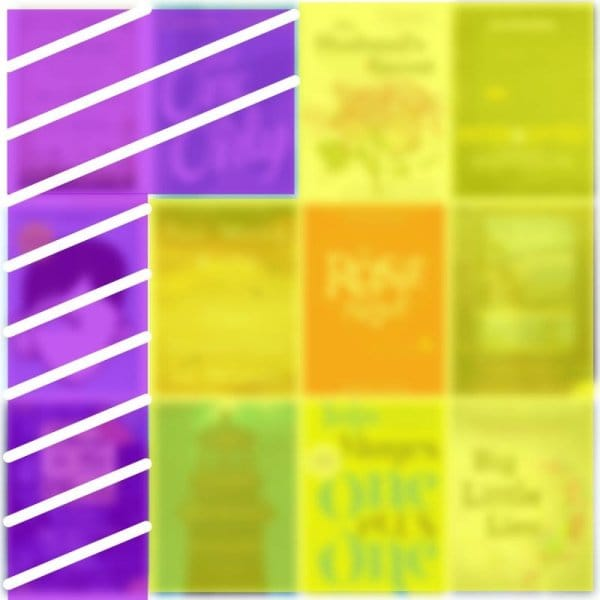

Svako malo osvane članak o najboljim knjigama koje morate pročitati da bi postali bolji programer. Evo zato i moje preporuke za dvanaest izuzetnih knjiga koje nipošto ne bi trebalo propustiti.

<!--more-->

Pa da počnemo sa sumarnim vizualom svih naslovnica tih knjiga:

+ `žutom` bojom su označene knjige klasične literature; dakle, ne-tehničke.
+ `ljubičastom` bojom su označene tehničke knjige.
+ `belim` štraftama je naglašeno da se knjige ne čitaju cele.

Šta želim da kažem?

Da bi postali dobar programer, morate da prvo postanete solidan čovek. Čitanje knjiga je deo tog puta. Zato _više_ čitajte nego što učite iz knjiga.

S druge strane, tehničke knjige ne čitajte cele. Naučite da brzo skenirate poglavlja, prepoznavajući o čemu se priča i izdvajajući delove koji su bitni. Fokusirajte se na koncepte (_zašto_), a štiklirajte mentalno gde se sadržaj bavi implementacijom (_kako_).

Gde sam ono zaturio Kindle?