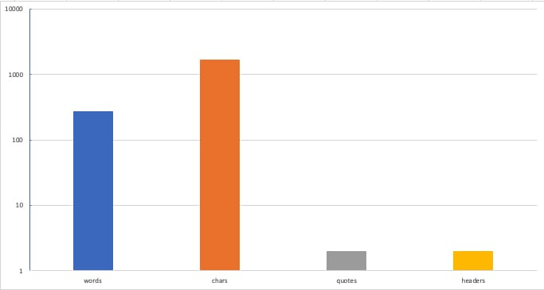

Big data. Small data. Lični podaci. Tajni podaci. Prosečni rezultati. Šareni grafikoni i gladne pita karte. Tabele i redosledi. Mašinsko učenje. Podaci koji prave nove podatke. Meta-podaci. I beskonačan broj fotki mačaka.

Sve(t) vrvi od podataka. No, sada kada imamo _sve_ podatke, da li imamo i sve odgovore?

<!--more-->

_Walmart_ i _Best Buy_, američke kompanije, sigurno imaju najveće baze proizvoda, cena, kupaca i čega sve ne. Sigurno troše novce dostojne omanjeg grada na održavanje i prikupljanje svega toga. No njihova zarada (_revenue_) ne raste. Zašto?

Idemo dalje: postoji nemali broj istraživanja koja kao rezultat daju samo sumirane podatke: tabele, proseke, grafikone - i tu sve prestaje. Kao da je krajnji grafikon cilj samom sebi. To su one analize gde je srednja vrednost i pitanje i odgovor na sve, počevši od nastanka univerzuma do toga zašto postoji toliko fotki mačaka.

## Podaci != Razumevanje

Pozajmiću dva citata:

> You can have data without information, but you cannot have information without data.

[DKM](https://en.wikipedia.org/wiki/Daniel_Keys_Moran) kaže ovde dve stvari. Izdvojio bih prvi deo: podaci su, sami po sebi, _bezvredni_. Gomila ničega, mačka u džaku. Podaci ne nose bilo kakvu informaciju. Podaci su samo glupe jedince i nule; izjednačene su fotke mačaka sa rezultatima istraživanja.

Prvi korak u osvešćivanju podataka je stvaranje informacija na osnovu podataka. Da, ovo je trenutak kada se ujedinjuju svi Excel-i sveta i vesele se.

Ipak, rano je za radovanje: sumiranje podataka je takođe bezvredno! Sumiranje je tek probiranje i prebiranje; razdvajanje mačaka od ostatka svega; redukcija velikih skupova na veličine koje ljudski um može da procesira.

Ali ono ne sme da bude samo sebi cilj.

Gospođa [Fiorina](https://en.wikipedia.org/wiki/Carly_Fiorina) jako lepo kaže:

> The goal is to turn data into information, and information into insight.

Ovde izdvajam drugi deo: uvid je razumevanje. I samo tada podaci konačno imaju smisla, kada postanu nekakav uvid. A znamo: tek na osnovu uvida možemo nešto i učiniti.

## Samo-uvid ovog teksta

Hajde, igre radi, da kažemo da je gornji tekst nekakav skup podataka - beznačajan niz slova i znakova.

Vadimo informacije iz teksta:

| Informacija   | Vrednost |
| ------------- | :------: |
| broj reči:    |   273    |
| broj znakova: |   1705   |
| broj citata:  |    2     |
| broj naslova: |    2     |
| broj mačaka:  |    ∞     |

Ah, kako bi samo mogao lep grafik da se napravi:

Bezvredno.

Potreban nam je kontekst u kome podaci važe. Ovde je to domen leksike, napisanih reči i rečenica. Informacije se moraju izvući iz tog konteksta. Sledi analiza, da bi konačno izdvojili uvid:

>  Podaci su bezvredni. Iz njih treba izvući informacije, koje služe da bi došli do uvida, razumevanja, a potom i akcije.

Dopunio sam prethodni citat _akcijom_. To je mali, lični pečat koji želim da naglasim: ako razumevanje ne prati akcija, čemu onda sve to?

Zato: prikupi, analiziraj, razumi i uradi.
