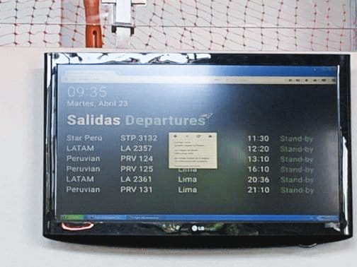
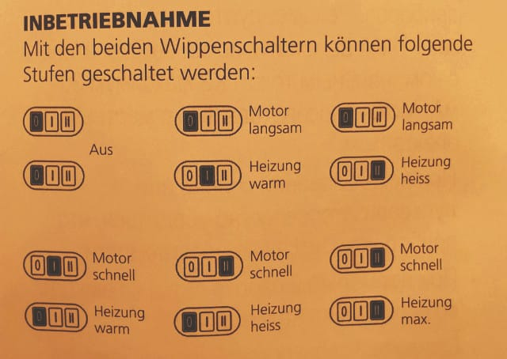

Živimo u svetu koji smo napravili eksponencijalnim: sve je u velikim brzinama i ogromnim količinama. Plašim se da tehnologija ne pomaže čoveku; samo ga zasenjuje lajkovima, botovima i praznim sadržajem. Uzdamo se u laku dostupnost i umetnu kreativnost. A mi, razvijaoci softvera, nastavljamo da tapkamo kroz frameworke, skramove i obrasce.
<!--more-->

Par primera iz prethodnih par dana koja su me nagnala da razmišljam (ponovo) na ovu temu.

## Red letenja

Jedini red letenja na malom aerodromu:

Zašto se ovako nešto trivijalno uopšte dešava? Zašto ljudi koji nisu obučeni za rad sa računarom ne mogu da reše ovaj problem? Zašto uopšte i postoji pojam "biti obučen za rad sa računarom"?

## Chat

Mobilna web aplikacija lokalne avio-kompanije. Odlazim na chat, trebam dodatne informacije:

Zelenim sam označio deo koji je predviđen za komunikaciju. Možda je UI simpatičan, ali je UX jako loš: šta god da se napiše jedva stane u predviđeni prostor, svaka poruka vraća skrol na početak, još kada je otvorena tastatura stvari postaju... frustrirajuće.

## Vreme dolaska

Avionska karta:

Molim vas, želim vaš softver u Boingu.

## Fen za kosu

Iz uputstva fena za kosu:

A šta ako je motor na **I**, toplota na **II**? Gle, a motor radi i kada je na **0**?!

## Sudo-mašina

Poslednji primer je iz prodavnice bele tehnike. Prodavac mi objašnjava sve programe i prednosti nove sudo-mašine. Te dugme za ovakvo pranje, te dugme za onakvo pranje, jače, sporije, brže, ispiranje... U meni nešto počinje da se buni: želim samo da operem posuđe. Treba mi samo **jedno** dugme: "operi". Zašto je to tako teško?

## Reset

Možda se čini da je rešenje u _znanju_. Sve ovo gore može biti prosto rezultat neznanja, nestručnosti... Međutim, odbijam da idem tim putem.

Uzmi na primer igrice - one dobre možeš odmah da počneš da igraš (kada si poslednji put čitao upustvo za igranje igrice?). Ali isto tako znaš da pomeraš svog lika sa WASD i mišem. Analogijom, u razvoju i inženjerstvu proizvoda namenjeni ljudima rezultat mora da prosto _služi_. Dalje, moraju da postoje univerzalni obrasci i pravila upotrebljivosti koja će biti primenjeni. Ne propagiram jednoobraznost, ali haos ne vodi ničemu.

Ok, dosta s ovime, idem da naučim još jedan framework.

