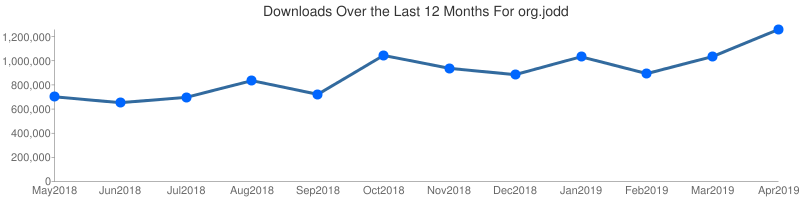

Priče o start-up-ovima i milionima "uzetih" investicija svakako izmame uzdahe i pokrenu interesovanje. Ovo nije takva priča. Šta više, nije uopšte priča sa slatkim ivicama i ukusnim krajem. Zamislite malo poznat skup Java alata i frameworka otvorenog koda, proizvedenih u Beogradu, koji se preuzimaju milion puta mesečno, a za koji sigurno niste čuli.
<!--more-->

Ovo je priča o [Jodd](https://jodd.org)-u.

Pre nego što nastavim, da razjasnim: autor sam tog projekta. Sve što bude ličilo na samo-reklamiranje je tu nenamerno.

## Zašto?

Kako je nastajao, **Jodd** je pružao nešto što tadašnji Java ekosistem nije imao u ponudi. To može da bude neka od sledećih karakteristika:

1. značajno drugačiji oblik implementacije,
2. udobniji svakodnevni rad programera, i
3. bolje performanse.

**Jodd** je vremešan. Počeo je kao web framework (_Madvoc_), nastao kao zamena za WebWork2 - davno izumrli framework, koji je dobro zamišljen, ali je manjkao u implementaciji. Uskoro nastaje i IoC kontejner (_Petite_), jer Spring u to vreme nije ni imao naznaku da bi koristio anotacije, a bogme, bio je i pozamašan. Zatim, objektni maper za bazu (_DbOom_), jer smatram da relacije ne treba definisati unapred, već na mestu upotrebe (ne ORM, vec OM+R). Tu je i potpuno novi način implementacije aspekata (_Proxetta_).

Pojavile su se i neke nezavisne alatke. Na primer, HTTP klijent (_Http_), jer je raditi sa http-commons znalo biti zamorno. Nastaje i HTML/XML parser (_Lagarto_), jer su performanse postojećih implementacija bile neverovatno slabe. Nad njim nastaje _Jerry_, parser HTML-a koji ima sintaksu kao jQuery - prvi takav. Na kraju bih da izdvojim i _Json_, jedan od najbržih JSON parsera i serializatora koji danas postoje.

Ima tu još koječega; no ovo je dovoljno da se stekne predstava o tome šta je **Jodd**. Ako ste pomislili na nekakav paralelni Java univerzum - to bi bila najbolja slika svega onoga što ima unutra. Jer sa **Jodd**-om dobijate gro alatki za izradu web aplikacije, u svega **1.7 MB**, _bez_ zavisnosti, sa fokusom na lak svakodnevni razvoj i kod koji se brzo izvršava. Potpuna alternativa.

No neću dužiti dalje, i ovo je bilo previše. Pričajmo o drugim stvarima.

## Šta je zapravo open-source projekat?

Open-source se često zamišlja kao romantizovana priča gde neko napravi i objavi kod, a zatim on polako raste, sve sa korisnicima prepunim razumevanja, a pomoć neprestano pristiže u vidu stalnih nadogradnji koda i novih ideja. Ova utopija se dešava retko; rezervisana je za projekte koji su opšte prihvaćeni u ekosistemu i imaju značajan broj korisnika (i, po pravilu, nekakav izvor prihoda). Većina nema takav luksuz.

Open-source projekat često znači _upornu, tvrdoglavu posvećenost_ kodu koji donosi vrednost drugim programerima. Za to najčešće ne dobijaš nikakvu zaslugu, pohvalu, a kamoli novac. Umesto dobijaš brdo kritika (ko je rekao Reddit?:), zahteva za implementacijom stvari koje nisi ni nameravao da uključiš i graničnih slučajeva gde specifikacije nisu dovoljno jasne. Znam da zvuči ofucano: to jesu sati i dani i nedelje rada, samo da bi tamo nekom liku iz Kine proradio program. Dok ne shvatiš da taj lik iz Kine nije stereotipni bubuljičavi koder sa okruglim naočarama i zift crnom kosom, nego tech-lead za projekat, i da su izabrali tvoje biblioteke ispred svih ostalih, jer im prosto "rade bolje". Takav rad je borba i traje neprestano. Jednom kada počneš da donosiš vrednost, moraš odlučiti koliko si spreman da grizeš da bi to i nastavio. Potpuno isto kako to važi za preduzetnike, tako važi i za open-source projekte.

## Nije sve lako

Nepostojanje _feedback_-a je karakteristična za male OS projekte kao što je ovaj; to je često... poražavajuće. Ne znati da li projekat ikome zaista čini je Pandorina kutija. Bilo je više takvih [momenata](https://github.com/oblac/jodd/issues/585) kada sam je otvorio; uticalo je čak na moje duševno stanje u tom periodu. Ne mogu reći da je bilo lepo; bilo je grozno. Izgubiš sebe i pokušaš da ponovo pronađeš smisao u onome što radiš. A onda uhvatiš sebe kako prečesto osvežavaš [GitHub](https://github.com/oblac/jodd) stranicu da bi proverio broj zvezdica kojima su označili tvoj projekat :) Zato, ako koristite neki open-source projekat koga razvijaju pojedinci, pošaljite im po koju poruku; siguran sam da će im značiti.

Ono što mi je jedno vreme teško padalo je gotovo nikakva podrška lokalne... bilo čega lokalnog. Da se razumemo, ne smatram da je **Jodd** revolucionarno dostignuće, ali verujem da sadrži par premisa koje su (i dalje) vredne. Ne želim da 'prodajem' priče i time podstičem interesovanje; neka svako sam uoči vrednost i zato se uključi u igru. To se ovde ne dešava. Prijatelj iz doline silikona mi je jednom prilikom napomenuo da su ljudi tamo mnogo... pa, prijemčiviji idejama. On je, primera radi, bio opčinjen time što je poterao jQuery skripte na Nashornu; i radio je dalje optimizacije CSS selektora. Kako bilo, nikada nije bilo ozbiljnije podrške; često ni razumevanja. Ne tražim da neko kodira umesto mene, ali često zatreba da se diskutuje o arhitekturi, podele misli; i tu najviše nedostaju sagovornici. Slično sam doživeo i sa drugim projektima, nažalost. No dobro, siguran sam da je to samo moje iskustvo i da nije nužno tako stanje stvari.

A onda uočim ovo:

U pitanju je statistika sa Maven Central-a, koja saopštava da se **Jodd** biblioteke preuzimaju milion puta mesečno u proteklih par meseci, sa tedencijom rasta. Not bad.

## Greške su deo puta

Najveća greška, osim očigledne - pokretanja 15 projekata na kojima ću raditi sam - je to što nisam odvojio vreme na generisanje sadržaja. To je možda najveća zamka open-source projekata: neprestano radimo da usavršimo kod, implementiramo novu ideju, funkcionalnost ili nešto refaktorišemo... Međutim, sav ostali sadržaj je podjednako važan. To znači: imati blog, primere, svežu dokumentaciju, ići na konferencije... U stvari, kažu da se čak treba posvetiti _više_ ostalom sadržaju, nego samom projektu. Što, kada razmisliš, potpuno ima smisla: jer kako ćeš drugačije da prodaš projekat?

Jedna od prilično glasnih stvari koja ne ostavlja najbolji utisak je zastareli [tutorijal](http://joddframework.org). Sa opsegom posla koji je u pitanju, bojim se da sam digao ruke.

Verovali ili ne, termin "micro-framework" je skovan upravo za potrebe **Jodd** frameworka (cca 2015-te); to se potom nekako raširilo dalje. Okej, okej, možda su i drugi došli na sličnu ideju nezavisno. Kako bilo, pre par godina se pojavilo vanredno interesovanje za slične male i fokusirane frameworke. **Jodd** je našao svoje mesto među njima; odjednom je bilo puno mesta gde se moglo pojaviti i učestovati. Prepoznao sam taj momenat, ali ga nisam iskoristio: dao sam prednost drugim stvarima (konferenciji). To je bila greška. Ovakve trenutke ne možemo da biramo.

## Kul stvari

Dobre stvari bavljenja open-source projektima je to što imaš prilike da dobro izučiš programerski ekosistem. Naučiš puno toga što ti zapravo i ostane; u ovom slučaju raznoliko poznavanje kako Java-stvari funkcionišu.

Jako je lepo i kada preko svog projekta upoznaš nekoga, naročito iz drugih Open-Source projekata. Tako na primer, momci iz [Gatling](https://gatling.io)-a su puno pomogli sa konkretnim PR-ovima i savetima i optimizacijama; za [ByteBuddy](https://bytebuddy.net/) sam saznao i pre nego što je objavljen i tako redom. Tu su i redovni pomagači na projektu, ljudi koje nikada nisam upoznao, ali eto, odvajaju vreme da bar nekako pomognu.

I super je kul kada napraviš stiker za svoj projekat :) Makar i kada srpska carina zapleni paket, jer sadrži više od "par identičnih stvari", te posumnjaju da se zapravo bavim nekakvom prodajom stikera i time se nezakonito bogatim? wtf, ljudi, 100 stikera :)

## Idemo dalje

Ovo nije žalopoljka, niti hvala, već, prosto, jedna open-source priča koja se dešava tu blizu, u Beogradu.

Radim open-source jer verujem da čini(m) promenu.

Idemo sada dalje.
