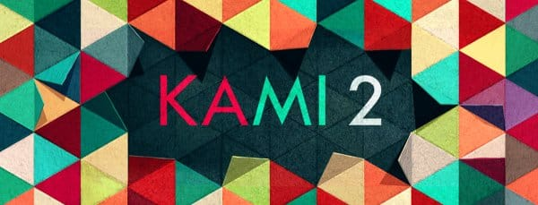
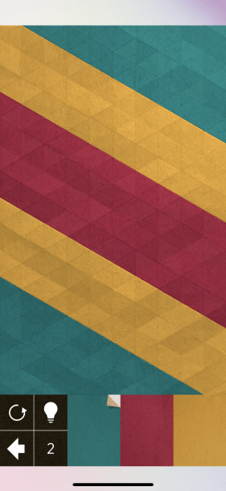
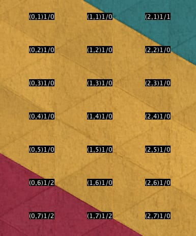
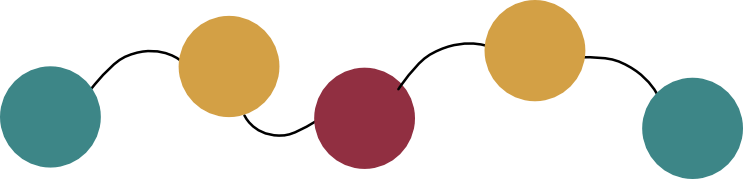
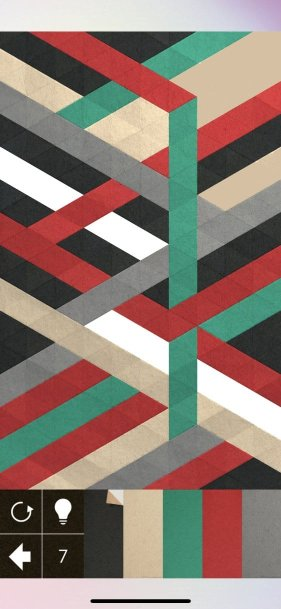
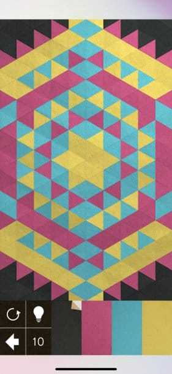
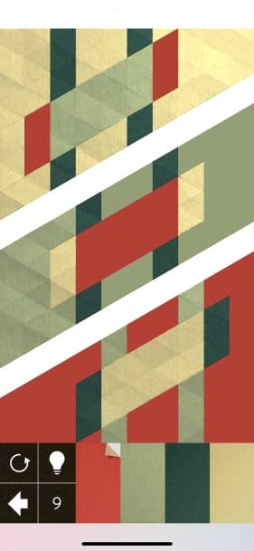

[Kami 2](https://www.stateofplaygames.com/kami2) je zanimljiva logička igrica koja mi drži interesovanje već neko vreme. Izazova radi, pokušao sam da napišem program koji pronalazi rešenje za njene zagonetke.

<!--more-->



Svaka zagonetka je zadata na tabli koju čine grupe trouglova različitih boja. Igrač odabira jednu takvu grupu i "prebojava je" u drugu boju. Pri tome se susedne grupe obojene istom bojom spajaju, čime formiraju novu, veću grupu trouglova. Cilj je obojiti celu tablu jednom bojom - za zadati broj poteza.

Iako se to možda ne vidi iz opisa, mehanike igre je jednostavna. Igrač se trudi da prebojava grupe trouglova na takav način da se površina obojena jednom bojom povećava.

Jedna od prvih tabli je ova:



Rešenje je sledeće:

1. Oboji crvenu oblast u žuto - dobija se jedna velika žuta oblast,
2. Obojiti žutu oblast u zeleno.

Ok, vreme je za kod.

## Učitavanje

Prva stvar je naći način kako prebaciti tablu iz igrice na smisleni način u budući program. Broj trouglova nije mali, te ručno formiranje table ne dolazi u obzir. Pragmatično rešenje je da se napravi screenshot table, prebaci na kompjuter (Airdrop:) i napiše kod koji ume da procesira ovakvu sliku, te napravi memorijski model table sa kojim se dalje može raditi.

Očitavanje pozicije trouglova nije problem. Iako tablu čine trouglovi, struktura je ipak obična matrica: dovoljno je uzimati piksel svako malo po `x` i `y` osi i time očitati boju trougla.

Prvi izazov je prepoznavanje identične boje - kao što se sa gornje slike vidi, trouglovi nisu obojeni uniformno. Zato boje poredimo sa određenim dozvoljenim odstupanjem. Bez nekog većeg udubljivanja u problem, poredim svaku RGB komponentu ponaosob i gledam da li je razlika između komponenti u dozvoljenim granicama. Ukoliko se sve komponente boje poklapaju u datim granicama, smatram da je boja ista. Pokazuje se da ovo radi dobro; ipak ponekad treba ručno prilagoditi sliku naglašavanjem ili promenom boja, jer igrica primenjuje nekakav filter preko table, čime su desni i viši trouglovi nešto svetliji.

Važnija stvar u vezi trouglova je njihovo uvezivanje. Neophodna je informacija kako su trouglovi povezani, da bi znali koji su susedni, kako bi se boja "prelila" na njih. Nezgodno je to što su trouglovi postavljeni naizmenično: čas se dodiruju temenom (pa nisu povezani, tj. susedni), čas svojom stranicom (pa jesu povezani). Kako je tabla ipak samo matrica, dosta je primeniti baš to pravilo oko povezivanja svakog drugog trougla, pri čemu treba voditi računa i o trouglovima iznad (parsiranje kreće od levog gornjeg ćoška i ide redovima ka dole).

Evo kako izgleda očitavanja za deo table (u zagradi su koordinate, a poslednji broj je indeks prepoznate boje):



Na primer, trougao `(0,5)` je povezan sa dva žuta trougla: `(0,4)` i `(1,5)` i sa jednim crvenim: `(0,6)`.

## Graf table

Onog trenutka kada učitamo sve trouglove i njihove međusobne veze, raspored sa ekrana postaje nevažan: dobijamo zapravo graf trouglova - čvorova! Svaki čvor ima informaciju o boji i susedima.

## Redukcija grafa

Jasno je da nema potrebe baviti se svim trouglovima (čvorovima) - zanimaju nas samo _oblasti_, tj. grupe susednih trouglova iste boje. Zato pravimo redukciju grafa: spajamo susedne čvorove istih boja. Nakon redukcije, graf će biti sveden na čvorove koji predstavljaju oblasti iste boje, a neće postojati dva susedna čvora iste boje. Tako graf gornje table postaje ovo:



Redukcija grafa je `290` očitanih čvorova svela na samo `5`: `[G - Y - R - Y - G]`!

Redukciju sam uradio na trivijalan način:

```
uzmi prvi čvor iz skupa
spoji ga sa svim susednim čvorovima iste boje
ukoliko ih nema, smatram da je čvor optimizovan i uklanjam ga iz skupa
ponovljaj dok god ima neoptimizovanih čvorova u skupu
```

Za sada je zadovoljavajuće.

## Rešavanje problema

Nema druge do primeniti sirovu silu (_brutal force_). Ideja je sledeća:

```
za svaki čvor generiši moguće "klikove"
svaki klik primeni na tablu: generiši novu tablu i redukuj je
ukoliko ostane samo jedan čvor, našli smo rešenje
u suprotnom, reši ponovo tako dobijenu tablu (rekurzija)
```

U našem primeru bi to izgledalo ovako:

+ za prvi, levi zeleni čvor, generišemo "klikove". Naravno, ignorišemo klik s istom bojom, pa generišemo dva "klika": jedan s žutom i jedan s crvenom bojom.
  `[G - Y - R - Y - G]`
+ Uzmemo žuti "klik" i primenimo ga na zeleni čvor. Čvor postaje žuti.
  `[Y - Y - R - Y - G]`
+ Redukujemo graf pošto postoje susedni čvorovi iste boje.
  `[Y - R - Y - G]`
+ Za novi graf sve ovo rekurzivno ponavljamo: sada za prvi žuti čvor generišemo dva "klika": zeleni i crveni. Međutim, oba ne dovode do rešenja, pa kako je dostignut maksimalni broj klikova (`2`), vraćamo se nazad na početni graf i uzimamo sledeći, crveni "klik".
  `[R - Y - R - Y - G]`.
+ I on neće dovesti do rešenja u predviđenom broju koraka (klikova). Time smo završili sa prvim čvorom početnog grafa, pa konačno prelazimo na sledeći, crveni čvor na početnom grafu.
+ ...

Rešeno!

Drugim rečima, prolazimo drvo svih mogućih grafova koji nastaju tokom igre i pronalazimo prvo koje rešava problem.

## Usložnjavanje

Kako se table usložnjavaju, vrlo brzo stvari krenu da izmiču kontroli. Broj mogućih poteza i stanja postaje jednostavno prevelik. Ako početni graf ima `n` čvorova, svaki čvor generiše u prvom koraku `(c-1)` novih grafova (listova stabla), gde je `c` ukupan broj boja. Kako se ide u dubinu, svaki novi graf generiše sličan broj listova (`n*(c-1)`), te dobijamo konačnu složenost `O(n^d)`, gde je `d` maksimalna dubina drveta, tj. broj klikova za koliko treba rešiti tablu. Užasno puno.

Vreme je za optimizaciju.

### Prevremeno odustajanje

Prva optimizacije je prosta: ukoliko je broj preostalih boja u grafu veći od broja preostalih poteza, nema smisla nastavljati dalje. Ovo je dovelo do malog, ali primetnog ubrzanja.

### Smanjivanje broja klikova

Značajna optimizacija je bazirana na sledećoj pretpostavci: nema smisla da menjamo boju čvora u onu koju nema niko od susednih čvorova! Drugim rečima, ako posle poteza nema redukcije grafa, onda nismo ništa pametno uradili. Ovo _značajno_ ubrzava algoritam, jer prosto ne generišemo "klikove" drugih boja osim onih koje imaju susedi čvora. Na svim tablama relativno je mali broj čvorova koji se graniči sa svim ili većim brojem boja.

### Paralelno procesiranje

Nisam našao pametniji način da paralelno izvršavam kod, sem da koristim paralelno procesiranje strimova. Svi moji pokušaji su završavali sporijim kodom (no i dalje bržim nego kada se izvršava u samo jednoj niti). Ostaje za analizirati u čemu grešim.

Kako bilo, poslednje dve optimizacije dovode do značajnog poboljšanja performansi. Table koje su se ranije rešavale za desetak sekundi, sada se rešavaju za manje od jedne.

Rešeno!

Sve je bilo sjajno dok nisam probao jedan od kompleksnijih primera:



Uh. Vreme je za još mozganja.

### Prioritizacija drveta

Trenutni algoritam rekurzivno _obilazi_ sve grafove u drvetu igre. S druge strane, nemoguće je prvo izgenerisati celo drvo pa ga onda rešavati; za tako nešto je potrebno (pre)mnogo memorije.

Razmišljanja mi se kreću u smeru da nisu svi grafovi jednaki - drugim rečima, nisu svi potezi (klikovi) jednaki. Neki su "bolji" od drugih, izgledniji da će dovesti do rešenja. Takve bi trebalo obraditi pre ostalih. Samo, koji bi to potezi mogli biti?

Oni koji smanjuju broj boja na tabli/grafu.

Ako jedan potez dovede da se umanji broj boja (kao što smo na primeru eliminisali crvenu boju), možemo smatrati da je bolji od ostalih. Jer rešenje je upravo to - eliminacija svih boja osim jedne.

Moramo da se rešimo rekurzije, jer više ne procesiramo stablo igre po redu obilaska. Umesto toga, pravim niz listi: `arrayListOf<LinkedList<Board>>`. Svaka lista će držati table sa istim brojem boja. Na primer `array[2]` daje listu svih tabli (grafova) koji imaju `2` boje.

Prioritizacija se ostvaruje time da se svaki put potražuje prva neobrađena tabla sa najmanje boja. Na taj način forsiramo obradu grafova koji imaju manje boja, nadajući se da ćemo pre doći do rešenja ukoliko forsiramo klikove koji eliminišu boje.

Algoritam na kraju postaje ovo:

```kotlin
while (true) {
  val board = nextBoard()

  if (board.colors.size == 1) {
    printSolvedSolution(board)
    return
  }

  val remainingClicks = maxClicks - board.depth
  if (remainingClicks == 0) continue
  if (remainingClicks + 1 < board.colors.size) continue

  ClicksProducer()
    .createClicks(board)
    .parallel()
    .map { it.click() }
    .forEach { addBoardToQueue(it) }
}
```

Sa ovom optimizacijom se poslednji primer rešava najčešće ispod 8 sekundi, sa nekih `800k` probanja (kliktanja). Kažem "najčešće" pošto `parallel()` ne radi deterministički, pa se ponekad rešavanje oduži - no i dalje je sve dovoljno brzo.

### Simetrija

Specijalni slučaj je kada je tabla simetrična:



Ova tabla je suludo matematički kompleksna! Gotovo da je svaki trougao zaseban, jako je malo grupa trouglova iste boje; a broj klikova je čak `10`. Algoritam ne uspeva da ovo reši za neko prihvatljivo vreme čekanja.

Pošto je simetrična, mogu da posmatram samo jednu četvrtinu table! No stvari nisu tako jednostavne za implementaciju. Kada je tabla redukovana, klikove na trouglove koji nisu na ivicama četvrtine vrede kao 4 koraka, a ne jedan. Na primer, klik na crni gornje-levi ugao treba primeniti i na sve ostale crne uglove, pa ga zato treba računati četiri puta. To dalje značajno optimizuje pronalaženje rezultata, ali usložnjava kod.

Sa ovom optimizacijom, tabla se rešava za tričavih 12-tak sekundi, sa nekih `1.1m` kliktanja.

Rešeno!

### Višestruke table

A onda je došla ovakva tabla na red:



Jednostavno rešenje, ali nezgodan slučaj za algoritam: ni jedan od prvih klikova ne eleminiše boju, čime se najvažnija optimizacija ne primenjuje. Očigledno je da ovde zapravo rešavamo 3 prostije table ponaosob.

Nazad u editor: pišem kod koji deli tablu na više manjih tabli, te svaku rešavam zasebno. Ovom prilikom malo varam, jer pretpostavljam da je broj klikova za sve nove, manje table isti. Varam malo više i predviđam boju kojom sve bi sve table trebalo na kraju biti obojene; no ovo i nije toliko strašno, samo želim konačno u krevet.

Rešeno!

### Sortiranje klikova

Ipak, i dalje postoje table koje znaju da naprave problem. Nova optimizacija je ta da očekujemo da su klikovi na čvorove koji imaju najviše suseda "bolji" od ostalih klikova. Drugim rečima, prvo bojimo oblasti koje imaju najviše suseda. Ovo se implementira jednostavnim `sorted()` u strimu klikova.

Rešeno... valjda :)

## Gde ja stadoh, ti produži

Trenutni algoritam rešava veliki broj Kami2 tabli u razumnom vremenu - ali verovatno ne i sve. Takođe je potrebna manje prilagođavanje koda tu i tamo; nije sve automatizovano. Potpuno rešenje će morati da napiše neko pametniji :)

Ovde negde i završavam. [Kod je dostupan](https://github.com/igr/kami-solver).

(Eh, kada bi AI zaista postojao...)
