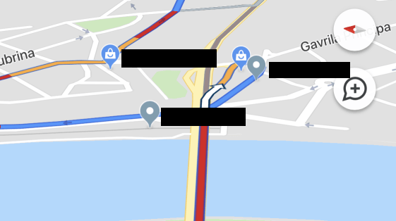

Vozim prateći naznačenu putanju Gugl-mape. Nalazim se u sporoj koloni vozila; gužva se pojavila kada joj vreme nije. Pratim alternativne pravce; kako imam vremena da posvetim pažnju prikazu na telefonu, uočavam oznaku izvesne radnje za venčanice na Gugl mapi.

U tom trenutku kreće buka.

<!--more-->

Buka koju samo ja čujem, unutra, u sebi. Nepodnošljiva buka informacija koje svaki dan pronalaze put do mojih receptora; a koje potpuno, apsolutno, sasvim: _ne želim_.

Želim da znam kuda vodi ovaj put. Ne želim da znam išta o onome što nije predmet mog fokusa ili pak nije moja borba koju sam odlučio da vodim. Počinjem da osećam odbojnost ka _neželjenim_ informacijama, da mi ponašanje fiktivnog junaka g. Holmsa u 'Grimiznoj studiji' postaje blisko: odbija da zna da li se Mesec vrti oko Zemlje - ili je obratno - jer to nije predmet njegovog interesovanja.

{.center}

Kao da je bilo nekad, kada smo umeli da prepoznamo vrednost informacija. One su i dalje vredne - šta više, vrednost im se uvećava u tehnološkom društvu; no upravo zato živimo kakofoniju informacija i, time, pogrešnih obrazaca. I ne radi se samo o tome da _ne želim_ da saznajem za bilo kakvu organizaciju ili radnju dok vozim: takav dotok informacija ne mogu da _isključim_. U isto vreme ne dobijam informacije koje su mi tog trenutka vrednije: kuda treba ići, već samo nagađanja izvedena iz skupa vozila koje dele istu prostorno-vremensku koordinatu. Krug.

Nisam siguran šta da kao kapetan Esid kažem maloj Lini... Ostavljamo bučan svet u kome se buka ne može isključiti; nažalost, ne _onakva_ buka na koju misli Koja.

Sunce je danas izašlo u 6:58.
