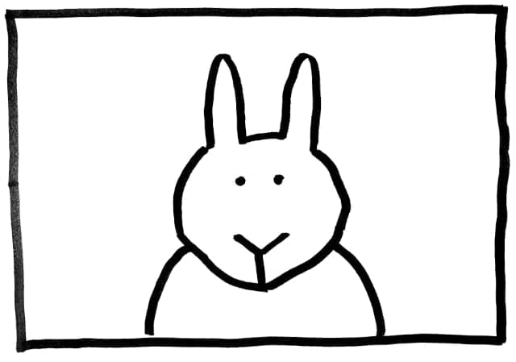
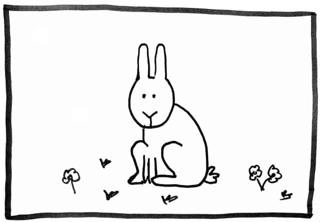
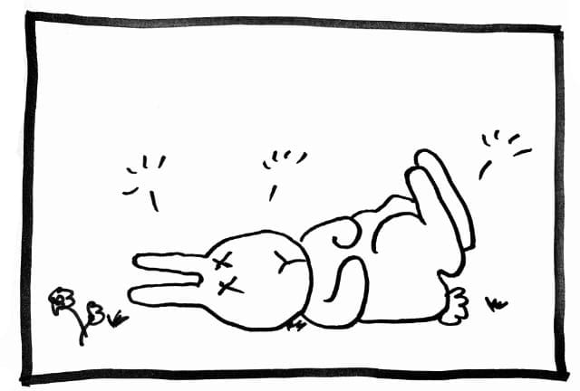

Zdravo. Ovo je **Zeka Peka**.

{.center}

Svaki put kada neko plati za AWS/Azure/GCS sertifikat...

{.center}

...jedan mali **Zeka Peka** tamo negde...

{.center}

... tek tako, skonča.

{.center}

> Hajde da ne ubijamo male Zeke Peke.

## Pre nego što Bezosdron dođe po mene

Obećanje podataka i izvršavanja koda u oblaku nije samo u promeni aktera za skladištenje i pokretanje programa. Podjednako važna je i _pragmatičnost upotrebe_ platformi. Vidi, ne želim da gubim vreme na traženje načina kako se nešto podešava, neispravne linkove, zastarele tutorijale od pre svega par meseci, kriptične nazive... Ovamo se busamo kako imamo prepametnog Aleksu, Guglicu koja sama zakazuje šišanje, a ne uspevamo da korišćenje ovih platformi učinimo pragmatičnim. Ne želim _sve_ moguće opcije, želim opcije koje meni rade posao. _Alexa, go figure that out_.

Ili bar: razumljivim do te mere da mi nije potreban mistični guru koji će mi pokazati kako nešto uraditi dok ispija kafu pomešanu s bademovim mlekom, a odmah potom life-couch koji će me uveriti da je život ipak lep. Fino su se dosetile te oblačne firme: umesto da plaćaju svoju podršku i razvoj u pravcu rešavanja namera (eng.: _intent_); naplatiće nama izdavanje sertifikata, čime postajemo divna, besplatna podrška njihovim firmama. Ok, poslaće i neke stikere za laptop; prosto da se lakše prepoznamo. Predlažem da se uz sertifikat dobija i telefonski broj, pa da budući kupci mogu dobiti savet nas, novopečenih nosioca mudrosti platformi.

Ne ljutite se; priznajem: jesam ovde prešao granicu ukusa i postao zakeralo, lajavi krelac. No zaista ima dana kada mi je preko glave _nemar_ koje tehnološke firme imaju prema programerima. Ima nas čak toliko, da će uvek biti nekog ko će radosno kucati besmislenosti iznova i iznova. I, naravno, ne završava se sve na pomenutim platformama; isto se može primeniti na skoro sve aspekte razvoja softvera.

Da li zaista želiš da još jedan mali **Zeka Peka** umre zabadava?

p.s. probaj da dobiješ [ZDRUM](https://zdrum.work/certificate/) sertifikat, on je _Zeka-Peka-friendly_.
