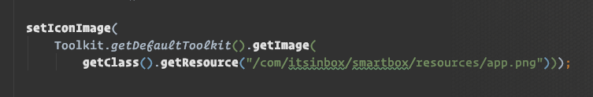
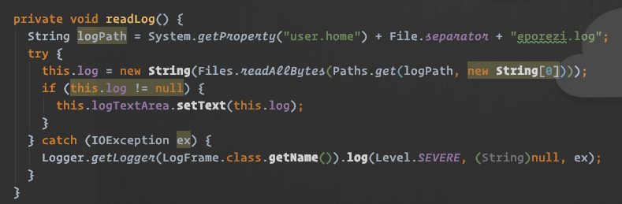
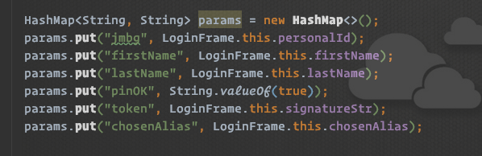
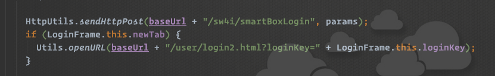
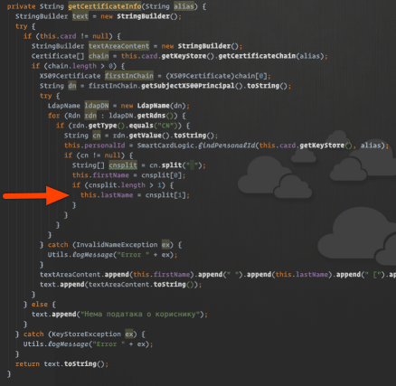
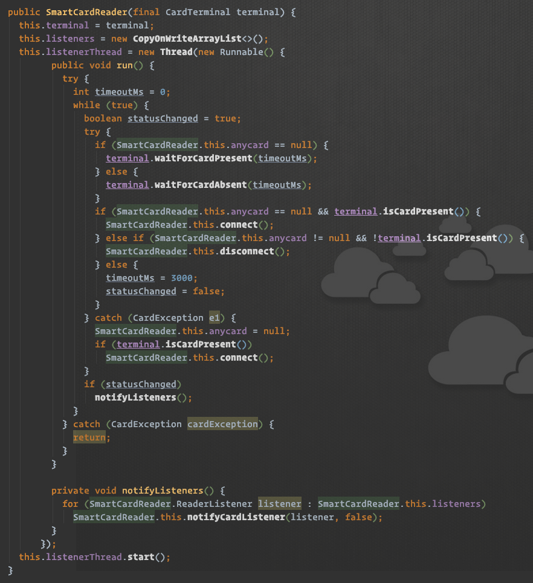
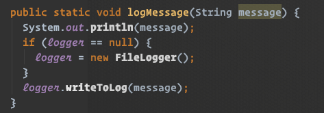
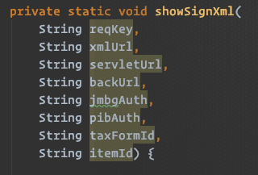
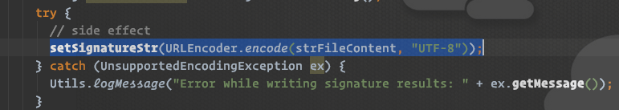

Tek sam nedavno realizovao da postoji aplikacija `еПорези`. Kako je pisana u Javi, tiče se civilnog društva, a i kako sam radoznao (iako nisam mačka), odlučih da zvirnem u kod verzije `1.2.2`.

<!--more-->

Ne bih da budem vanredno strog: ovo je dobronameran uvid i, prvenstveno, subjektivna ocena koda - i to koda dobijenog reverznim inženjerstvom. Ništa više, ništa manje. Na kraju, pisao ga je naš kolega, i to treba uvažavati.

Napomena: podrazumevam da je program u javnom vlasništvu (_public domain_) i da mi je kao takvom dozvoljeno da ga analiziram. Nisam uspeo da pronađem zvaničnu licencu pod kojom je objavljen.

## GUI paket

Swing deo koda preskačem u nadi da je generisan, a ne ručno pisan. Postoji dosta ponavljanja, na primer:

Ovakve stvari bi trebalo enkapsulirati (i keširati) u posebnoj klasi. Iako deluje jednostavno, dešava se _previše_ toga i neophodno je podeliti odgovornosti (_separation of concerns_).

`LogFrame#readLog` mi je takođe zapao za oko:

Ovaj metod prvo prebaciti u klasu koja se bavi logom (postoje i druge slične metode koje se mogu grupisati). `Paths` se ne koristi kreiranje `logPath` (čime bi se izbegao `File.separator`), a koristi se potom za čitanje fajla. Nedostaje specifikacija enkodinga za kreiranje stringa od niza bajtova, što je preporučeno. Sledi nepotrebna provera u `if`. I - možda najgore - mešanje sa UI komponentom, što ukazuje na razlog zašto ovaj metod nije izmešten: jedan `Consumer` bi rešio sve to; ili, bolje, da metod koji se zove `read` i vrati to što je pročitao, a ne da vraća `void`. `Logger` instanca bi mogla da bude i `static` za klasu.

Klasa `LoginFrame` je, nažalost, baš loša :( Sa svojih 700+ linija predstavlja miks biznis logike i baratanja UI; puno je tu različitih namera. Da izdvojim neke mirise:

Ovo se _mora_ prebaciti u domenski objekat, kako god posle radili generisanje parametra HTTP zahteva. Dalje:

Ovo je ključan deo kojim se korisnik loguje na bekend. Upada mi u oči da se ne proverava rezultat HTTP poziva. To je čudno kada je korišćenje API-ja u pitanju. I zaista, kada ponovim ovaj upit iz konzole, ustanovljvam da `/smartBoxLogin` endpoint uvek vraća `200`, a ne neku od `4xx` greški. Kapiram da bekend radi posao, ali opet, ne bi trebalo da tako izgleda Rest API.

`LoginFrame#performLogin` zaista ne bi trebalo da boravi u Swing klasi - to je praktično najvažnija funkcija zbog koje ceo program postoji.

Idemo dalje:

Školski primer [uklete piramide](https://en.wikipedia.org/wiki/Pyramid_of_doom_\(programming\)). Ubaci malo UI kompomnenti, dodavanje teksta greške u nešto što se zove `certificateInfo` i dobijamo bućkuriš.

`updateCheck()` sadrži puno koda koji se tiče networkinga, za koji već postoji druga klasa. I ponovno notorno korišćenje UI komponenti usred biznis logike: mešanje dva različita domena, koje se ponavlja i u drugim klasama.

## LOGIC paket

Ovde bih izdvojio `SmartCardReader` - ostale klase se manje-više bave čitanjem kartica, sertifikatima i sl. Da pogledamo važan deo koji neprestano proverava i očitava kartice.

Opet gledamo višestruko ugnježdavanje. Lično ne dopuštam dva `try` ugnježdena bloka; u ovom kodu se ovaj obrazac ponavlja. Dalje, četiri `if` izraza imaju _komplikovane_ uslove. Možda deluju logički jednostavno, ali je upravo to mesto gde treba uvesti domenski jezik: zameniti ove uslove metodama čije ime označava nameru! `catch` blok krije **grešku** (ako se ne varam): ponovo se radi pokušaj konekcije, te ako ne uspe, novi exception sada ispada iz prvog `try` bloka i - izlazi iz `while` petlje! To znači da postoji uslov koji dovodi program u stanje da ga je potrebno restartovati. Pokušao bih i izbegnem korišćenje `null` za `anyCard` (i time biznis logiku), već bih gledao da uvedem implementaciju 'nepostojeće' kartice. Kasnije, metod `addCardListener()` ujedno i poziva listenere, što nije OK, jer radi dve stvari. Ova klasa nije velika, ali zaslužuje dodatnu pažnju zbog svoje važnosti.

## Ostatak koda

Iako je pisan za Javu 8, kod ne sadrži nikakve Java 8 novine. Ne kažem da mora, ali primećujem par mesta koja bi mogla biti drugačija da je nešto od funkcionalnog 'skliznulo' u kod.

`FileLogger` je potpuno nepotrebna klasa. Ako se već koristi Javin ugrađeni loger, nema razloga ručno praviti novi logger koji snima u fajl - za to postoji `FileHandler`. `Utils#logMessage()` - uh, ko ne voli Utils klase - ova metoda je takođe čudna:

Koristi `System.out` (a već postoji javin loger), plus se `lazy` inicijalizuje `FileLogger` zašta nema potrebe. Ne postoji ni nosioc informacije o važnosti poruke (da li je greška, upozorenje).

Metod `showSignXML` ima 8 ulaznih parametera, pravi primer kada treba uvesti novi model:

Na mnogo mesta nedostaje `final`. Ovo je već lični stav, ali bih bar insistirao da svi ulazni parametri metoda budu nepromenjivi.

`ProxyType` enum sadrži `allValues` koji je samo skladište za postojeći `values()`. Nepotrebno. Opet, na drugom mestu se ne koristi `enum`, već su nekakvi tipovi zadati kao različiti 'magični' stringovi.

Čistoća metoda pati zbog važnih side-efekata. `SigningLogic#signXml()`, na primer, radi važnu operaciju koji rezultuje nekakvim potpisom. Međutim, po uspešnosti ove operacije, dobijeni potpis se upisuje u properti klase _usred_ iste funkcije (opet ugnježdeno više nego što bi trebalo):

(kako li se ovo testira?) Ako je namera funkcije dobavljanja ovog stringa (neophodan za logovanje), onda bi ga trebalo vratiti nazad, verovatno ovde kroz `Optional`.

## Kako se logovati BEZ čitača

Ovo je _puko_ nagađanje - niti imam čitač, niti sam koristio program. Deluje - ponavljam, samo deluje - da je suština u sledećem:

1. poziva se `/sw4i/smartBoxLogin` sa ličnim podacima i tokenom. Ako se dopusti programu da prvi put izgeneriše token, koristeći validnu karticu i sertifikate, čini se - ponavljam, samo tako deluje - da sledeći put je dovoljno samo ponoviti ovaj poziv. Naravno, tu se prenosi i nekakav nasumičan `loginKey` koji sadrži timestamp, što je takođe lako generisati. Nažalost, bekend uvek vraća `200`, te nije poznata uspešnost ovog koraka.
2. Prosto otvoriti `/user/login2.html?loginKey=...` stranicu u pretraživaču.

Možda ovo vredi proveriti - i generisati tokene kod nekoga kome cela skalamerija radi, pa ih nadalje koristiti bez kartica. _Možda_. (Tu sam za pomoć)

## Cepidlačim?

Kako god da zaključite, na vama je. Ovoj analizi nisam posvetio previše vremena; sve navedeno je prosto štrčalo i smetalo pri prvom prolazu. Bilo mali ili veliki, za mene su ovi propusti jednaki. Trudim se da ih nemam u svom kodu - i smatram da nam je dužnost da ga _neprestano poboljšavamo_ (tema za neki drugi put:). Ovo bi posebno trebalo da važi za kod koji služi građanima.

A... možda sam samo održao previše **Clean Code** radionica :)

Na posletku: šteta što ne postoji razumevanje da se otvori kod programa. Najmanje je tu do koda.

## Konačna ocena

Over & out.
