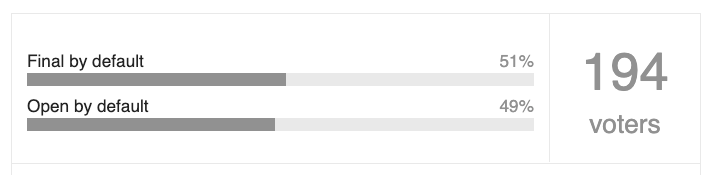

Kratka mentalna vežba: kada pišete kod koji se koristi od strane drugih ljudi (biblioteka, modul...), da li vodite računa da je `fool-proof`? Da li _ograničavate_ da bi zaštitili od budalastog korišćenja, ili _otvarate_ da bi pružili više?

<!--more-->

Izdvajam ovde odluku dizajnera Kotlina da sve klase po default-u budu `final`. Daleko smo od trivijalnosti, reč je o dizajnu (tada novog) programskog jezika. Zastanite za trenutak, stavite se u njihove cipele: šta bi odlučili?

[Sažetak njihovih odluka](https://discuss.kotlinlang.org/t/a-bit-about-picking-defaults/1418) vredi pročitati. Postoje valjani razlozi za i protiv te odluke. Postavljena je i javna anketa, a rezultat je zanimljiv:

Nit' vamo, nit' tamo. Negde u diskusijama mi je zapalo za oko sledeće rezonovanje, kritika odluke Kotlinovih tvoraca:

> Again, you’re speaking from the point of view of, "we need to stop idiots." I am speaking from the point of view, "we need to help people."

Ovo je probudilo izvesnu emociju kroz podsećanje na to kako i sam dizajniram open-source biblioteke: vodeći računa o tome da korisnik ima više izbora i bude omogućen da uradi što više na način koji njemu odgovara. To ponekad gotovo neminovno vodi do slučajeva budalaste upotrebe koda - često i od mene samog.

Međutim, odlazeći tako dalje u razmišljanjima, dosta kasnije, počeo sam da se pitam jesu ili ova dva odgovora zaista ortogonalna?

Sada mislim da nisu - pripadaju različitim kontekstima.

## Kod za poneti

Ne postoji deterministički način merenja odluka kada je u pitanju razvoj softvera. Na kraju presuđuje _intuicija_, zasnovana na _iskustvu_. To je u redu, jer razvoj softvera [nije nauka](https://oblac.rs/pisanje-programa-umetnost-ili-nauka/).

Ništa više, ništa manje.

Zato: ne postoji dobar kod. Ali postoji _bolji_ kod. I kao kod svake veštine, na njemu se mora _neprestano_ raditi. To je ono što nosim iz ove mentalne vežbe.
