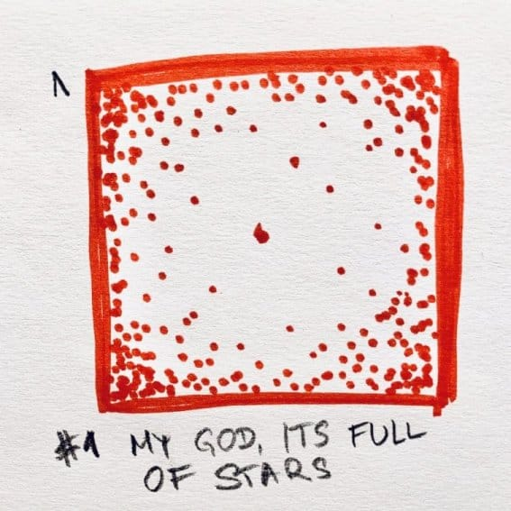
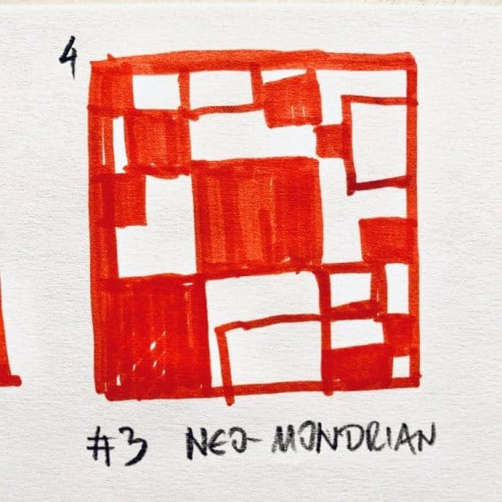
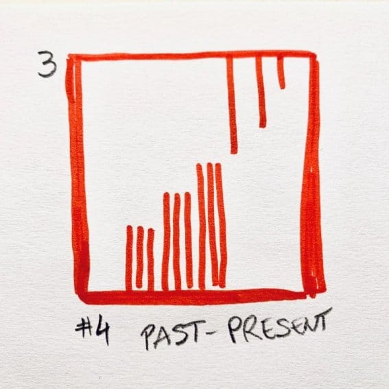

Bez puno razmišljanja, reci šta ovo predstavlja: `[]`? Kakve veze ima smajli `:)` sa programiranjem? A i sa AI? Konačno, zašto _pogrešno_ doživljavamo programiranje kao umetnost.

<!--more-->
Dobrodošli u apstrakciju.

## Nivoi apstrakcije

Ono što nas čini ljudima je (i) sposobnost razmišljanja o apstraktnim pojmovima. Mnoge vrste imaju moć rasuđivanja. Ipak, samo čovekov um može da obuhvati razmišljanjem sve što _poželi_: stvari koje nismo videli/osetili/doživeli, ili pak neke potpuno imaginarne (ko je rekao 'jednorog'?).

Postoje nivoi apstrakcije, kako se ona usložnjava; podela ima raznih, ovo je tek jedna od njih. Prvi nivo apstrakcije je razmišljanje o onome što je prisutno, dostupno čulima. Praktično da i nema apstrakcije. Drugi nivo apstrakcije je razmišljanje o onome što nije dostupno čulima, ali je poznato. Samo su još šimpanze na ovom nivou apstrakcije. Drugi nivo podrazumeva analizu onoga što je dostupno, detalje, kategorije. Na trećem nivou apstrakcije predmet mišljenja može biti nešto što nikada nismo iskusili čulima, pa čak i predmet imaginacije. Ipak, sve imaginarno se može nekako opisati pomoću poznatih, materijalnih objekata/pojmova. Četvrti nivo apstrakcije je meta razmišljanje - rezonovanje o samoj apstrakciji. Razmišljanja ovde nemaju neposrednu vezu sa stvarnim svetom. Matematičko razmišljanje je takvo, na primer.

## AI

Ovako sagledana evolucija čovekovog mozga donosi jasan odgovor na to šta nije veštačka inteligencija, bar danas. Mi, ljudi, nismo primenili nov oblik razmišljanja na postojeće predmete, već smo usložnili nivo apstrakcije. Dakle, uvećavamo sposobnost apstrakcije, a ne misaonog mehanizma. Zato AI nije I. Ono što doživljavamo danas je samo uvećanje 'misaonih' procesa, koji često nadmašuju ljudske. Ali ne i uvećanje nivoa apstrakcije.

Zato je, u suštini, nevažno to što imamo tehnologiju koja toliko nadmoćno igra šah ili Go, ili tako tačno prepoznaje naša lica. Sve je to zaparavo niski nivo apstrakcije, algoritam koji mašinskim učenjem kao čulom dolazi do saznanja o onome čime se bavi.

Ključno za razvoj bića je, dakle, usložnjavanje misaonog procesa.

## Stvaranje umetnosti

Uzmi papir i probaj da ilustruješ... koncept bloga.

Apstrakcija je, možda, jedna od najvažnijih koncepta umetnosti. Ilustracije, na primer, mogu da naročito koriste apstrakciju za iskazivanje svoje priče. Susrećemo se neprestano (i sve više) s takvim apstrakcijama: svaka ikona na ovom vašem ekranu je apstraktni simbol koji ima značenje.

Takva apstrakcija, koja prenosi značenje ili poruku, postoji radi svoje svrhe. Kreativnost apstrakcija se ogleda u ideji da se _izbaci_ sve što nije esencijalno za postizanje tog cilja. Nekada izbacimo mnogo toga, kao u primeru sa ikonama, gde par piksela mogu označavati polje u listi zadataka, ili trougao nekakvo dugme za puštanje sadržaja. U drugim slučajevima se može oduzeti samo malo, jer je neophodno preneti više informacija. Ne postoji savršena formula, svaki slučaj je zaseban.

## Razvoj softvera, konačno

Uzmi sada prethodni deo teksta i zameni reči "ilustrovanje" i "simbol" sa "programiranje" i "program".

Softverski razvoj je upravo to: apstrakcija koja prenosi informaciju. Prilikom razvoja, oduzimamo sve što nije važno za postizanje cilja. Programski jezici su apstrakcija komunikacije i računarskih procesa. Korišćenje programskih jezika je opet nova apstrakcija. Koncepti kako radi neki framework - dodatna apstrakcija.

Nije ni čudo što se 1) teško razumemo kroz kod i 2) što ima toliko različitih softverskih rešenja i koncepata!

Zato i naglašavamo da je dobar kod onaj koji se _razume_. Kao što dobra ilustracija uspeva da prenese svoju priču, tako i dobar kod uspeva da prenese svoju _nameru_. Nekada uspemo u tome. Nekada su koncepti očigledni nekome, a drugi ih shvati  drugačije. Dešava mi se da na nekakvoj obuci za Kotlin koju povremeno držim, ponekad i oni najiskusniji, arhitekte kojekakvih poslovnih sistema sa 15+ godina iskustava, neke osnovne koncepte jezika jednostavno razumeju drugačije. Uhvatio sam sebe u jednom takvom trenutku: "Zanimljivo da vidiš tako! Meni ovaj kod izgleda drugačije...". Ovo je rečenica koju možemo da zamislimo kako dvoje izgovara u [MoMA](https://www.moma.org)-i ispred nekakve instalacije, a ne ispred monitora sa trivijalnim Kotlin kodom.

Sagledavanjem svega ovoga, nekako, pronalazim mir u haosu. Dugo sam razmišljao o "čarobnoj formuli" koja poizvodi dobar kod i pretvara olovo u zlato. Danas nemam više te iluzije: razvoj softvera nije egzaktna nauka. Svakom problemu se prilazi na uvek novi način; mi vremenom samo izoštravamo našu olovku (softverske veštine) i naučimo da koristimo gumicu (refaktoring). I što se više nas bavi razvojem, to će biti više kojekakvih rešenja, biblioteka, koncepata...

## Usavršavanje programiranja

Jasno je zašto programiranje podseća na umetnost; apstrakcija je ključni (osnovni?) koncept programiranja. Ipak, razvoj tu negde i staje, dok umetnost ide i (daleko) dalje.

Imajući u vidu sve izrečeno, neko bi mogao da dođe do sledećeg zaključka:

> Dobar programer ima veću moć apstrakcije.

Zanimljivo, zar ne!? Ova jednostavna premisa menja toliko stvari koje su danas uvrežene. Mi pogrešno učimo našu decu algoritamskom programiranju, umesto da im razvijamo apstrakciju. Čitanjem knjiga - bilo kojih - uvećavamo razumevanje apstrakcije; da podsetim, programiranje je većim delom _čitanje_ koda. Na intervjuima za posao dajemo sadističke algoritamske probleme koji ničemu ne služe. Trošimo vreme na frejmworke umesto na koncepte. I tako dalje.

Otkrio sam zanimljiv način na koji možemo da uvećamo sposobnost razmišljanja na apstraktan način: u pitanju je _ilustrovanje_. Nije bitno koliko dobro crtaš. Uzmi olovku i probaj da predstaviš složene koncepte iz života koji te okružuje. **Nacrtaj svoj kod.**

Idemo dalje: postoji [WARTEGG](http://www.aspghandwriting.org/main/docs/Wartegg-Test-Form.pdf) test ličnosti. Verovatno sam jedini na svetu koji je pogrešno protumačio uputstvo (tja :) i shvatio ga kao izazov, a ne kao test: umesto da crtam šta god, ograničio sam sebe da koristim samo zadati simbol. Ispostavilo se kao dobra vežba: ponavljanjem datog simbola na razne načine nacrtaj nešto i daj mu ime.

Za kraj, pitanje o kojem mozgam: može li se apstrakcija, naročito softverskog koda, nekako izmeriti?

