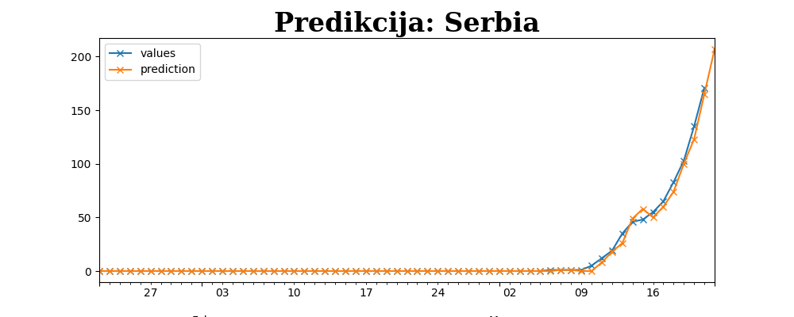

Otvoreni podaci. Čemu sve to. Sova.

<!--more-->

Umesto da [kukam](https://oblac.rs/virus-koji-je-pojeo-otvorene-podatke/), trebalo bi da bar pokušam da podelim ideju o značaju otvorenih podataka. Kako ispada, najmanje je reč o podacima.

## ŠBBKBB

Otvoreni podaci su, prvo i osnovno, tkzv. izvor istine (_source of truth_). Nema nedoumice u očitavanju stanja, nema različitih izvora. To sada nije slučaj: ne postoji zvanični sirovi izvor podataka. Takođe, ne postoji _jedan_ izvor: podaci koji su, recimo [ovde](https://github.com/CSSEGISandData/COVID-19) se donekle razlikuju od toga šta se kod nas emituje. Postojanje jednog, nedvosmislenog, bogatog, sirovog i ispravnog izvora je _neophodnost_. Zanimljivo kako ova jednostavna premisa uključuje puno tehnoloških izazova: obezbeđivanje _istinitih_ podataka zahteva infrastrukturu koju može pružiti samo onaj koji ima iskrenu nameru u tome.

Otvoreni podaci su transparentnost namera i delovanja. Deljenjem onoga što znamo efikasno saopštavamo sve informacije koje imamo. Ne treba nam treće lice da ih prepričava i nestručno tumači putem sredstava za javno informisanje. Pravovremena informacija stanja je tu i da upozori i nagovesti moguće izazove, dozvoli efikasniju upotrebu resursa.

Otvoreni podaci su dostupni za analizu. Ne samo za vizuelizaciju podataka: ona je, svakako, potrebna. Vizuelizacija nudi jednostavan način poređenja i praćenja - jako bitno da usvojimo - _prošlosti_. Nije lako napraviti vrednu vizuelizaciju; ono što vidim na zvaničnim sajtovima tne bih nazvao korisnim (Italija, na primer, to [radi drugačije](http://opendatadpc.maps.arcgis.com/apps/opsdashboard/index.html#/b0c68bce2cce478eaac82fe38d4138b1)). Kako bilo, važniji aspekt je analiza podataka koja se bavim onime što dolazi. Pravilne predikcije mogu da daju odgovor na pitanje kako postupamo i kakvog efekta imaju učinjeni postupci. Otvoreni podaci konačno dozvoljavaju stručnim licima da se bave onim što najbolje znaju i ponude vredne uvide u stanje stvari.

## Predikcija

Da ne bi sve ostalo na rečima (gledam da to izbegavam) ilustrovao sam jedan takav slučaj korišćenja otvorenih podataka. Napisao sam [kratak program](https://github.com/igr/c19rs) koji koristi pomenuti [nezvanični izvor](https://github.com/CSSEGISandData/COVID-19) otvorenih podataka. Program se bavi predikcijom broja zaraženih. Propustivši ga kroz dostupne podatke dobijam ovakav grafik:

**NAPOMENA**: analiza radi na NEZVANIČNOM izvoru podataka i napravljena je od stane NESTRUČNOG lica.

Predikcija dosta verno prati dešavanja. Za analizu se koristi Kalmanov filtar. Reč je o poznatom načinu kako se radi predikcija trenda. Ne znam mnogo o svemu tome: igrao sam se s ovime ranije za drugačije primere (vrednosti kripto valuta).

Kada bi ova predikcija koristila ispravne podatke, mogla bi da pruži precizniju sliku o bliskoj budućnosti. Ukoliko predviđanje nastavi da pobacuje (kao što je trenutno slučaj), to bi bio znak upozorenja, na primer.

Međutim, ovo je banalna analiza. Nedostaju podaci koji bi bili odvojeni po naseljenim mestima. Trebalo bi zatim uključiti korelaciju sa gustinom naseljenosti mesta u kojima se pojavljuju zaraze: kriva se sigurno ponaša drugačije na mestima gde je manja gustina stanovništva. A tu su korelacije sa ostalim otvorenim podacima - šta je sa podacima o saobraćuju? I konačno, sa demografskim podacima: starosne grupe takođe imaju udela u ovakvoj analizi. Itd.

Kalmanov filter radi na bliskom rastojanju - u ovom slučaju su to dani. Ne daje tačnu predikciju za duži period: takva analiza bi zahtevala dodatne proračune. Na primer - primećujem ugrubo logaritamsko ponašanje trenda (varijabla `LOGY` uključuje logiratmski graf). Na primer, Kalman kaže da sa trenutnim trendom dostižemo brojku od 1000+ tek druge nedelje aprila, logaritamska formula je sumornija (i verovatno tačnija) i predviđa kraj marta. Imamo li sve što je potrebno do tada?

Ponavljam: ovo je sve ilustracija kako bi se otvoreni podaci mogli koristiti - kada bi oni postojali. A sada zamislite šta bi neko ko se zaista razume u sve ovo mogao da napravi kada bi imao sve potrebne podatke!

## SOVA

Pomenuo sam da prava platforma za otvorene podatke, naročito ona koja se bavi podacima civilnog drušva, mora da odgovori na razne izazove. Osim izuzetne dostupnosti, neophodna je distribuirana mreža kojoj se može verovati.

Jedna od prethodnih nedaća, poplave, su takođe pokazale nespremnost sistema (ma šta ta reč značila) u vanrednim okolnostima. Nakon smirivanja situacije, Miloš Žikić i ja smo počeli da radimo na predlogu platforme koja bi radila u vanrednim okolnostima. Takva plaforma bi povezivala one koji mogu da pomognu sa onima kojima treba pomoć. Platforma bi, u suštini, pružala pravovreme otvorene podatke o stanju stvari; slično onome o čemu ovde pišem.

Nažalost, kada nedaća prođe, odnese i svako razumevanje treće strane o potrebi za istom. Kako bilo, nastavio sam da se bavim idejom sporta radi na svoju ruku, preimenovao projekat (iz Boup:) u SOVA (Sistem za Obaveštavanje u Vanrednim okolnostimA). Negde sam tako došao do upotrebe [IPFS](https://ipfs.io) klastera za skladištenje i objavu dokumenata; zanimljiva tehnologija.

Zamislite kada bi takva platforma postojala: jedna kojoj bi se moglo verovati, dostupna za različita scenarija vanrednih okolnosti; koja bi se hranila otvorenim podacima i pomagala efikasnijim delovanjem.

Tja.

## Sad stvarno dosta :)

Prestajem, obećavam; ovo se i ne razlikuje mnogo više od kukanja.
