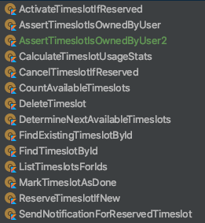

Program pišemo ili u anemičnim servisima ili u nakrcatim domenima. Nikako ne uspevam da se pomirim sa time, neprestano u potrazi za boljim pristupom.

<!--more-->

Anemični servisi su klase prepune 'biznis' metoda koje su, uglavnom, ne baš jasno imenom povezane sa modelima sa kojim rade. Klasa `BookService` sadrži metode za dodavanje knjiga, brisanje, pa gomilu _finder_ metoda za pronalaženje knjiga po ovom ili onom uslovu. Ovakve klase se ne koriste OO principima; sve se završava na ubrizgavanju referenci drugih instanci i ponekim aspektima. Nazivaju se anemičnim jer predstavljaju samo puki spisak, listing metoda koje su dostupne. Grupisanje je, ponavljam, labavo: koji servis treba da vrati knjigu koju je drug član pozajmio iz biblioteke: `MemberService`, `BookService` ili `BorrowingService`?

S druge strane spektra, nakrcati domeni prate drugačiji pristup: DDD. Nisam imao prilike da ga probam u živom projektu, ali sve do čega sam došao mi je bilo... prosto previše. Domenske klase iz DDD projekata koje sam proučavao su po pravilu glomazne i, važnije, rade više od jedne stvari. Sa time nikako ne uspevam da se pomirim. Da ne bude zabune, mnoge stvari u DDD imaju smisla. Jedan važniji (možda i zapostavljen) koncept je ograničavanje konteksta (_bounded context_); zatim upotreba agregator itd. DDD svakako dovodi u pitanje anemični model i nudi povratak u OO: biznis metode su sada na modelima, kao u svakom školskom primeru koji smo radili. No, one rade previše: i čitaju i menjaju i znaju da sadrže stanja.

## Jav(i)na opsesija imenicama

Jedna od premisa filma [Arrival](https://www.rottentomatoes.com/m/arrival_2016) je da jezik kojim se služimo oblikuje naše razmišljanje i poimanje sveta. Čini mi se da ovo posebno dolazi do izražaja kada je jezik sintaksno ograničen, kao što je to slučaj s programskim jezicima. U tom svetlu, Java nas, nažalost, mnoge stvari uči pogrešno.

Java programe zaposeda Mafija Imenica™ - spremna da isporuči odsečenu konjsku glavu sumnjivog koda među plahte tvog divnog programa koji se drznuo na drugačije. Pogledaj samo sve te klase... `DonRunner`, `SonnyExecutor`, `CorleoneFactory`, `BarziniParser`, `FredoEnabler`, `SicilianRepository`... imenica do imenice; klase koje imaju anemičnu metodu `execute()` ili sličnu. Da ne pominjem funkcionalne interfejse, čije postojanje samo naglašava nesposobnosti jezika da izađe iz stiska Mafije.

Problem sa imenicama je što one _ne_ izvršavaju posao. Posao se izvršava jedino kako i može: u metodama. Kao i u svakom govornom jeziku, akcije se opisuju glagolima. Zašto onda toliko opsesivno koristimo imenice (klase) da opišemo akcije (metode)?

## Nešto između

Hajde da se drznemo da zaigramo jednu igru, poznatu kao "nešto između" rešenje. Za početak, moramo da pobegnemo od Java Mafije Imenica™. Biram **Kotlin** jer je najbliži Java svetu i nema puno iznenađenja u njegovom razumevanju.

Šta su onda gradivne jedinice ovog pristupa? Glagoli. Metode. Tačnije: _funkcije_ (postoji razlika između ova dva pojma). Umesto da pravim klase - kataloge metoda, pisaću kod _samo_ u funkcijama. Klase su mahom zadužene za _stanja_ i tehničke stvari. I to je sve: imenice su `data` klase, glagoli su akcije su funkcije.

## Uradi ili učini. Nema PokušajServisa.

Da skiciram primerom. Treba da izbrojimo nekakve slobodne termine. Funkcija je: `() -> Long`. Može da se zove `countAvailableTimeslots`. Rezerviši termin ako je slobodan: `(TimeslotId) -> Unit`. Funkcija može da se zove: `reserveTimeslotIfNew`. Finderi su, na primer, funkcije: `(TimeslotId) -> Timeslot?`. Skapirali ste.

Ovo je bio lakši deo. Kompleksniji je kompozija ovih funkcija. Gde da ih pišemo? Kako ih povezujemo?

Kotlin je pristojan funkcionalni jezik: funkcija je građanin prvog reda, što znači da je i _tip_. Na primer, `(Int) -> String` je tip, na isti način kao što je i `String` tip, osim što je `String` ujedno i klasa (i ovde postoji razlika između ova dva pojma). Šta pa to znači? Pa, kao što se može implementirati interfejs, tako možemo da implementiramo i funkcijski tip.

Da, dobro ste pročitali: napravićemo Kotlin objekat koji implementira funkcijski tip. Gornji primeri postaju:

```kt
object CountAvailableTimeslots : () -> Long {
  override fun invoke(): Long {
    // implementacija
  }
}
object ReserveTimeslotIfNew : (TimeslotId) -> Unit {
  override fun invoke(timeslotId: TimeslotId) {
    // implementacija
  }
}
object FindTimeslotById : (TimeslotId) -> Timeslot? {
  override fun invoke(timeslotId: TimeslotId): Timeslot? {
    // implementacija
  }
}
```

Metod `invoke()` je samo način kako Kotlin ostvaruje implementaciju funkcijskih tipova. Ovaj metod se nigde ne koristi eksplicitno (iako to može). Pošto su funkcije Kotlin objekti, pozivaju se na sledeći način:

```kt
ReserveTimeslotIfNew(id)
FindTimeslotById(id)
```

Da rezimiram: funkciju implementiram kao objekat; svaki pišem u jednom fajlu. Svaka funkcija radi jednu i samo jednu stvar. Implementacije su kratke i jasne. Naziv funkcije (tj. objekta) je glagol i jasno označava šta radi. Ne brine me dužina imena, sve dok je jasna namera funkcije. Biznis sloj na ovaj način postaje spisak glagola - akcija, na primer:



Nema servisnih klasa. Nema bogatih domena. Nema paterna. Samo akcije. Modeli su najprostije `data class`.

### Fun-tastičan put popločan žutim ciglama

Pošto je implementacija funkcije klasa kao i svaka druga, dozvoljeno je koristiti sve sve što OOP nudi: nasleđivanje, enkapsuliranje zajedničnog koda itd. Na primer, može se napraviti testna verzija iste funkcije tako što nasledimo njenu implementaciju. Ili čak ne nasledimo - dovoljno je da delimo isti potpis funkcije, dakle, njen tip.

Dalje, implementacija funkcije može, kao i svaki klasa, da sadrži i druge metode pored `invoke`. Da ponovim ovu mozgo-zavrzlamu: implementacija funkcija može da ima svoje metode :) Na primer:

```kt
object DetermineNextTimeslots : (Int, DateTime) -> List<TimeslotAndDoctor> {
  override fun invoke(count: Int, from: DateTime): List<TimeslotAndDoctor> {
    // implementacija
  }
  val uptTo10 = { dateTime: DateTime -> DetermineNextTimeslots(10, dateTime) }
}
```

Poziva se: `DetermineNextTimeslots.uptTo10(from)`. Ono što sam ovde uradio je, ni manje, ni više nego _currying_ funkcije. U Kotlinu ne postoji _currying_ ugrađen u sam jezik, na način kako je to u Skali ili Haskelu, pa je ovo jedan trik za to. Ništa nas ne sprečava da dodatne metode ne budu u vezi sa implementacijom funkcije, ali ne nalazim tome neku vrednost.

## Dobrodošli u Kontekst!

Okej, sada imam gomilu funkcija. Kako ih koristim?

Uobičajeni način bi izgledao nekako ovako:
```kt
val res1 = foo(arg)
val res2 = bar(res1)
return res2
```

Ovim nismo daleko odmakli. Hajde da probamo nešto drugačije: da zaboravimo na pozivanje funkcija koje su nekakav blok koda kojem se prosleđuje argument i koji vraća rezultat.

Umesto toga, zamislimo da funkcije zapravo _primenjujemo na ulaz_. `foo(arg)` je funkcija `(arg) -> res1`: primenjuje se na ulaz i, pažnja, _menja_ ga u izlazni rezultat. Funkcija je, dakle, _transformacija_ ulaza u izlaz. Drugim rečima: funkcija je `A -> B`, a ne `foo(A): B` - prvo je definicija, drugo je samo sintaksa.

Bla, truć; u pitanju je samo semantika? Pratite me još malo.

Da bi izveli rečeno, potreban nam je i programski okvir koji naglašava koncept tranformacije. Nazvaćemo ovaj okvir _kontekstom_:

```kt
class Ctx<T>(val value: T) {
  companion object {
    fun <A> of(value: A): Ctx<A> {
      return Ctx(value)
    }
  }
  fun <OUT> map(fn: (T) -> OUT): Ctx<OUT> {
    return of(fn.invoke(this.value))
  }
  inline fun use(consumer: (T) -> Unit) {
    consumer(this.value)
  }
}
```

Kontekst je u izvedbi jednostavna klasa koja čuva vrednost, dozvoljava njene transformacije kroz `map()` i dalju upotrebu vrednosti kroz `use()`. Ništa više, ništa manje.

Kontekst je konceptualno mnogo više - igralište za kompoziju funkcija. Funkcije se više **ne** pozivaju eksplicitno. Sada ih samo dostavljamo kontekstu, a on ih za nas poziva po svom nahođenju:

```kt
Ctx.of(arg)
   .map(foo)
   .map(bar)
   .map{ res2.id }
   .use{ println(it) }
```

Napomena: ovde je prikazan minimalni kontekst; obično bude sadržajniji.

## Odjeci konteksta

Smisao konteksta je i u _odlaganju_ trenutka kada se funkcija poziva - tj. u enkapsulaciji pozivanja funkcije. Sada je kontekst taj koji odlučuju kada i na koji način se to dešava. Ovo ima dalekosežne posledice.

Greške (izuzeci) su uobičajeni primer korišćenja konteksta: nema potrebe za ručnim obradama greške pri svakom pozivu. Izuzetak se može uhvatiti bilo kada i čuvati u kontekstu do samog kraja. Method `use()` u slučaju greške ne radi ništa, a neki metod `onError()` bi mogao da ih obradi. Nebitno je u kom trenutku nastaje greška - da li pri pozivu `foo`, `bar` ili bilo koje druge funkcije u nizu poziva. Tok poziva se jednostavno prekida, o čemu odlučuje kontekst, a ne programer.

Kontekst po potrebi može da nosi i dodatne osobine. Na primer, može da upravlja transakcijama nad bazom. Pre pozivanja prve funkcije se otvara transakcija, a pre prvog `use()` se ona zatvara. Želiš da ubacis logovanje poziva? Par linija koda u kontekstu.

Kontekst čini aspekte suvišnim. Aspekti su veštački (jer je bajtkod) alat uveden u programiranje usled nedostataka u programskom jeziku. Umesto da rešavamo problem, koristimo zaobilaznicu.

Ako pažljivo zagledaš primere, uočićeš da sve funkcije imaju _jedan_ argument. Ovaj princip može da bude potpuno stran. Ali, ako usvojimo funkcije kao transformaciju ulaza, on sasvim ima smisla. Na isti način kako funkcije imaju jedan rezultat, tako mogu imati jedan ulaz. Ovaj princip te primorava da stvaraš odgovarajuće smislene tipova za ulaz, koje smo pre toga tako olako zanemarivali.

Kontekst ujedno ograničava kojim redosledom se funkcije mogu pozivati. Trenutni tip vrednosti u kontekstu određuje skup funkcija koje mogu biti pozvane nad njim. Sintaksno je nemoguće uraditi glupost i pozvati dve funkcije koje nemaju veze jedna sa drugom.

I konačno: ne moraju se samo vrednosti čuvati u kontekstu. Kontekst može da čuva i funkciju, kao svaku drugu vrednost. Time se mogu spajati i preklapati konteksti, ali o tome drugom prilikom.

## Čekaj, pa ovo je...

Da, ovo nije ništa novo - prodajem ti mačku u džaku, možda živu, a možda i ne. Gotovo sigurno si već koristio  `Optional`, ili `CompletableFuture`, ili... `List`. Sve su ovo konteksti o kojima pričamo.

Ovo je zapravo okrnjeni funkcionalni način programiranja. Zašto okrnjeni? Jer ne polazimo od teorije kategorija i po njoj modeliramo kontekste i pravila, već smo do svega došli pragmatičnim putem i zaobišli neke strože ivice teorije: koristimo ono što nam odgovara, u ovom trenutku.

Naš kontekst gore nije ništa drugo do implementacija _Functor_-a, otuda i ime metode `map`, tradiocionalno korišćene za ovu transformaciju. Nažalost, Kotlin ne podržava `trait`-ove, no to ne umanjuje ono što njime može izvesti. Primera radi, u Scali se `Functor` može definisati ovako:

```scala
trait Functor[F[_]] {
  def map[A, B](fa: F[A])(f: A => B): F[B]
}
```

te se onda neki naš kontekst praviti nad njime (i ostalim transformacijama).

To ne znači da moraš da implementiraš _sve_ transformacije koje postoje (aplikitiv, monad...); slobodan si da se poslužiš onima koje su ti potrebni. Savet bi bio da kreneš od jednostavnog konteksta, te ga usložnjavaš po potrebi.

## A Java? A Java?

Java, nažalost, neće nikada biti oslobođena Mafije Imenica™. Način kako su uvedeni delići funkcionalnih principa govori o tome da Java zauvek ostaje zatvorena. Zapravo, najbolji deo Jave je JVM, i ako tako posmatramo stvari, sve je jedno kojim se jezikom služimo, zar ne?

Hajdemo da onda sanjamo o boljim i drugačijim konceptima, umesto da t(a/i)pkamo u Javi.

