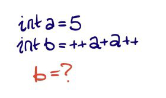
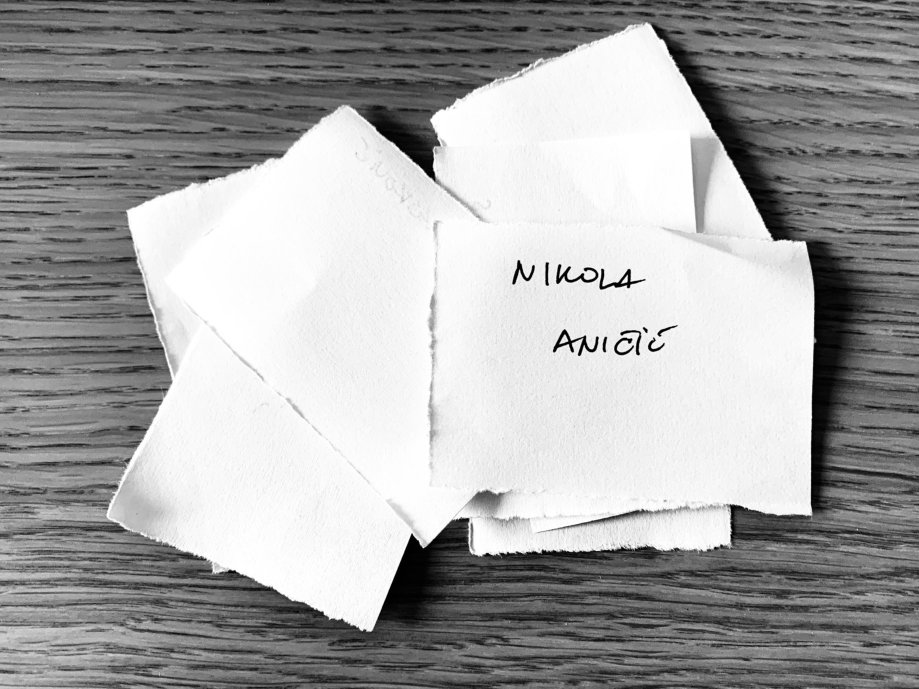

Na prvi pogled, pitalica koju sam nedavno postavio je lukava, ali ne toliko teška.
<!--more-->
Da podsetim, zadatak je bio:



Na kraju krajeva, dosta je iskucati kod i pokrenuti ga da bi dobili rezultat.

## Rešenje

Kako to često biva sa stvarima koje radim, nisu ono što se vidi na prvi pogled. Tako je i sa ovim zadatkom. Rešenje je sledeće:

> Vrednost `b` je ili `12` ili `13`.

Hajdemo po redu.

## Java, C#...

U jezicima kao što je Java, C# i sl. ponašanje pre i post inkrementacije/dekrementacije (u daljem tekstu: _inc/dec_) je _potpuno_ definisano. Ovde su od važnosti sledeća pravila:

+ Vrednost postfix inc/dec izraza je vrednost operanda **pre** pre inc/dec operacije.
+ Vrednost prefix inc/dec izraza je vrednost operanda **nakon** inc/dec operacije.
+ RHS strana (desna strana izraza) se potpuno izračunava pre nego što se dodeli LHS.

Tako, na primer, izraz:

```java
x = x++;
```

je identičan sledećem:

```java
temp = x;
x = x + 1;
x = temp;
```

Primenjeno na zadatak:

1. `a` se inkrementira (prefix inkrementacija) i postaje `6`.
1. 'pamti' se vrednost `a` za kasniju postfix inkrementaciju.
1. izračunava se RHS izraz: `a + a = 6 + 6 = 12` i smešta u LHS.
1. `a` se uvećava krajnjom postfix inkrementacijom, koristeći zapamćenu vrednost, te postaje `7`.

Svi noviji jezici rade slično, te je odogovor `12` verovatniji.

## C, C++

Ovde stvari već nisu čiste: ne postoji definisano ponašanje, te rešenje zavisi od kompajlera i od verzije jezika.

C, C++14 (gcc 8.3) najčešće daju rešenje `13`. Postfix inkrementacija se ovde izvršava pre nego što se izračuna RHS. C++11 eksplicitno definiše ovo ponašanje: sve _value computation_ se dešavaju pre, i uvodi pojam sekvenci pre i posle; međutim, nisam dobijao drugačije rešenje.

C++17 dodatno pročišćava specifikaciju, te ovi kompajleri daju rezultat `12` uz izbacivanje upozorenja:

```plaintext
warning: multiple unsequenced modifications to 'a'
```

Sad, verovatno nešto grešim u vezi C++ verzija, te ih ne treba uzeti zdravo za gotovo. Opisani rezultati su oni koje sam mogao sam da sprovedem i uverim se u iste. Kako bilo, poenta je da rezultat zavisi od kompajlera i verzije jezika.

Zabavno, zar ne :)

## A nagrada?

Drago mi je što je bilo odziva na pitalicu, pa čak i onih kojima ne treba IntelliJ licenca. Da ne bih cepidlačio, svi odgovori su bili smisleni i slučajnim izborom je izvučena nagrada.




