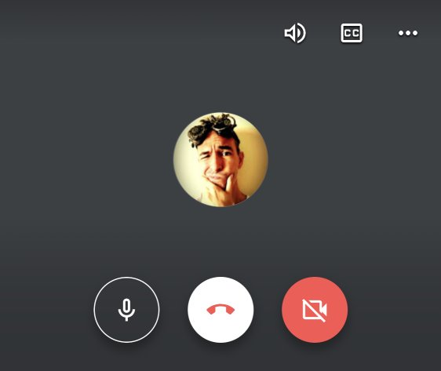
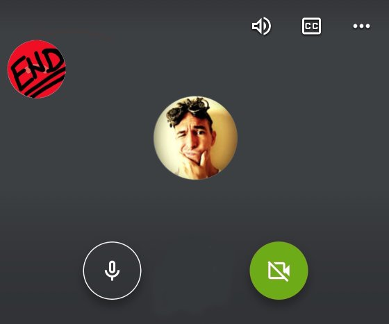

Po ko zna koji put greškom pritiskam dugme za završetak razgovora, umesto za isključenje kamere. Grmim i ljutim se na Gargamele, dok žurno nanovo uspostavljam vezu.

<!--more-->

Teško je zamisliti da Guglov UI tim ne ubraja znalce. Kapiram da postoje detaljne specifikacije dizajna, definicije upotrebe i pregršt saveta za primenu. Tu je i iskustvo sakupljano godinama. Uostalom, pričamo o firmi koja objave o novim Android emodžijima učini da zvuče važne gotovo kao da su uspešno prizemljene SpaceX rakete.

Iz nekog razloga, UI tim koji radi na _Meet_ aplikaciji je odlučio da poređa dugmiće na sledeći način:

{.center}

Ovakav UI mi nikako ne prija: uhvatim sebe da svaki put upotrebljavam dodatni kognitivni napor samo da bih kliknuo na odgovarajuće dugme; tačnije, da ne pritisnem dugme koje _ne_ treba.

Postajem rob ovakvog korisničkog interfejsa. Od mene se očekuje da se prilagodim serviranom. Izgovoru je teško protivurečiti: ko sam pa ja da kažem da Guglov dizajn nije OK?

`Meet` je samo ilustracija. Slično doživljavam i u drugim aplikacijama. Github, Slack, Gmail... sve što iole više koristim, brže dođem do UI zidova o koje se odbija moj UX. Nije do mene - ne smatram moje korišćenje posebnim, već učestalim.

## Adaptivni UI

UI koji doživljavamo danas je, kako ga lakonski nazivam: **krut** UI. Da ne bude zabune: UX i dalje može biti dobar (ili loš), no svi UI su i dalje uglavnom nepromenljivi, fiksni.

Gajim uverenje da se tehnologija treba prilagoditi čoveku, a ne obratno. UI je tu, možda, jedan od najvažnijih medijuma komunikacije čoveka sa mašinom. Bez obzira što se danas mnogo zna o tome kako čovek percipira UI zarad dobrog UX-a; i dalje su iskustva mahom kruta. Ponegde postoje mogućnosti uključenja-isključenja delova interfejsa, promena tipografije i boja... i tu negde se sve završava.

Rešenje "jedno za sve" naivno pretpostavlja da je ono i _dobro_ za sve. Ako nešto znamo, to je da su ljudi različiti. Ko onda ima toliko smelosti da tvrdi da njegov UI odgovara _svima_?

Razumem da iza svega stoje studije i analize; da verovatno ima smislenog razloga zašto je jedno dugme crveno sa belim, a drugo belo sa crvenim, ili kako god već. No svaka takva studija koja završi s jednim rešenjem, završava samo s _statističkom_ sredinom.

UI treba da postane **adaptivan**, po meri pojedinca. Fleksibilan, dinamičan, da dozvoli slobodne rasporede i svakakve promene: kako korisniku već odgovara. Briga me ako je dugme potpuno izmešteno sa strane i potpuno drugačijeg oblika, ako više nikada ne budem pravio grešku. Makar bilo i najružnije dugme ikada. Zar nije to smisao UX-a, na kraju krajeva?

{.center}

UX ne treba da bude proizvod UI. UX treba da bude cilj, a UI samo implementacija. Estetika je važna, ali je tek jedan sastojak iskustva. Plašim se da to danas nije slučaj.

Adaptivne interfejse sigurno nije lako napraviti. Kao i sa svime, tako bi bilo samo u početku. Ako bi počeli da se bavimo drugačijim pristupima, i dizajnirali aplikaciju drugačijim redosledom, stvari bi se promenile.

Sloboda za UI!
