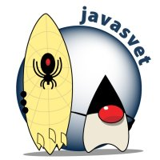

Bio jednom jedan JavaSvet. A onda Heapspace.

Obećavam da neću dramiti. Ako i ne održim obećanje, briga me; 16 godina ostavlja traga na duši. Došlo je vreme da prođem sećanja koja su preostala. Nekada treba stati i pustiti.

Ovako je to bilo.

<!--more-->

Psihoterapeut mi je jednom razotkrio da je verovatan uzrok mojoj neprestanoj potrebi da _radim zajedno_ to što nisam imao priliku da tako nešto proživim u okviru porodice. Otuda pokušaji školskih novina, kompjuterske sekcije, sajta za kodere... Šta znam, rekao bih da tu ima više od toga. Kako bilo, ne čudi mnogo to što negde **2004.** godine kontaktiram ICTT - verovatno prvi IT biznis inkubator na ovim prostorima - sa željom da osnujem zajednicu Java programera. ICTT je bio zvanični predstavnik Sun Microsystems u našoj državi (koja god tada bila). Brzo sam dobio potvrdan odgovor, kao i kontakt momka koji im je pisao negde u isto vreme sa sličnim predlogom.

ICTT se nalazio u poslovnom tornju Genex kula. Otišao sam na prvi ugovoreni sastanak - i to je bilo to. Upoznao sam [Nemanju Kostića](https://www.linkedin.com/in/nemanjakostic/), pomenutog momka sa istom idejom, koju je ICTT izgleda razumeo - te ne samo što nam je ustupio server za sajt, već je dozvolio da koristimo njihove prostorije za prve sastanke. Usledilo je ono što je i nastavilo da se ponavlja: napravio sam prvi sajt JavaSvet-a.

Sajt je kodiran u Javi (naravno), uz pomoć Nemanje, Milana Trajkovića i, na serverima, Marka Marinovića; zamalo da bude u J2EE tehnologijama koje su tada bile u punom jeku, iako falične. Za logo sam dugo premišljao; želeo sam da _Duke_ (maskota Jave) bude prikazan na kul način (tada još nije bilo hipstera), te da više pokazuje duh ('vajb' takođe nije postojao) zajednice, koja nije nužno štreberska (gikovi su ipak postojali). Pronašao sam Djuka surfera i uz male modifikacije napravio logo:

{.center}

Da je ovo film, Truman bi upravo pozdravio komšije i poželeo im dobro jutro.

## JavaSvet v1

JavaSvet je zvanično nastao **19. maja 2004.** godine. Već prva verzija sajta donosi ono što je (p)ostao usud organizacije: ukazivanje da radimo stvari _zajedno_, da delimo znanje, učimo, razmenjujemo iskustva, bla truć, jer, hej, ne treba da u ovome budemo sami. Otuda je i nastala krilatica JavaSveta:

> otvorena zajednica, za otvorene ljude.

Mogu da posvedočim da je zajednica bila tu za svakoga ko je delio iste vrednosti. A da li smo mi bili dovoljno otvoreni, na nekome drugome je da zaključi.

{.center}

JavaSvet je postao prva zvanična JUG - Java User Group - na ovim prostorima. Ako mislite da je to bilo lako, varate se: nismo postojali ucrtani ni u jednoj mapi, te je potrajalo objasniti Sun-u da zaista postojimo. Na kraju, bilo je lepo videti JavaSvet upisan u listu svih JUG-ova pod imenom naše zemlje. Novembra iste godine se oformila i JUG-NS iz Novog Sada, koja je bila pohvalno aktivna jedno vreme. Kasnije se spisku priključila i [NišJUG](https://nisjug.org) - koja, verovali ili ne, još uvek postoji i aktivno radi. Svaka čast [Draženu Nikoliću](www.linkedin.com/in/drazennis/) i prijateljima iz Niš; prepoznajem sav njihov trud - hvala vam što ste tu i na uvek lepoj saradnji. Da je ovo film, zajedno bi leteli iznad kukavičjeg gnezda.

Podjednako nelako je bilo registrovati udruženje građana tih godina. **14. decembra 2004.** to i zvanično postajemo posle puno hladnih dana provedenih na šalterima. Pri tome smo uspeli da rešimo i birokratski _dead lock_: kada jedan papir zahteva postojanje drugog, koji ne može da se izda bez prvog. Bar je finalizacija bila zanimljiva; proceduralno potpisivanje u SIV-u, u jednoj od onih lepih, prostranih kancelarija.

Oduvek sam smatrao da sajt treba da bude ogledalo tehnološke organizacije. Vrlo brzo smo imali puno, baš puno toga:

+ Aktivne forume na različite programerske teme. Pitali smo i odgovarali Javu, arhitekturu, tehnologije, open-source; a nismo kačili slike mačaka i srećnih timova. Zanimljivo je vratiti se toliko godina i otkriti da čoveka muče problemi slične prirode - u mom slučaju je to arhitektura kodom, te se na forumu pitam da li je bolje `Televizor.uključiSe()` ili `TelevizorServis.uključiTelevizor(Televizor tv)`. Koliko tek godina treba da prođe da se dođe do odgovora :) Tu, na forumu, se sakupilo nekih 700 tema i 3500 odgovora.
+ Katalog Jave u SCG: spisak partnera, načini dobijanja zvaničnih sertifikata, lista IT firmi koje rade Javu (ne mnogo), pregled fakulteta i škola koje uče Javu (stidljivo), zatim: mogućnosti hostovanje Java aplikacija lokalno (nikakve), kao i saradnje sa lokalnim časopisima i magazinima (skoro nikakva). Ideja je bila da pospešimo prisustvo Jave ukazivanjem kako stvari stoje, izdvojimo one koji nešto rade po tom pitanju i damo predloge ili konkretnu pomoć da se stvari unaprede.
+ Gomila tekstova na Java teme, svojevrsna baza znanja: od spiska paterna, prikaza knjiga, tehnologija; sve do manjih primera i konkretnih rešenja problema.
+ Agregator svakakvih vesti iz sveta koje se tiču Jave.
+ Katalog domaćih open-source rešenja, u bilo kojoj tehnologiji.
+ Besplatna berza IT poslova - jednostavno i pregledno, bez ikakvog ulepšavanja.
+ Rekurzivni pozivi na saradnju, jer... učiti zajedno je važno, zar ne?

Sajt je tek jedna manifestacija organizacije. Više pažnje i truda smo poklanjali svakoj _offline_ interakciji - od tada, pa, kako se pokazalo, zauvek nadalje. Suština JUG, pa i JavaSveta su okupljanja uživo i zajedničke akcije. A toga nije manjkalo.

{.center}

Jedna od prvih većih akcija je bila "Topla i spržena Java" - oduvek sam imao dara za dramatično naslovljavanje dostojno holivudskih filmova B produkcije. U pitanju je bila kolekcija Java biblioteka i srodnih besplatnih i open-source programerskih alata, na 4 CDa ili 1 DVD. Tih godina Interneta nije bilo na pretek, pa je ova kolekcija štedela vreme potrebno za preuzimanje. Koštala je svega 260 dindži, dovoljno da pokrije troškove materijala (koji su nekako uvek ispadali veći nego planirani). Nemanja i ja smo poslali nekih stotinjak DVDova širom tadašnje države.

Ah, da; krajem decembra 2004. sam napravio i prve brendirane majice:

{.center}

Ako sam nešto naučio za sve ove godine, to je priprema materijala za štampu. Vrlo programerska stvar.

Zanimljiva su ta prva okupljanja JavaSvet-a. Na svojevrstan način oslikavaju vreme koje smo živeli, kao i naša stremljenja koja su (na žalost ili na sreću) ostala nepromenjena. Uočavam i formiranje obrasca koji je nastavio da se ponavlja: opstanak organizacije je zavisio od vanrednog entuzijazma pojedinaca. Nikada nismo uspeli da dostignemo cilj - bar ne onaj kojem sam stremio u glavi, ali je vrednost koju su ti pojedinci ulili nazad bila dovoljna da sve potraje toliko dugo. Zahvalan sam prilici da prosto budem tu, među svima, dok se sve dešavalo.

Da je ovo film, bili bi zajedno deo kluba mrtvih pesnika.

Prvo okupljanje ('meetup' nije postojao) je bilo **14. avgusta 2004.** u Geneksu. Započeo sam time šta je ideja JavaSveta; priča koju sam sizifovski nastavio da kotrljam uzbrdo svih narednih godina, doteran do ivice samoispitvanjem smisla svega. ICTT se predstavio sa fokusom da je Java nepokrivena tržišna niša, što govori o tome koliko tehnologija još nije doprela do lokalnog poslovanja. Nemanja je završio prikazom vruće teme tih dana, aspektnog programiranja (koja je kasnije razgalila i profesore na ETFu, jer pojma nisu imali da tako nešto postoji).

{.center}

Naredna okupljanja nisu bila česta; čekalo se i po par meseci na sledeće. Prvi predavači su neki od pionira u Java tehnologijama na ovim prostorima: [Dejan Krsmanović](https://www.linkedin.com/in/dejankrsmanovic76/), [Mateja Opačić](https://www.linkedin.com/in/mateja-opacic-3a69755/), [Predrag Spasojević](www.linkedin.com/in/predrag-spasojevic-17132b1/)... Teme su bile solidne, a predavanja posećena.

A onda je došlo proleće.

Godinu dana od nastanka JavaSveta, **19. maja 2005** imali smo prilike da ugostimo tvorce Spring frameworka (Boot nije bio ni u petogodišnjem planu), uz pomoć firme S4HC. Predavanje je zaslužilo da se organizuje u Hajatu; trajalo je 3 sata, a slušalo ga je nešto više od 150 prisutnih. Kada ovako napišem, zvuči lako. To nipošto nije bio slučaj: niti je bilo jednostavno, a ni jeftino po mene. No, dovesti dvojac iz Springa je bio ekvivalent Kojotu koji je konačno uhvatio Pticu Trkačicu: šou se mora održati. I bi ga. Volim prepričavati trivijalnu anegdotu: najavljivanje da u Beogradu postoji Silikonska dolina, te odlazak u nju sa zbunjenim predavačima.

{.center}

Trend se nastavio: **11. novembra 2006.** gost je bio Jonas Boner, ovaj put zahvaljujući firmama YoungCulture i Attribute. Istini za volju, predavanje je bilo samo reklama za njihove proizvode, no bilo je svakako vredno ugostiti svetski prepoznatog stručnjaka. I odvesti ga veče pre na roštilj, jer, domaćini smo prvo.

Deljenje sadržaja i volonterski rad je od prvog dana bio uvršten u DNK organizacije. Počeli smo na Mašinskom fakultetu, novembra 2004., sa predavanjem za koje nismo znali da li će biti održano do poslednjeg trenutka. To je dovelo do slabije posećenosti i - spavanja za vreme predavanja :) U jednom trenutku, Nemanja je počeo da crta mačku na tabli. Na moj uzneveren pogled je mirno objasnio da je to `Tomcat`, Java server. Studentima, izgleda, ponekada treba dodatni motiv da prate.

{.center}

Otišli smo i na najveću evropsku konferenciju: Javapolis (sadašnji Devoxx). Mene je ona fazno pomerila; za tih par dana sam upio toliko novih informacija i - važnije - dobio uvid u različita razmišljanja; dugo sam potom bio van sebe od uzbuđenja. Možda se baš tada pojavila klica ideje da slično organizujemo i u našem domu. Zabavno je da umalo nismo propustili konferenciju. U to vreme su nam trebale vize za putovanja, kao i potvrda zašto se putuje. Nemanja i ja smo poslali zahtev organizatorima konferencije, spremili sve papire, i, uvereni da neće biti problema, kupili karte i smeštaj. Ne lezi vraže, odbili su nas za vizu par dana pred put. Nemanja je u afektu poslao mejl ambasadoru, ne baš pristojnog tona. Za to vreme sam pokušavao da saznam gde je nastao bag (niko se nije javio na telefon kada je ambasador pozvao organizatore), pa je Javapolis hitno poslao tražene potvrde zvaničnim kanalima; taman na vreme da nam odobre vize. Osim... što je amabasador dodatno zahtevao pismeno izvinjenje za gnevni mejl. I eto nas u amabasadi Belgije: Nemanja predaje odštampano izvinjenje, a ja se trudim da ostanem miran i sačekam da prođu (opravdani, verovatno) kaprici ambasadora. Konačno, pasoši su nam bili ukrašeni još jednim pečatom, a mi se dobrano smrzli u autobusu bez grejanja do aerodroma u Budimpešti.

Da je ovo film, Ripley bi upravo ispalila vanzemaljca u svemir.

## JavaSvet v2

Problem JavaSveta je u ličnoj zamenici "mi" - ona je prečesto bila samo "ja". Ne zameram nikome; svi su se iskreno trudili koliko su mogli i dali mnogo nazad. No, okupljanja nisu mogla bez predavača, forumi bez odgovarača, a druženje bez drugara.

{.center}

Nisu to bile jedine vetrenjače. Domaći kompjuterski časopisi, na primer, nisu pridavali ni trunku pažnje onome što smo radili. Ilustracije radi, za Spring predavanje nisam dobio ni jedan odgovor od pozvanih domaćih magazina. U neverici, i već očaju, pisao sam Bug-u, časopisu suseda koga sam tada redovno čitao. Odogovorili su brzo i bili toliko ljubazni da pošalju i poklon. Potpuno odsustvo odgovora domaćih časopisa me je emotivno uzdrmalo. Potajno sam se nadao da će bar "Svet Kompjutera" (časopis sa kojim sam odrastao) spoznati delić vrednosti onoga što radimo; no to se nije desilo. Ni tada, niti ikada posle.

Bilo je i pokušaja zloupotrebe. Jedna firma je predložila da zajedno napravimo niz predavanja za studente, uključujući dvodnevnu radionicu. Iako to iziskuje vreme i puno truda, pristao sam. Međutim, firma je potražila i sve mejlove članova koje sam do tada sakupio - nekih hiljadu adresa. Bez razmišljanja sam odbio; firma je odmah otkazala dogovor. Studenti su ostali bez predavanja na teme koje u to vreme nisu imali gde da čuju. Potišten, učinio sam ružnu stvar: otkrio sam da sajt dotične firme pati od _SQL injection_-a, te obrisao puno toga iz njihove baze. Ne dičim se time.

I koštalo je, nije da nije. Neko je morao da plati posluženja, klopu, carinu na tupave DVDove kojih se Sun hteo rešiti, poklone, izrade majica. A koštalo je najviše onoga čega imamo najmanje - vremena.

**8. aprila 2007.** počinje novi ciklus organizacije, sa jednim aktivnim članom. Sajt dobija novi izgled, a ostalo manje-više ostaje nepromenjeno: borba kako doći do novih predavača, kvalitetnih tekstova i publike... Uočava se pomeraj u interesovanju: sve više smo se bavili temama koje nisu isključivo Java, agilnim metodologijama, webom. Počinjem da kuburim s prostorom, saradnja sa ICTT je splasnula, te je trebalo pronaći novi. U pomoć pristiže Kulturni centar REX, sa kojim smo imali lepu saradnju duže vreme.

A onda se dogodio **IT Dan**.

{.center}

Prva tehnološka konferencija posle tektonskih društvenih promena u našem društvu je bila "IT Dan". Za nju je zaslužan [Nikola Veber](https://www.linkedin.com/in/nikolaveber/), koji je tada radio u Sun-u, u inostranstvu. Javio se mejlom, podelio nameru da napravimo konferenciju i ponudio pomoć. Tek tako. Prva konferencija je trajala jedan dan, u nemogućem terminu pred Novu godinu, u hladnom REX-u. Bilo je skroz okej. Nikola se javio i sledeće godine, i na sličan način pomogao da se organizuje **IT Dan 2008**. Ovaj put je sve bilo ozbiljnije: konferencija je trajala dva i po dana krajem oktobara 2008., u NS i u BG. Slušali smo predavače iz inostranstva, kao i domaće predavače, među kojima izdvajam [Bogdana Kecmana](https://www.linkedin.com/in/bogdan/) i Predraga. IT Dan mi je naročito drag; sve je, nekako, bilo potaman: raznolike teme, sjajna posećenost, topla atmosfera i, konačno, onaj osećaj da se dogodilo nešto vredno.

To je ujedno bilo i poslednji IT Dan. Nikola više nije bio u prilici da dolazi; a, već uobičajeno, lokalna pomoć nije pristizala.

## JavaSvet dot rs

**Februara 2009.** počinje treći ciklus JavaSveta. Da je JavaSvet ptica, bio bi feniks sa dijagnostikovanim poremećajem sećanja. Da ne bude da samo kukam i naričem: problemi su ostali isti, a(li) i ja sam.

{.center}

Google Glass hakaton je bio prvi takav organizovan u ovom delu zemaljske kugle. Drugar [Saša Slavnić](https://www.linkedin.com/in/sasaslavnic/) se javio sa namerom da napravimo događaj. Preuzeo je na sebe kompletnu organizaciju, pa smo **4. juna 2014.** sproveli dvodnevni okršaj desetak timova. Nismo imali nagrade: takmičili smo se jer je bilo zabavno i da nešto naučimo. Zar treba više od toga?

{.center}

Tu negde počinje i saradnja sa CPN-om, koji je koristio sjajan prostor u centru Beograda. Nažalost, kako to već biva, taman kada smo se dogovorili o saradnji i započeli sa prvim predavanjima, prostor im je grubo oduzet. Promocija nauke je, izgleda, manje vredna od promocije staklenih đinđuva.

Maja 2011. smo ugostili Simona Bordeta u KC Gradu. Italijan, koji stoji iz Jetty projekta, je pričao o podešavanju JVM GC-a i o Web soketima. Kako je kasnije izjavio, bio je prijatno iznenađen odzivom na okupljanju i angažovanjem zajednice. Po njegovim rečima, bilo je iznad nivoa dotadašnjeg iskustava sa sličnim okupljanjima u rodnoj mu grudi.

Prostor je bila i ostala neprestana boljka JavaSveta, te je trebalo stalno iznova dovijati se na razne načine. Ah, koliko sam samo maštao o tome da imamo nekakav stalan prostor, gde će svako uvek moći da svrati, gde bi se neprestano bavili tehnologijama, društvom; organizovali okupljanja, izložbe, izazove, panele, hakatone, obuke... Sve to je tako lepo posloženo u mojoj glavi (još uvek); ali, pusti snovi. I tako se JavaSvet selio kao kakvo nomadsko pleme. Jedno vreme smo bili u Sava Centru (zahvaljujući firmi Pamet), gde smo u retro-nesvrstanom stilu dočekali novu verziju Jave:

{.center}

te nastavili u DOB-u (zahvaljući Deploy-u), ponovo Geneksu, pa čak i jednog leta u galeriji Ozon. Pored uobičajenih okupljanja, organizovali smo obuke na fakultetima i neprofitnim organizacijama. Smislio sam nekakav trodelni kurs razvoja Java web aplikacija, vrlo konkretan i pragmatičan primer. Išao sam, tako, dokle god sam mogao doći: PMF, Mašinski, dupke pune sale na FON-u, klub Mensa članova, drugi Java klubovi i JUGovi, učestvovao na prvim lokalnim konferencijama, panelima i gde sve već ne. Zanimljivo, jedini fakultet koji nije pokazivao bilo kakvo interesovanje je bio ETF: najdalje što sam postigao je predavanje pred tri zatečena studenta u KST-u.

{.center}

JavaSvet je tako nastavio da postoji 'na mahove' do 2014., sa nekih pet-šest dešavanja godišnje. Smenjivale su se firme koje su pomagale, najčešće ustupajući prostor ili predavače. Smenjivali su se i ljudi koji su povremeno dolazili u organizaciju, zauvek pridodavši deo sebe u mozaik onoga što je JavaSvet činio.

## HeapSpace

A onda je došao [Miloš Žikić](https://www.linkedin.com/in/miloszikic/).

Miloš je već bio značajno prisutan u JavaSvetu: držao je predavanja, pomagao oko organizacije. Verovatno i ne zna da je bio katalizator da bitne ideje postanu temelj mojih budućih stavova. No najvažnija stvar koju je uradio je bila transformacija u HeapSpace - bez njega, ničeg dalje ne bi bilo.

Videvši moje usamljene pokušaje da pobedim te proklete vetrenjače, Miloš se javio i rekao: hajde. Tek tako i tako lako. Praktičan kakav zna da bude, razumeo je da organizacija treba da bude tim sa kormilarom, a ne probušeni skif. Tako su se stvari ponovo pokrenule.

Energija koja se ulila u HeapSpace tih prvih godina je bila, bez preterivanja, jedan kvazar ideja, akcija, pokušaja, činjenja, neodustajanja. Po prvi put nakon deset godina postojanja sam osetio da imam partnere koji dele istu viziju i kojima je, bar neko vreme, srce kucalo na isti način.

Da je ovo film, sada bi Brus Vilis verovatno konačno dao hard i umro muški.

Jedan od prvih projekata koji nas je dobrano 'zapalio' je bilo snimanje filma o razvoju IT sektora na ovim prostorima, dokumentacija svega šta se dešavalo od 60-tih. Jugoslavija je imala jedan od prvih računara na svetu: CER-10. Priča bi neizostavno uključila i Galaksiju osamdesetih, teško priključenje na internet devedesetih, pa konačni IT-talasa 21. veka koji nepravedno preti da zagluši sve ostalo šta se ovde (ne) dešava. U to ime smo se i našli sa Vojom Antonićem, Zoranom Modlijem i Dejanom Ristanovićem, radi dogovora o snimanju tizera:

{.center}

Ova fotografija mi je izuzetno draga, jer je to bio poslednji put da se trojica kultnih IT figura uz koje sam odrastao našla zajedno. Voja je otputovao u svet, a Modli nas zauvek napustio sa ovog sveta.

Iako smo našli ekipu za snimanje dokumentarca i sve dogovorili, od filma na kraju nije bilo ništa. Usud JavaSveta se preneo i na HeapSpace: tako je teško bilo ići dalje. Fokus i energiju smo preusmerili na konferenciju, a a filmadžije nisu bile motivisane da same nastave.

HeapSpace je nastavio da kuburi sa prostorom. Pokušavali smo da nađemo partnera - StartIT je delovao kao pravi: bave se preduzetništvom, mi tehnologijom; različite sfere, ista suština. Nismo iskoristili priliku, i to je okej. Pokušali smo i sa UK Vuk; dugačak sastanak je prošao tako što je meni šlic zjapio širom otvoren sve vreme, dok je Mita bezuspešno ukazivao na to nemim znacima zbog kojih sam posumnjao u njegove namere :) Ni tu se nismo našli. Sa SKC i CPN smo imali kraću saradnju, te konačno jednu dužu sa UK Parobrod.

**Voxxed Days Belgrade 2015** je bila konferencija koja nas je zbližila i napravila ono što HeapSpace jeste i danas. Moje viđenje konferencije je bilo finansijski naivno: neka sve bude besplatno, jer, mir u svetu. Žile je bolje kapirao kako stvari rade, i ispravno smatrao da konfa treba da bude finansijski zaokružena. Sva sreća, pa je tu bio [Aleksandar Marjanović](https://www.linkedin.com/in/aleksandar-marjanovic-7213b54/) - umeo je da odlično balansira oba pogleda, te smiri moje ideje ("da veliko roze prase pukne kao pinjata i prospe čokoladice po posetiocima konferencije") i Žiletovu poslovnu energiju dostojnu omanje full-time firme ("koliko smo vidljivi? ko je owner? gde su rezultati?"). Sada mi izgleda da su naša tri vektora bila ortogonalna, ali su zato kliknula i formirala taj heap-prostor, prisutan do danas.

{.center}

Od prvih danas smo se zalagali za kvalitet, žarko želeli da pomerimo granice u svemu šta radimo. Zvuči otrcano: takmičili smo se sa nama samima, a ne sa drugima. Da je ovo film, sada bi Roki trčao uz stepenice Filadelfijskog muzeja umetnosti pun snage, spreman za meč.

To se ogledalo u svemu šta smo radili. [Bob Živković](https://twitter.com/bzivkovic5) nam je radio prvi brending, zatim [Aleksa Gajić](https://www.facebook.com/gajicalexa). Prvi obožava pice iz PizzaBara, drugi nas je ugostio i podelio neke divne priče i crteže koji nisu nigde posebno završili. Predavači su dolazili iz celog sveta, iz velikih i malih kompanija; ne uspevam ni da sagledam koliko ih je bilo, i šta smo sve činili da ih privučemo da dođu. Neke stvari samo [Vesna Marjanović](https://www.linkedin.com/in/vesna-marjanovic-hs/) zna; komunikacija sa predavačima vremenom nikako ne postaje lakša. No zahvalnost koju osetimo na kraju je nemerljiva i vredna truda.

Snaga tima je i njegov diverzitet: najmanje nas je bilo koji smo se bavili tehnologijama, i to je činilo stvari samo boljim. [Dimitrije Stamenković](https://www.facebook.com/dimitrije.stamenkovic.9) se obazrivo pridružio tehnološkoj organizaciji; na početku je, kako sam kaže, o meni mislio da sam pajser. Brzo je, srećom, uvideo koje vrednosti delimo i šta sve činimo da ih vratimo nazad - i evo ga, Mita, još uvek je tu i sve rock-n-roll. Pregrmeli smo svašta zajedno. Jedino nisam siguran da li je promenio mišljenje o meni: ignoriše kada ga pomenem:)

{.center}

**Voxxed Days Belgrade 2016** je tek bila velika konferencija, meni lično najdrža! Imali smo iskustvo prethodne, tako da samo sada mogli da damo najbolje od sebe. A to je uključivalo i velike kartonske kocke, ogromnu tablu sa likovima iz Silikonske Doline, koncert, žurku, photo boot, blesave volontere, Unicorn tears napitak i mnogoooo dobre energije. A konfa ko ringišpil, svaki krug se nešto dešava. Tu negde usput, upoznaš i one koji postanu dragi prijatelji, i sa kojima kasnije radiš i na drugim projektima i okolnostima. [Katarina Šonjić](https://katoncoffee.com) je, tako, odrastala sa nama, počevši sa volonterima, grizla i borila se kroz iskustvo sopstvene konferencije, da bi na kraju postala neizostavna inspiracija da se trudimo dalje.

{.center}

Da je ovo film, sada bi doletela Kapetan Marvel i pomenula mater Tanosu.

## Heapspace

Liči da je promena veličine slova `S` mala stvar, ali iza stoji mnogo više. [Jovana Tomić](https://www.linkedin.com/in/jovanatomic) je bila ta koja nas je uvek vukla na nove strane i inspirisala da oprobamo drugačije pristupe. Otvarala je neke nova prilike kroz koje smo vraćali vrednost, ali i rasli zajedno dalje. Tako smo i došli do toga da [Nemanja Jehlička](https://www.linkedin.com/in/nemanjajehlicka) dizajnira sledeće izdanje konferencije, ali i vizuelni identitet organizacije - poslednji projekat pre nego što je otišao van zemlje. Skupili smo se kod Mite, a Jehlička je pustio prezentaciju na nekakvom projektoru. Niko nije očekivao dizajn koji su ukazao na zidu :)

{.center}

I to je baš i bilo okej: verovali smo u Jovaninu viziju, a Nemanjinu ideju; te razumeli šta to zapravo gledamo i imali smelosti da to i ispratimo. To je bila i poslednja edicija **Voxxed Belgrade** konferencije. Pokazalo se da malo dobijamo time što smo deo skupog 'Devoxx' cirkusa. Iako je VDB bila za nekoliko reda veličine veća, kvalitetnija i sadržajnija od svih Voxxed konferencija ikada, nismo mogli da dosegnemo veličinu potrebnu da postanemo i Devoxx. S druge strane, pomoć iz Devoxx centrale nije dolazila, te smo i dalje sve radili sami: od nalaženja predavača do sponzora. Vreme je bilo da nastane **Heapcon**.

{.center}

Paralelno je zaživeo još jedan projekat. Miloš je podelio koncept **Tehnološkog Doručka**, Dimitrije ga je učinio ukusnim, a Jovana regionalnim. Kratka doza preduzetničkih priča baš inspiriše. Neverovatno je kako svaka uvek ostavi utisak - toliko puta me mrzi, priznajem, da odem; ali se nateram i nikada ne pokajem. Projekat i dalje živi, nedavno je održan 51. okup po redu.

Neki projekti i ideje nisu zaživele. Usled nedostatka adekvatnog prostora, nismo uspevali da održavamo tehnološka okupljanja. Plaćali smo i cenu obimnosti konferencije, te nije bilo mesta za druge inicijative. Neke smo izgurali "na mišiće", kao **OpenData**; a mnoge su prosto morale da budu ostavljene, jer jednostavno nije bilo dovoljno resursa (kako ružna reč) za sve. No edukacija nikako i nikada nije prestala. Uvek smo pronalazili način da delimo šta znamo: od toga da učimo klince računarima ili održavamo programerske radionice.

Heapcon konferencija je [2018](https://2018.heapcon.io) i [2019](https://2019.heapcon.io) nastavila sa novim-starim trendom. Pod novim imenom, šarenim dizajnom [Milice Pantelić](http://milicapantelic.com), ali istom osnovnom uvreženom idejom, guramo dalje. Kvalitet, različitost, razigranost, umetnost, tehnologija, domaćinska atmosfera, želja da budemo sami sebi bolji. Snalazimo se često u hodu, kao što smo to radili sve vreme: kao kada 'Plava' sala dobije crvenu presvlaku; posetioci se zaglave u liftu sa tanjirima punim hrane; predavač zapreti da će otići ukoliko mu predavanje ne bude posećeno; ili im se pak ne dopada kako je napisan Code Of Conduct; te sponzor kome su ukradeni pokloni, ili umalo spržimo projektor u Kinoteci. Kako bilo, najdraži mi je komentar drugara Saše: "hej, kao da sam bio u nekoj drugoj zemlji, a ne u Beogradu".

To je i bila ideja cele ove priče: da se izmestimo u prostoru i vremenu; i podsetimo da postoje vrednosti koje nemaju ograničenje trajanja i delovanja.

## I kraj

Da je sve ovo bilo lako, jednorozi bi postojali. Umesto njih imamo Gargamele. Ništa od ovoga nije jednostavno, niti jeftino; mnogo lutanja, žrtvovanja, grešaka na putu. Mnogo truda koji je na kraju ostao bačen u prazno, jalov. Mnogo sjajnih ideja koje su zapostavljene. Tužan sam, ponekad, jer vidim šta je sve moglo, da je samo...

U jednom trenutku sam izgubio se i sve. 'Izgubiti' zvuči kao suprotnost od 'imati'; nedostatak nečega. Nije tako. Izgubiti sve znači _biti ništa_. Tačka, singularitet crne rupe, koja, nažalost uvuče i ostale. Ispada da se i čistog srca može napraviti sra\*e; te sam kriv za poremećene odnose. Sebičan, nisam umeo da utišam ego. Jbg.

{.center}

Da je ovo film, sada bi Joel Barish pustio sunčeve zrake u očišćen um.
Da ovo nije film, došlo bi vreme da pritisnem pauzu.

---

Puno toga sam, jasno, izostavio; nešto je i prepušteno zaboravu. Mnoge drage osobe nisam ni pomenuo, a svakako zaslužuju. Molim da ne zamere, zahvalan sam na svemu što smo radili _zajedno_. Puno mi znači.

[Heapspace](https://heapspace.rs) ostaje u dobrim, sposobnim rukama i vedrim i vrednim umovima. Udostojite ovaj iskren trud bar vašom pažnjom.

Na kraju, nemam odgovor na dva pitanja:

1. Da li smo - svi zajedno - _propustili_ da bude nešto više?
2. Da li je _sve ovo_ vredelo?

Samo da ne prestanemo da učimo.

{.center}
