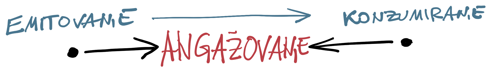

Postoje tri razloga zašto se sadržaj javno objavljuje.

<!--more-->

Prvo da raščistimo sa pojmovima. Pogrešno je reći da se sadržaj "deli" (_share_) na Internetu. 'Deliti' podrazumeva nekakvo zajedništvo. Mogu da podelim parče torte sa drugom. Možda delim stan sa cimerom. Delimo slično mišljenje o novom filmu. Delimo ovaj težak trenutak.

Tu bi trebalo povući granicu.

Objavljivanje informacija nije deljenje, već _emitovanje_; nemaju komponentu posedništva. Ni znanje se ne deli: ne učimo od drugih, već isključivo sami; naravno, uz pomoć emitovanih informacija, prethodnog iskustva i čega sve ne.

Dakle, sadržaj na Internetu (ili kakvom medijumu) se **ne deli**. On se postavlja, emituje, objavljuje na virtuelnim mestima pored kojih ljudi prolaze ili se zadržavaju. Internet je samo ogroman, šljašteći bilbord.

Da se vratim na razloge.

## Mišljenje

Prvi razlog se tiče potrebe da čovek nešto znači. Ovo osećanje nije ni dobro ni loše; kako se nosimo s njime nas moralno određuje.

Dakle, reč je emitovanju nekakvog _mišljenja_ - čak i kada ono nije u formi reči, već, recimo, u formi fotke vaše mačke koja radi što i sve mačke na svetu. Pridodajemo važnost (opravdanu ili ne) emitovanom, jer smo - eto - posebni, a mišljenje je naš izražaj. Zato brojimo srca i palce, pričamo o dosegu, maštamo o prepoznavanju.

Malo mišljenja je zaista vredno. To što imamo internet, [ne znači](https://oblac.rs/licemerje-narcisoidnosti/) da smo vredni konzumiranja. Zapravo, što više razmišljam (ha!), čini se da je mišljenje (a ne misao!) precenjen proizvod.

## Sadržaj

Drugi razlog je namera ponovne upotrebe. Emitujemo sadržaj koji drugi mogu da iskoriste za nešto - da se nasmeju, pri učenju, da se pozove na radnu akciju.

Slobodan sadržaj, oslobođen egoizma mišljenja (ali ne i iskustva!), ima vrednost. Ponavljam, upliv mišljenja sam po sebi nije loš: naše je da kritički procenjujemo i odredimo se prema onome što konzumiramo.

## Angažovanje

Najvažniji razlog emitovanja je i najređi - poziv na angažovanje (_engage_). Angažovanje je zapravo put od emitovanja do pravog deljenja. Time važi i obratno: angažovanje je način uoptrebe sadržaja koji predstavlja put od konzumiranja do angažovanja.

Angažovanje je vrednosni filter beskonačnog sadržaja.

Angažovanje košta samo jedno: vreme, te je zato toliko vredno. Vreme možete podariti uživo, učestvovanjem; ali i kroz donacije (novac kao vrednost u korelaciji sa vremenom utrošenim za sticanje istog).

## Samo-uvid

Ovako razložene, stvari su jednostavne za uvid. Prvi razlog ućutkujem (nemam puno pokrića), drugome dajem mesta (imam iskustva godina), a treći, nažalost, ne dostižem. Pisanje je sjajna veština za usaglašavanje unutrašnjih glasova, svima bih je preporučio. No, pisati se može i u tišini.

Ispostavlja se da imam očekivanja: priželjkujem učestvovanje, a gnušam se emitovanja. Da znam kako, okupio bih one koji bi da dele i osnažio da delaju.

Idemo dalje.
