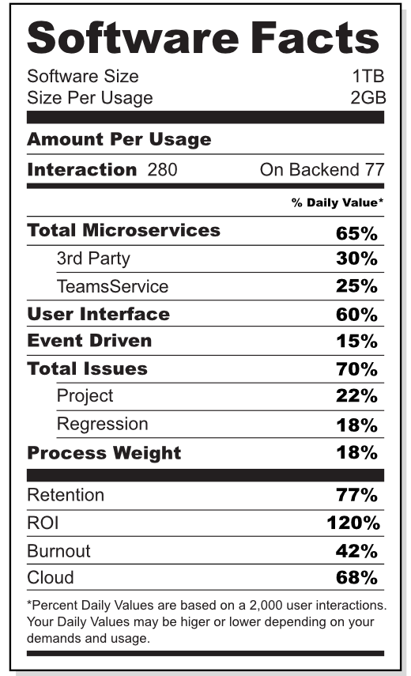

Imam jednu noćnu moru. Sanjam da smo neprestano okruženi digitalnim uređajima i servisima koje je neko tamo negde programirao. A onda spoznajem kako je sve isprogramirano.

Budim se u grčevitom, paničnom strahu - samo da bih u magnovenju skapirao da je san java. Probudi se, kažem sebi!

<!--more-->

Pristajemo na loš softver iz dva razloga. Jedan je zato što pišemo puno lošeg koda.

Da ne bude zabune, time što ističem da se piše loš kod, ne izdvajam sebe iz mnoštva: još uvek to radim. Mogu da ponudim samo izgovore, nažalost.

Zašto onda pišemo puno lošeg koda?

Zanimljiva je godina 1969. Poslednjih dana oktobra te godine, u Rimu, održala se druga konferencija posvećena softverskim inženjerskim tehnikama, organizovana od strane NATO naučnog komiteta. Termin "softverski inženjer" je upravo nastao na ovim okupljanjima. Ono oko čega su se svi pristuni složili, bilo je da softversko inženjerstvo zapravo _nije inženjerstvo_ i da se stanje mora hitno popraviti. Nažalost, akademija i industrija su kasnije krenule svaka na svoju stranu, i, rekao bih, od tada se više nisu susretale. Čini mi se da danas akademija pokušava da se dodvori industriji prineseći joj žrtve: vežbajući mlade umove veštinama tek za opstanak, a ne za evoluciju.

Da se vratim na pomenutu konferenciju. Čitajući izveštaj, koji uključuje i živopisne transkripte diskusija, opis razvoja Apollo projekta, muke sa COBOL-om i šta sve ne; preplavio me je snažan déjà vu: muče nas _identični_ problemi pola veka kasnije!

Drugim rečima, ne postoji softversko inženjerstvo. Postojimo mi, samo-obučeni programeri, naučeni da brojimo do 2 (jer `0` i `1`) i žongliramo kod tamo-vamo, jer ne umemo ništa bolje. Ponoviću: ne umemo ništa bolje.

Zašto je tako?

Odgovoriću citirajući opasku g. Dijkstra, izrečenu na pomenutoj konferenciji:

> We may not change our thinking habits.

Pola veka kasnije, ova misao odzvanja. Da li je vreme da se dignemo ruke?

## Drugi razlog

Pristajemo na osrednja rešenja. Ljudska interakcija se svodi na "korisnički doživljaj". U takvom svetu, bitni su proseci velikih podataka. Uobičajeno ponašanje rezultuje većom konzumacijom.

Sad, dok ostali imaju tu privilegiju da prihvate nametnuto, ma kakvo ono bilo; mi, takozvani softverski inženjeri bi trebalo da reagujemo. Ne bi trebalo da olako dozvoljavamo svet prepljavljen lošim softverom.

A da bi uopšte krenuli sa time, potrebno je jasno znanje šta je loš softver. To je već zadatak za inženjersku struku, a ne za industriju. No ako softverski inženjeri ne postoje, ko će onda to uradi?

Zamisli sada kada bi svaki softver imao obaveznu marku kvaliteta. Kao što na svakom proizvodu koji unosimo u naša tela postoje _Nutrition Facts_, zašto tako nešto ne bi postojalo i za sve ono što unosimo u naše umove i svakodnevicu?

{.center}

🤷
