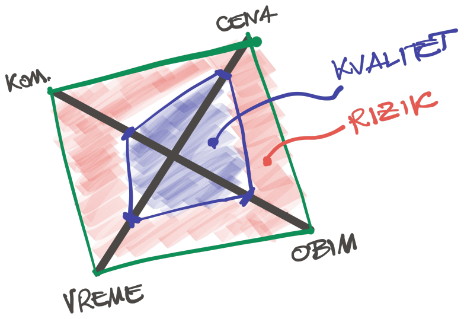

Prolazim još jedared sveže napisani kod. Bolno je ružan. Vidim probleme u najavi. Pun je ponavljanja. Nema testova. Nema dokumentacije. Zastajem kurzorom miša iznad dugmeta za "Commit". Deo mene nemo pati, zadržava odluku da pustim kod.

<!--more-->

Emocije nadolaze: ovo nije nivo na koji pristajem, to nije kod za koji želim da kažem da je moj, potire profesionalni pristup do koga mi je stalo, pa ne možemo ovako, pa... nije okej! Ne mogu tako!

Stop.

Sve je, zapravo, u najboljem redu.

**Kvalitet** je površina određena:

1. vremenom,
2. cenom,
3. obimom zahteva,
4. efikasnošću komunikacije.

Ovako nekako:

{.center}

Jednostavno, nema prečice.

Isto važi i za kod. Potrebno je vremena za dobar kod. Vreme iziskuje veću cenu. Povećanje obima posla umanjuje kvalitet, ukoliko se ništa drugo ne menja. Konačno, neefikasna komunikacija umanjuje kvalitet - više šuma ometa jasnoću.

Gde je tu znanje i iskustvo? Ne bi li trebalo da utiču na kvalitet?

Utiču, pod stavkom za komunikaciju. Znanje je osnova efikasne [komunikacije](https://oblac.rs/manifest-organizovanog-softverskog-razvoja/).

Da se vratim na temu: ružan kod je tu s razlogom. Gornji grafik pomaže: ucrtaju se parametri, odrede oni na koje možeš da utičeš, i... pustiš.

Commit. Push.
