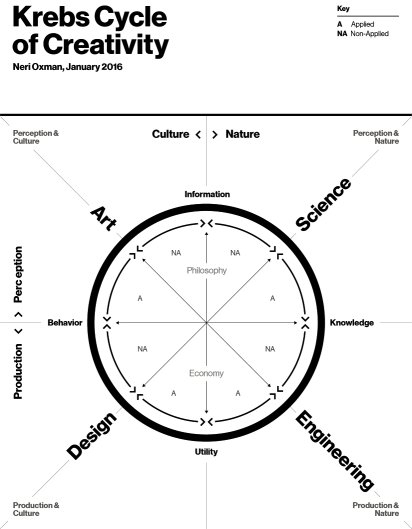

Postoji nešto čak i u najveštijima što neprestano teži da nas svrsta među umetnike.

<!--more-->

Počeo bih odmah jako, baš sa Knuthom:

> We have seen that computer programming is an art, because it applies accumulated knowledge to the world, because it requires skill and ingenuity, and especially because it produces objects of beauty. A programmer who subconsciously views himself as an artist will enjoy what he does and will do it better. Therefore we can be glad that people who lecture at computer conferences speak of the state of the Art.

Donald svakako ima šta da kaže kada je u pitanju kompjuterska nauka, no trebalo bi da se kloni ovakvih romantizovanih i, na kraju, neosnovanih izjava. Ne osuđujem njegovo razmišljanje; već naše prihvatanje izrečenog samo zato što ga je Donald izgovorio.

Knute, sve što si rekao važi i za svaku drugu aktivnost kojom se čovek bavi. Hajde šale radi da uzmemo vrtenje palčevima: ukrstimo preostale prste tako da palčevi ostanu slobodni, a njih rotiramo jedan oko drugog. Potrebna je minimalna doza znanja i iskustva za ovu motornu vežbu. Stvari postaju kompleksnije ako želimo da nam se palčevi pri tome ne dodiruju. Kreative takođe ne manjka: promenom smera rotacije, svetlima i senkama možemo svašta nešto da učinimo. Čak i da odemo toliko daleko da kroz različitost pokreta osmislimo jezik nemušte komunikacije! Predivno.

Ovo beslovesno poređenje jeste ružno ruganje postavci; to svesno činim da bi što pre stavili tačku na ovu besmisao. [Ponavljam se](https://oblac.rs/pisanje-programa-umetnost-ili-nauka/), jer se i premisa ponavlja; zato hajde da razradim stav.

Programiranje je delatnost inženjerstva. Inženjerstvo je _produkcija_: pojednostavljeno, pretvara znanje (time i iskustvo) u... _alatku_. Programiranje je primena znanja za razvoj rešenja. I to je sjajna delatnost, ali ne i umetnost. Isto kao što i veština nije umetnost. Preduslov je, ali nije dovoljna. Umetnost je, pak, na drugoj strani spektra. Subjektivna je. Provocira da bi dovodili u pitanje sve(t) oko nas. Kvantitativne metrike kao što je "kvalitet" nisu primenjive.

Ako pitamo "one druge" šta misle o svemu, ne pronalazim da se slažu s Knuthom. Šta više, izvesna Neri Oxman se bavila relacijama i vezama između domena o kojima pričamo, na način koji nikada doseći neću. U svom radu "Age of Entanglement" izvrsno mapira domene i njihove odnose:

{.center}

Kako ne bih da suština teksta ostane na kritici naših slabosti, predlažem sledeću naviku: da mi, razvijaoci softvera svih zemalja, jednom zanavek prestanemo da se trošimo na strane koje razvoj to nije. Dovođenjem stvari u perspektivu one postaju jasnije.

Drugim rečima, hajde da se ne ložimo. Hajde da umesto toga razumemo, naučimo, i, konačno, podržimo tu umetnost koju toliko prisvajamo. Razvoj nikada ne može da _bude_ umetnost, ali mora da bude dopuna. Programerskim rečnikom, klase `Code` i `Art` ne nasleđuju isti interfejs, ali čine kompoziciju.
