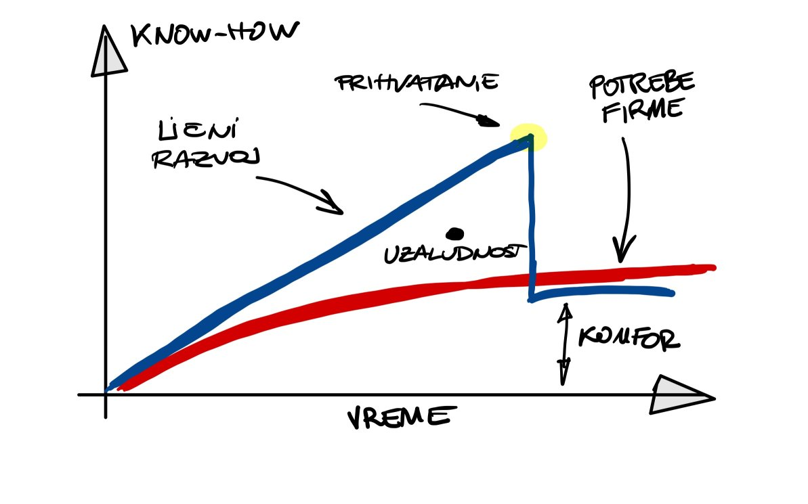

Dan kada je Don otpisao karijeru i postao senior Kihot, programer vetrenjača.

<!--more-->

Don voli da programira. Postala je to veština u kojoj uspeva da se iskaže, dozvoljava mu da se igra i bude kreativan. U isto vreme programiranje mu je i alat i kist i lopta.

Takođe je veština koja ga tera do kraja. Performanse, elegancija, jasnoća, povezivanje tačaka; kockice koje se neprestano slažu dok u jednom trenutku ne legne sve na mesto. Klikne. Znaš da je sve kako treba, čak i kada nije svaki detalj izbrušen.

Godinama, veština programiranja se preliva u veštinu razvoja projekta. Reč je o pukom skaliranju - ono što je nekada postizao kodom, Don sada vidi primenjivo na ceo projekat. Zvuči jednostavno - i jeste. Samo je potrebno vremena. Nema prečica.

Usput, Don izgrađuje nešto što opisuje kao _osećaj za dobar razvoj_. Reč je, zapravo, o prepoznavanju obrazaca. Gomila koda, stilova, načina, sistema; svi su, na kraju, nekakvi obrasci. Ljudski mozak je prilično dobar u prepoznavanju obrazaca, ali loš u verbalizovanju istih. Posle 20-tak godina neprestanog bavljenja softverskim inženjerstvom, Donu se dešava da brzo uoči nedostatke i labava mesta koja treba pritegnuti; no treba mu vremena da objasni zašto je tako. Dobrim delom i zato što su oni koji slušaju daleko.

Kada se manje sluša, više se govori. Kada se više govori, više je šuma. Usrednjavanje više mišljenja je mediokritet. Osrednje stanje je stagnacija.

To nas dovodi do nestabilnog ekvilibrijuma: _ne znamo šta znači dobar razvoj_ (pojam "razvoj" je uzet kao generički sinonim za: projekat, program, sistem, proces...). Jer "dobar" je apsolutni, merljivi termin, a ne pitanje osećaja, zar ne?

Ako ne znamo šta znači dobar razvoj, kako uopšte znamo da naš rad vodi na pravu stranu?

----

Donu ostaje da ponudi samo sledeće: da sve svoje iskustvo (osećaje i utemeljene obrasce) usmeri na razvoj, te učini da se stvari dese. Bez obzira na sve. Stremljenje ka rešenjima, bez drame, pragmatično, zdravorazumski. Ište prostor da se razmaše idejama, insistira na disciplini radi fokusa.

Daj mi vetranjaču, kaže Don, i pobediću je.

Štos je u tome što to nije ono što tržištu treba.

Ono što se traži je nešto inteligentnija verzija majmuna. Naime, majmuni su se pokazali neobično pouzdanim u prepoznavanju obrazaca; skorašnja istraživanja pokazuju velike sličnosti u načinu kako ljudski i mozak rezus majmuna procesira vizuelne obrasce. Kapiram, ako bi im pokazali dovoljno dobrog i lošeg koda, majmuni bi uskoro mogli da obavljaju pregled Pull Request-ova; očevidno neefikasne softverske prakse.

Tržište, dakle, vapi za primatima koji će, svi u glas, kucati koda po pisaćim mašinama, u nadi da će iz toga proizići Šekspirovo delo. Oni su jeftini, zamenjivi, poslušni, fokusirani na kucanje i vole sitne nagrade. A ako Šekspirovih soneta izostane, nije problem; dok rezultat liči na stihove - dobro je.

U takvom poretku, Don pobediti vetrenjače ne može. Puno truda treba uložiti da veštine rastu linearno sa vremenom. Tek kasnije uočava da su potrebe savremenog profesionalnog razvoja softvera logaritamska funkcija: lažljivo bliska linearnoj na početku, a dobrano odstupa na sredini karijere.

S druge strane, stagnacija je tako primamljivo komforna. Donov programerski um uočava naupkle obrasce, godine mu dozvoljavaju da ih saopšti bez ustezanja. Zalud. Ne traži se zrelost. Već komforna, glasna, šarena sve-uspešnost.

Svi gubimo, ali se smejemo samo Don Kihotu.

Idemo dalje.
