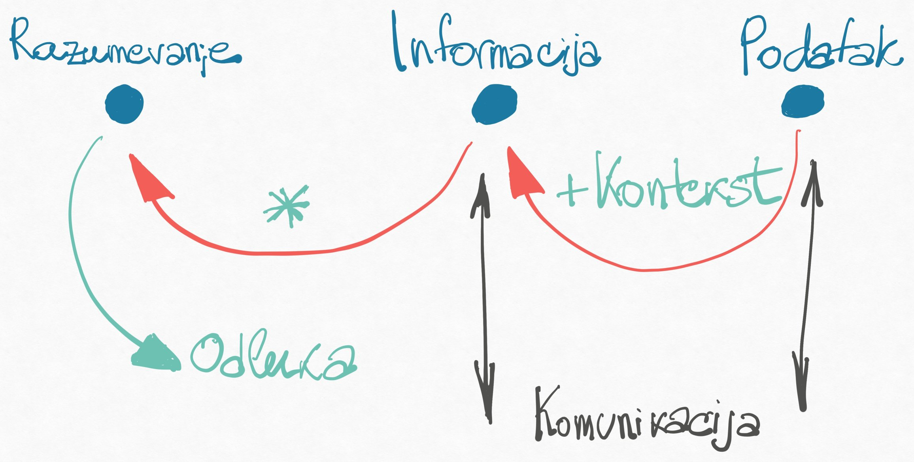

Vic ide ovako:

Programerova žena šalje muža u prodavnicu po hleb, te mu kaže: "Kupi jednu veknu hleba. Ukoliko ima jaja, kupi tuce."

Muž programer se vraća kući sa 12 vekni. "Zašto si kupio toliko hleba?", upita ljutito žena. "Jer je bilo jaja", odgovori on.

<!--more-->

Koliko upotrebljavamo akronim `IT` neko bi pomislio da se time zaista i bavimo. Upravo tako: _ne bavimo se informacijama_ kako bi trebalo.

Da krenem ispočetka.

## R,I,P

**Podatak** je izolovana, neobrađenja činjenica. `1` ili `crveno` ili `gore`.

**Informacija** je procesuiran, organizovan i struktuiran podatak, kaže Vikipedija. Drugim rečima, informacija je podatak proširen _kontekstom_. Na primer, `12` je samo podatak. `12 vekni` je informacija, jer pruža kontekst za podatak - znamo na šta se podatak odnosi, možemo da pretpostavimo domen, imamo iskustvo da ocenimo da li je to mnogo ili malo, itd.

Informacija služi da ukloni neizvesnost, smanjuje entropiju (neuređenost) sistema. Konačna upotreba informacija je da se na osnovu nje donese odluka.

**Razumevanje** je psihološki proces ostvarivanja veze ka objektu razumevanja, takve da se objekat može modelovati konceptima (apstraktnim idejama). Razumevanje dolazi od kombinovanja informacija - direktnih i implicitnih, prethodnih i sadašnjih. Razumevanje je sredstvo kojim upotrebljavamo informacije i donosimo odluke. Razumevanje je neprestani proces (bio bi beskonačan da život nije ograničen) i zato nema konačan broj ishoda.

**Komunikacija** je deljenje podataka ili informacija. Deljenje podataka nije isto što i deljenje informacija, jer nedostaje kontekst. Zato nam je vic smešan: žena deli podatak, a svaki akter pretpostavlja svoj kontekst, te formira svaki svoju informaciju, koje se razlikuju. Tranzitivno, razumevanje na kraju ispašta, pa se donosi se pogrešna odluka o kupovini.

Ne postoji komunikacija razumevanja (bar je tako sa ljudskom vrstom). Razumevanje, apstraktne ideje, se ne mogu preneti komunikacijom. Prenose se informacije, da bi došlo do sličnog razumevanja svih učesnika komunikacije. Uopšteno - svaka relacija (veza) se ne može komunicirati; mogu se deliti samo početni i krajnji čvorovi.

To sve nekako može da se predstavi ovako:

## Neke posledice

Kada nedostaje kontekst, informacija postaje podatak. Da bi razumeli, često pokušavamo da podatke ili nepotpune informacije dopunimo pretpostavljenim kontekstom. To je izvor greške, kao u vicu.

Znanje je skup prethodnih razumevanja. Šire, znanje je skup prethodnih kontekstka, informacija, razumevanja i donešenih odluka. Zahvaljući prethodnim razumevanjima, znamo da se obično ne kupuje 12 vekni hleba.

Razumevanje zahteva izučavanje podataka i konteksta da bi došli do informacija. Proces razumevanja je neophodan za odlučivanje; u suprotnom, odluke donesene samo na osnovu informacija ili, grđe, podataka, nisu odluke, već nasumičan izbor. Ovo je osnova kritičkog razmišljanja - koga nam svima manjka.

Jasna je neophodnost ispravne komunikacije: nije cilj preneti samo podatak, već informaciju. Nije cilj puki prenos, već razumevanje od treće strane. To nam ukazuje da komunikaciju treba usmeriti na to kako će treća strana razumeti informaciju. Zato u vicu kapiramo programera: komunikacija je pretpostavljala kontekst, umesto da ga je definisala.

Isti podatak može biti proširen različitim konceptima i tako činiti različite informacije.

## Programiranje

Računar je uređaj koji obavlja mašinsku obradu podataka. Program je skup pravila za mašinsku obradu. Sav kontekst programa je vezan isključivo za mašinsku obradu, te se sve informacije u računarskom sistemu tiču ove obrade.

Dakle, računarski sistemi pripadaju nižem nivou, domenu podataka i informacija u vezi sa mašinskom obradom. Na primer, JPEG slika je samo niz bajtova, podaci. JPEG format je kontekst, struktura za sirove podatke; te ceo JPEG čini jednu informaciju: da je u pitanju slika. Ovo je informacija iz mašinskog domena. Dalje, mašina "ne vidi" kontekst vezan za ono šta je na slici. Taj kontekst mašina ne može da iskoristi da pruži i takve informacija. Taj kontekst (šta je na slici) interpretira ljudsko biće, da bi došlo do razumevanja slike.

Tri stvari se mogu izvesti.

1. Postoji jaz između informacija koje program predstavlja (šta je na slici) i informacija koje čine program (JPEG format). Ukoliko je jaz veći, za takav kompjuterski sistem kažemo da je manje user-friendly, radi 'slabije' ili netačno. Ukoliko je jaz manji, on nam je "razumljiviji".
2. Programiranje je definisanje preslikavanja poslovnog (životnog) konteksta u mašinski kontekst, da bi se očuvala informacija.
3. Programiranje je aktivnost kojoj je neophodna komunikacija na dva nivoa: mašina na nivou podataka, i - važno - ljudi na nivou informacija. "Programiranje je komunikacija između programera", volim često da naglasim.

## IT

Konačno, informacione tehnologije... i kako se uspešno ne bavimo time.

Kako je fokus na programiranju, naši napori su usmereni isključivo u jednom pravcu: od razumevanja ka (mašinskim) podacima. Drugim rečima, programiranje je aktivnost koja: razumevanje razlaže na informacije, odakle destiluje podatke.

IT bi trebalo da se bavi i suprotnim smerom. Trebalo bi da radi na tome da se dosegne razumevanje počevši od mašinskih podataka. To se ne odnosi samo na programiranje, već i na ponašanje proizvoda, dokumentaciju, ali i način komunikacije u timovima itd.

Zapravo, sve više mislim da je taj smer _važniji_ od smera programiranja. Neprestano primećujem da nedostaje, a da to čini razvoj skupim i sporim. Primećujem sveopšti manjak održavanja informacija.

Na primer, u jednoj firmi sam kodirao godinama bez poznavanja domena. Na drugom mestu prolaze dani samo da dođem do osoba koje imaju informaciju o delu sistemu. Na trećem projektu, nema komunikacije između timova, a rade u istom domenu. Tamo već neki projekat, daje prednost formatiranju koda, u odnosu na ono šta radi. A tek firme koje obožavaju sastanke, jer stvaraju privid razumevanja. Svaka implicitna pretpostavka koju zaključiš, bilo u Skali ili dokumentaciji, uvodi entropiju. Projekat u kome tim sam sebe koči, jer ne poznaje baš sve zahteve. Mogao bih ovako do sutra...

Ako su cilj samo podaci, gubimo razumevanje, ne donosimo odluke. Zato je _podjedanko važno_ da se bavimo ne-programerskim aktivnostima, kao što su komunikacija, razumevanje, skladištenjem informacija, međusobnim uvezivanjem, merenjima, standardima (!) i primenama. Za mnogo toga, na žalost, ne postoji alat; neophodno je neprestano prisustvo, nadgledanje i praćenja tokova informacija, u oba smera.

Nije reč o tkzv. mekim veštinama. One su tek delić toga. Reč je o tehničko-socijalnoj svakodnevnoj aktivnosti, koja je lateralna kroz timove, a vertikalna od svakodnevnog razvoja do proizvoda.

Smatram da treba da postoji rola **IO**, Information Officer, koja bi se upravo bavila _informacijom u tehnologijama_.

---

P.S. Daleko da je ovo gore nekakva dokazana teorija, reč je samo o ličnim uvidima 🤷‍♂️.
