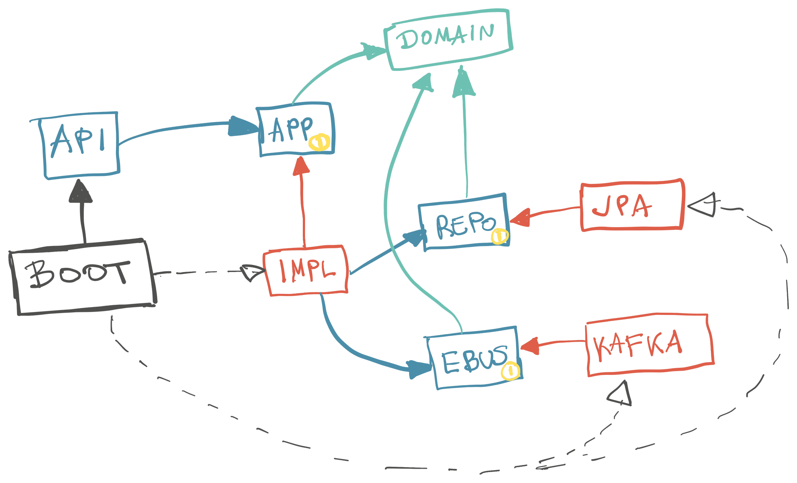

Sastavio sam mali primer SpringBoot/JPA/Kafka/OpenAPI bekend projekta.

[Github Repo](https://github.com/igr/paywent).

<!--more-->

Reč je o API-ju za prebacivanje novca sa jednog na drugi račun.

Ovo su brze, usputne, zabeleške; nedostaju detalji.

## Komponente

Dijagram komponenti izgleda ovako:

Svaka komponenta dolazi sa apstraktnom barijerom.

1. Komponente su definisane sa apstraktnim modulom, granicom (plave kućice) i implementacijom (crvene kućice).
2. Jedna apstraktna granica ne zavisi od drugih. `Api` koristi `App`, na primer, bez ikakve ideje šta je iza. Takođe, `App`  ne zna ništa o postojanju `Repo` ili `EBus`.
3. Implementacija zavisi isključivo od drugih apstrakcija. `AppImpl` zavisi od `Repo`, a ne od `JPA` (crvene kućice zavise od plavih, a ne od drugih crvenih).

Ideja je užasno prosta: implementacije su zamenljivi detalji.

## Glagoli

Anemične servisne klase su proizvod nepotpunog razumevanja pojma "entitet", o čemu ću detaljnije pisati drugom prilikom (ukoliko do tada ne ugasim ovo 🤷‍♂️).

Svaka biznis operacija je glagol. Ima svoju definiciju u interfejsu i jediničnu implementaciju u jednom od implementacionih modula.

U Javi, nažalost, ne postoji bolji način za pozivanje metode funkcionalnog interfejsa (wtf!); otuda `invoke()` metode svuda (po ugledu na Kotlin).

## Boot

Uvezivanje implementacija se dešava u `boot` modulu (neko ga zove i `main`). SpringBoot se pokazao boljim nego što sam očekivao; skapirao je implementacije sam od sebe.

## Impl

Ako u _istom modulu_ imate i interfejse i njihove jedinične implementacije... zašto?

Interfejsi odvojeni u zaseban modul prestavljaju apstraktnu barijeru. Tek takvo razdvajanje implementacije opravdava postojanje interfejsa (drugi razlog je dinamički polimorfizam, jasno).

Šteta što Java zahteva da i jedinične implementacije imaju ime. Voleo bih da vidim anonimnu jediničnu implementaciju interfejsa koja se deklariše kao i redovna klasa: `class extends Interface`.

U SpringBoot-u bi mogli da izvedemo upotrebe anonimnih implementacija koristeći factory metode za bean-ove, ali to predstavlja više posla zarad nedostatka jezika.

## Maperi

Jedino modeli domena prolaze kroz slojeve. S druge strane, svaki modul ima svoje tipove podataka neophodne za rad sa okvirima, I/O ili čime već.

Ovo iziskuje mapiranja podataka na svakom prelazu između barijera. To je OK. U pitanju su kratkoživeći objekti.

Mapiranja se mogu generisati; `MapStruct` fino radi posao. Ima mogućnost da javi grešku pri kompilaciji u slučaju nemapiranih polja; istu informaciju javlja i IDEA plugin kao upozorenje.

## Dev tool

Zgodno je imati CLI alatku koja pruža programeru svu potrebnu pomoć. I to na takav način da bez većeg poznavanja stvari može da _komunicira sa projektom_. U većini slučajeva, programeri se odluče da operacije (i komunikaciju) zapisuju u `README.md`, gde budu ostavljene na nemilost neizbežne entropije.

Takva alatka se može lako napraviti skriptama (ili sa `makefile`). CLI alatku bi trebalo izdvojiti i deliti je među projektima.

## Redovi

Dolazni zahtev za transferom novca se snima u bazu.

Slanje poruke (event-a) na eventbus u toku transakcije upisivanja u bazu nije ispravno. Reč je o dva zasebna implementaciona detalja, a transakcija pokriva samo rad sa bazom.

Zato postoji queue (FIFO red) zahteva za transferom. Zahtevi se obrađuju u zasebnom procesu.

Inače, jedna mikroservisna arhitektura može da beleži _sve_ biznis zahteve u opšti red; pa da ih potom obrađuje. Time se potpuno razdvaja zahtev za biznis operacijom od same operacije.

## Postgres + Queue

Postgres ima koristan način lokovanja kojim se vrlo jednostavno implementira queue. Treba ga samo upotrebiti pravilno. Ne treba nikakva dodatna tehnologija za implementaciju reda; Postgres je sasvim dovoljan i može da posluži do prilično velikog saobraćaja.

## Artifakti

Projekat ima dva artifakta: 1) doker imidž sa aplikacijom i 2) klijentsku Java biblioteku. Sledeći artifakt bi bila TypeScript biblioteka za korišćenje na webu.

Svi artifakti se generišu u isto vreme, iz istog izvora. Time svaka izmena _odmah_ postaje vidljiva u klijentskim bibliotekama.

## OpenAPI

Primenjen je API-first pristup. Iz šeme se generišu i SpringBoot kontroleri.

Dajem prednost ovom pristupu, jer radimo direktno sa izvornim tipom (jezikom) - OpenAPI definicijom. Istina, raditi sa velikom šemom nije ugodno (reč je o ogromnom tekstualnom fajlu, sa učestalim ponavljanjima). Preporučujem programski DSL kojim se generiše OpenAPI šema.

Da, postojala bi dva generisanja: DSL -> OpenApi -> Kod. To je u redu, jer se dešavaju u različito vreme i rešavaju različite probleme.

## Primitivna opsesija

Izbegnuti opsesiju primitivima. U primeru je tek započeto.

Domenski tipovi bi trebalo da budu _mnogo_ bogatiji. Primer koristi samo ID kao zaseban tip. Ima puno mesta za dodavanje ostalih tipova, kao što su `name`, `number` itd. Ako kod dozvoljava da pošalješ isti `String` za dve različite stvari (ime i adresa, na primer), onda tu nešto nije u redu.

Najveća kočnica bogatim tipovima su programski okviri (za bazu, json serijalizaciju...). Oni najbolje rade sa opštim tipovima, te je potrebno konfigurasti nove tipove za svaki okvir.

## Generisanje koda

U projektu postoji _mnogo_ mesta za generisanje koda, naročito za konverziju bogatih tipova u, na pr., JSON format.

Generisanje koda mora da bude takvo, da se uvek može zameniti ručno pisanim kodom ukoliko zatreba.

Generisanje može da bude moćna alatka. Zahteva zreliji razvojni proces. Posebno je interesantno otići korak dalje, te iz jedne json definicije modela generisati obilato koda za različite module. Najveća prepreka generisanju koda je potreba za izmenama polaznih podataka.

## Na kraju

Za ceo projekat mi je trebalo oko tri radna dana. Nije puno. Ovo naglašavam, jer smatram da uvek ima vremena za arhitetkuru.

Tu je [kod](https://github.com/igr/paywent), super ako nekom vredi.

Želeo bih da nastavim sa razvojem ovog primera do potpunog. Otvoren kod i tako to; al nije zanimljivo kao Instagram 🤷‍♂️
