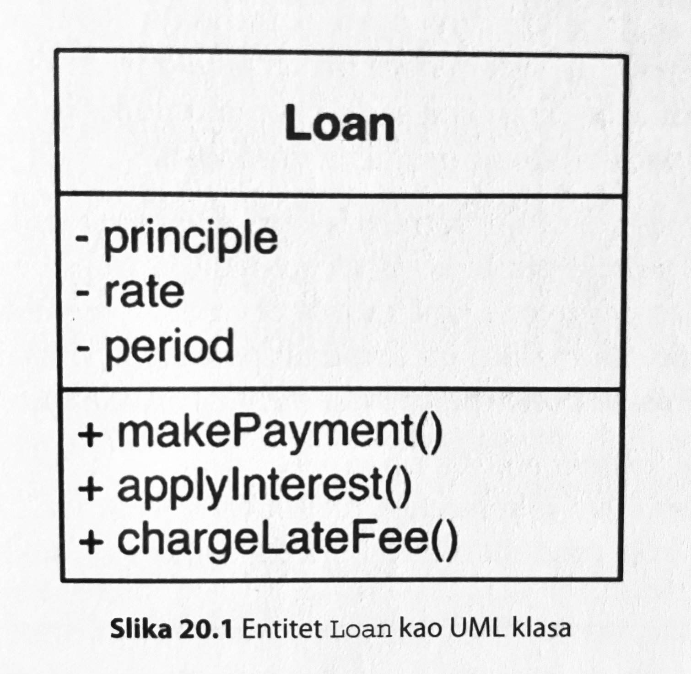
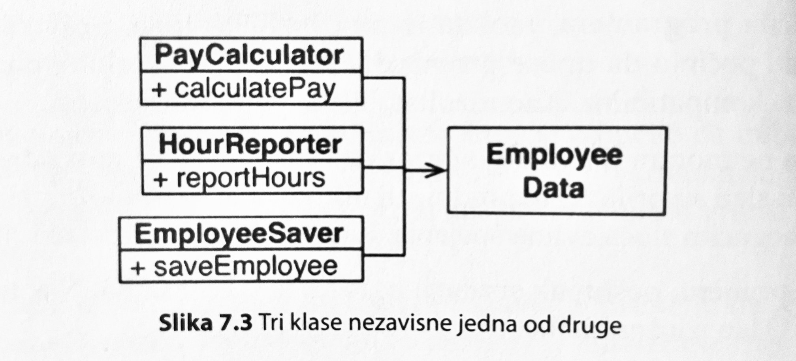

Onog trenutka kada smo usvojili da je klasa jedinica enkapsulacije, je trenutak kada je sve krenuloop nizbrdoop.

<!--more-->

Pažnja: srećno sa razumevanjem; nisam u mogućnosti da predočim sve detaljno koliko bih želeo i koliko bi trebalo 🤷‍♂️.

---- 

Kako bi programirali ono što je prikazano na sledećem dijagramu?

UML _entitet_ `Loan`. Da podsetim, UML je grafički jezik za modeliranje OOP i razvojnih procesa. Entite u UML zanima samo poslovna logika i poslovni podaci - i ništa drugo. Dakle, poslovna logika i poslovni podaci su neraskidivo povezani. To je i razlog zašto se entitet predstavlja na gornji način.

Dolazimo do zanimljivog dela: kako se implementira UML entitet?

Iz nekog razloga, naučeni smo da entitete mapiramo u _klase_.

**Zašto!?**

Baš tako, zašto? Zašto je izabrano da klasa bude nosioc implementacije entiteta? Samo zato što imamo OOP?

Zanimljivo je šta i sam R. Martin kaže povodom neophodnosti OOP za kreiranje entiteta:

> Sve što je potrebno je da kritične podatke i kritična pravila poslovanja povežete u jedan zaseban softverski modul.

Da ponovim završetak rečenice radi većeg dramskog momenta: "zaseban softverski modul". Dok je, zaista, moguće entitet implementirati kao (OOP) klasu; to je tek samo jedan način implementacije - ne nužno i najbolji.

---- 

U istoj knjizi se navodi sledeći dijagram kao primer dobrog rešenja, a sve u vezi SRP principa:

Rešenje je ispravno. Ipak, primećujete li nešto... pa, čudno?

Svaka klasa-imenica sadrži metod-glagol istog imena.

**Zašto!?**

Baš tako, zašto moramo da imamo klasu `PayCalculator` da bi u njoj imao metodu: `calculatePay`? Kako je to dobar kod? Odakle potiče ovakvo razumevanje? Iz ograničenja koje nameće razvoj fokusiran na OOP.

---- 

Moduli su potcenjena programerska alatka. Moduli nude precizno razdvajanje javnih apstrakcija i detalja implementacije.

Zašto modul ne bi mogao da implementira jedan ili više entiteta?

Deo problema su i alatke. Okruženje može da bude zamorno kada je više modula u toku. Neki alati čak i ne rade sa više modula (kotlin biblioteka za serijalizaciju, wtf!). No to ne znači da module treba zanemariti.

Moduli su prvi korak ka grupisanju celina. Komunikacija između modula je isto detalj: moduli sutra mogu da postanu mikroservisi i - pazi sada ovo - kod upotrebe modula ne bi trebalo da se promeni!

Još jedna zabeleška. Java se, na primer, traljavo bavi vidljivošću, jer je fokusirana na klase i grupisanje po paketima. Kotlin, s druge strane, ima vidljivost `internal` - dostupnu samo u okviru modula. To je vidljivost koja ima smisla. Problem s Kotlinom je što `internal` nije i podrazumevana vrednost, kao što je slučaj sa klasama (sve su zatvorene). Nevažna sitnica, neko bi rekao, a imala bi značajan efekat u poimanju modula.

---- 

Operacije su glagoli. Funkcije su operacije. Funkcije su glagoli.

Funkcija je instanca koja ima ulaz i izlaz. Tok programa je niz ulančanih funkcija; njihova kombinacija.

Podaci su nepromenljive imenice. Podaci su ulazi i izlazi operacija.

Grupisanje podataka se obavlja kompozicijom, ne nasleđivanjem - niti ugnježdavanjem.

Akcije su nečiste funkcije. Zarazne su i trebaju biti ograničene.

Poslovne operacije (funkcije) i poslovni podaci (data objekti) su neraskidivo povezani u modulu (entitetu).

To je sve što se ima reći.

---- 

Jedna od premisa naučno-fantastičnog filma "Dolazak" je da jezik određuje način kako poimamo stvarnost. Jezik Kuuk Thaayorre aboridžanaca nema pojmove za levo-desno, već smerove predstavljaju kao vremenski tok. Kada su okrenuti ka jugu, vreme prolazi s leva na desno. Okrenuti ka severu, vreme prolazi s desna na levo. Položaj nečega u prostoru je određen vremenskom osom čiji položaj zavisi od usmerenja posmatrača.

Programski jezici su podjednako uticajni - utiču na način kako razmišljamo o razvoju. Prirodno je da razvijemo sklonost usled korišćenja jezika; no moramo biti svesni toga. Jezik nam nameće arhitekturu, na isti način kako i komunikacija u organizaciji.

Evolucija koncepata bi trebalo da bude zajednička za sve jezike. Trebalo bi i da prestane podela na OOP i funkcionalne jezike (što je i inače potpuno pogrešna podela).

Pod izgovorom složenosti, umesto toga, dobili smo razne skript-jezike. Neki su potpuno promenili način kako gledamo na stvari, te premestili biznis logiku nazad na korisnički interfejs. Da bi se onda slavili kada se taj isti jezik vrati na bekend. Samo smo napravili još jedan krug, umesto da idemo dalje.

Popularnost oblačne infrastrukture ne ide na ruku - programski jezik je samo lepak; a kod vrišti od detalja.

Rezultat: sproriji, nesigurniji, manje kvalitetan razvoj.

> Jedini način da idete brzo je da idete kako treba.

Ovo nisam ja rekao.

---- 

Klasa je, nažalost, izabrana kao generički nosilac enkapsulacije. Koristi se za deklarisanje različitih softverskih pojmova: za podatke (imenice) i za funkcije (glagole). Klasa trpi sve. Pogledajte samo interfejs _svake_ klase (`Object`) u Javi - imaju čak tri preklopljene obaveze koji svaki ikada napravljeni objekat mora da trpi. Jedna je vezana za podatke (`equals`, `hashCode`, `clone`), druga je vezana za detalje sinhronizaciju (`notify`, `wait`), treća je vezana za runtime (`toString`, `getClass`). Zašto!?

Klasa je samo [prečica](https://oblac.rs/alan-key-vs-alan-ford/) uvedena u programiranje. Ispravnije bi bilo da funkcije budu `object`, a podaci budu `data`.

Za početak, hajde da iskoračimo izvan stega _klase_. Reč je o veoma jakoj vezi stanja i operacija. Sve više sam ubeđen da je klasa pogrešna tvorevina; ili bar daleko nevažna.

Smatram da potcenjujemo vrednost modula. Modul kao jedinica enkapsulacije je vredna ideja. Alati i razmišljanja bi trebalo da idu na tu stranu.
