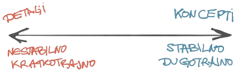
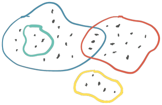

## Saznanje

Kako znamo da znamo?

Postoje dva pristupa u razumevanja saznanja. Racionalizam smatra da znanje postoji van iskustva, te da je izvor znanja upravo razum. Ideje nisu osetne; postoje van naše spoznaje i dokučujemo ih učenjem. Empirizam govori suprotno: znanje iskušavamo čulima; stičemo ga neposrednim iskustvom. Koncept iskustva je "znati kako" znanje, pre nego knjiško učenje. Kant strogo kritikuje iskustvo, nazivajući ga i vulgarnim: ideje su pre iskustva; a da bi ono postojalo mora biti u skladu sa idejama. Postoji razlika u preciznosti, time i u jasnoći: iskustvo je lični doživljaj koga je nemoguće baždariti, te ni porediti. Ideje su lišene upliva ličnog, te im je dozvoljena vančulna preciznost.

Nisam pristalica jednostranih izbora; moj deus-ex-machina za takva pitanja je razvrstavanje izbora u različite dimenzije istog odgovora. Tu moramo biti pažljivi: smisao prihvatanja više izbora nije izjednačavanje kojim se razlike zanemaruju, već bolje razumevanje upravo održavanjem razlika u fokusu.

Racionalizam i empirizam su, dakle, ortogonalne dimenzije saznanja. Znanje bez iskustva je pričanje u prazno, iskustvo bez znanja je ograničeno ponavljanje.

Razvoj softvera, kao i svaka druga grana inženjerstva, zahteva saznanje. Tradicionalno, učenje programiranja ima naglašeno racionalnistički pristup; algoritmika je matematička logika. Veći deo razvoja ipak ne čine algoritmi; uvažava se znanje iz prakse, naglasak je na empirijskim iskustvima. Ekspert postaje osoba sa znatnim znanjem i empirijski stečenim iskustvom u specifičnom polju. Iskustvo ima svoje trajanje i širinu delovanja. Kada se ne koristi, iskustvo stagnira.

Postoje koncepti i postoje detalji. Koncepti su racionalni sažetak; stabilni su, sporije se menjaju. Koncepti se ne gomilaju, već evoluiraju. Kontradiktorno je: koncepti se udaljavaju od konkretne primene da bi se ponovo upotrebljavali. Detalji su kratkotrajni, vezani za specifičnost implementacije, nestabilni van konkteksta u kome su primenjeni. Detalja ima neobično mnogo. Kontradiktorno je: detalji moraju biti precizni da bi se implementirali, ali između detalja vlada slaba kohezija; otuda nestalnost.


{.center}

Postoji "šta"-znanje i postoji "kako"-znanje. "Šta"-znanje barata konceptima; racionalno je, prenosivo. "Kako"-znanje se stiče empirijski i bavi se najviše detaljima. "Kako"-znanje vredi dok god su detalji kojima se bavi aktuelni.

Razvoj softvera je implementacija namera. Šta program radi je zaključeno time kako radi. Kako program radi se definiše iz onoga šta treba da radi.

Zaključci.

**Iskustvo nije preduslov za kvalitetan kod.** Očekivalo bi se da iskustvo u programiranju podrazumeva da ekspert nikada ne napiše loš kod. To je nelogična pretpostavka. Kako se pisanje koda bavi slabo kohezivnim detaljima, on je inherentno nejasan. Znamo da čaša čuva tečnost koja je u nju sipana, ali to ne znači da nam se tečnost ne može iznova preliti novom upotrebom čaše. Sjajan pisac, muzičar, reditelj ne garantuju ponovni uspeh nakon odličnog prvenca.

Iskustvo ne pomaže u pisanju kvalitetnog koda, već u ne pisanju manje kvalitetnog koda. Empirijsko saznanje nas više uči kako ne treba pisati kod, a ne kako pisati.

**"Kako"-znanje se iznova stiče od početka.** Iskustvo ne pomaže u sticanju novih empirijskih znanja. Novo se mora "propustiti kroz prste". Bez obzira na obimno "šta"-znanje, postoji neobično mnogo "kako"-znanja koje treba iznova usvajati. Nedavno sam napravio eksperiment: radio sam nekoliko projekata u šest meni novih programskih jezika i okruženja. Brzo sam razumeo šta treba da se uradi, prihvatio koncepte (ponavljaju se, uostalom). Ipak, potrošio sam (frustrirajuće) puno vremena na detaljima na svakom od projekata, da bih došao do toga da nesmetano izražavam nameru kroz kod. Ponavljalo se i sledeće: pokušavao sam da ponovim primenim prethodno "kako"-znanje u novom okruženju. Pokazuje se da takvo predznanje zapravo ometa usvajanje novog "kako"-znanja.

**Vrednost eksperata biva neiskorišćena.** Ne treba puno vremena za naučiti kako ne treba pisati kod. Ono što nedostaje našoj struci je upošljavanje svih saznanja pojedinca. Naglasak je više na proizvodnji koda što ima devastirajući efekat na duže staze. Dolazimo do apsurda: nikada nije bilo više resursa, a brzina razvoja i kvalitet izrade poniru. Problem rešavamo samolepljivom trakom - uvođenjem tkzv. agilnih metodologija. Iako deo odgovornosti leži u ekonomiji potražnje, etika inženjerstva bi trebalo da stane na put ovom trendu.

**"Kako"-znanje se ne prenosi.** Slušati eksperta je besmisleno, poput slušanja saveta "uspešnih" individua koje dele kada ustaju, šta jedu i koliko sati provode u meditaciji. "Kako"-znanje se ne prenosi, jer je individualno, osetno, čulno. Uporedio bih ga sa pokušajem opisa ukusa kakve egzotične voćke, na primer, ananasa. Kako bi ga opisali nekome ko ga nikada nije probao? Predavanja sa empirijskim saznanjima su malo vredna.

Smer učenja bi trebalo da polazi od "šta" prema "kako". Još uvek je potrebna pozamašna energija preći ovaj put iz ideja u detalje. Zato je i odbojan; dok je nadohvat slasno i brzo primenljivo "kako" znanje. Instant znanje, instant karma. Softverske kuće prečesto svoja rešenja kukavički reklamiraju na "koristite kako vam odgovara" način. Rešenja moraju da budu ubeđena i konkretna. Podjednako nezrelo je dodvoravanje programerima i lažno olakšavanje prvih koraka, učeći ih iskrivljenim idejama zarad bržeg ulaska u materiju. Time se više povećava pomenuti jaz do detalja koji su neophodni za konkretnu implementaciju. Ideja napretka jeste da se "kako"-znanje što pre stekne, ali ne na ušrtb "šta"-znanja.

## Stohastički proces

Kako je uređen proces softverskog razvoja?

Proces razvoja je stohastički proces. Ukoliko dozvoljava neki ishod, on će se izvesno i dogoditi. Većina ishoda nije deo namere procesa razvoja.

Proces razvoja je Markovljev proces - sve zavisi samo od trenutnog stanja, a ne od istorije.

Svaki proces razvoja, dakle, ima konačan broj ishoda. Uobičajeno se smatra da je samo jedan ishod poželjan. Neželjeni ishod poistovećujemo sa problemom na produkciji; on košta. Kvalitetan proces razvoja teži da smanji broj neželjenih ishoda. Testiranje, na primer, služi upravo tome - smanjuje neželjene ishode tako što ih pronalazi tokom razvoja, pre produkcije.

Nije moguće odrediti sve moguće ishode stohastičkog procesa softverskog razvoja; broj promenljivih je ogroman. Empirijski možemo samo da naslutimo ponašanje poređenjem sa prethodnim sličnim slučajevima. Otuda vrednost u ponovljenim obrascima razvoja.

Produkcija je ultimativna granica koje materalizuje sve ishode stohastičkog procesa. Sve pre produkcije je nagađanje.

Zaključci.

**Cena ishoda je mera opravdanosti.** Svi ishodi imaju svoju verovatnoću događanja i posledice, što formira cenu ishoda. Cena poželjnog ishoda je cena celokupnog razvoja. Cena neželjenog ishoda je cena posledica greške u produkciji. Ekonomski je opravdano ostaviti malo verovatne neželjene ishode, ukoliko cena posledice greške u produkciji prihvatljiva. Testovi su neophodni dok god je cena njihovog razvoja manja od cene greške koju testira. Zato je, na primer, svako ad-hoc određivanje procenta pokrivenosti koda testovima besmisleno, jer se ne bavi cenom grešaka koje se pokrivaju. Slično je sa testiranjem u produkciji - ako imaš takav elegantan sistem razvoja da je greške moguće ispraviti efikasno, onda testiranje u produkciji, jedinom realnom okruženju, je više nego dobrodošlo.

**Proces razvoja koji smanjuje broj neželjenih ishoda je vredniji.** Ako koristite proces koji smanjuje broj neželjenih ishoda, on je bespogovorno kvalitetniji. Jedna od ciljeva softverskog razvoja je upravo pragmatično smanjenje neželjenih ishoda.

Programer je jedan od izvora stohastičkog ponašanja u procesu razvoja, nepredvidiv. Zato sve - baš sve - što se ukloni sa puta programera čini proces kvalitetnijim. Svaki put kada se podstiče praksa ili procedura o kojoj mora da se eksplicitno vodi računa, kad-tad će se narušiti. Pravila, formatiranja, pitanja i odgovori, podešavanja... sve mora biti poravnato na takav način da se broj različitih načina upotrebe i razumevanja svede na minimum. Jasan je odgovor i na pitanje vrednosti [jakih tipova](https://oblac.rs/babe-and-zabe/) - da, programski jezici koji nisu jako tipizirani su manje kvalitetni, jer dozvoljavaju nepravilnu upotrebu koda.

**Istorija je nevažna.** Pošto je razvoj softvera Markovljev proces, sva istorija je nevažna. To zahteva izuzetnu disciplinu u održavanju svih sadržaja aktuelnim. Svaka informacija koja više ne važi invalidira ceo okvir kojoj pripada. Dokumentacija, alatke, procesi, procedure i sl. moraju biti aktuelni u svakom trenutku razvoja.

## Apstrakcija

Čime gradimo softversko rešenje?

Apstrakcija je samo ime za obrazac.

"Trougao" je apstrakcija. Može biti nacrtan na papiru, monitoru, pesku. "Trougao" nije ni papir, ni monitor, ni pesak. Pažnja: abstrakcija nije "JESTE" relacija.

Apstrakcije organizuju stvarnost koju doživljavamo tako da možemo da razmišljamo o zapažanjima. Ona je najmanja jedinica razuma/rezonovanja/razmišljanja. Apstrakcije su način na koji dajemo smisao.

Svaki govorni jezik je sistem apstrakcija. Gde postoje obrasci, tu su apstrakcije. Reči su apstrakcija: glas ili žvrljotina koja označava nekakav obrazac. Apstrakcije se nadovezuju, imaju pravila; promena reda reči u rečenici može da iskaže potpuno drugačiju nameru.

Apstrakciju je nemoguće potpuno opisati, jer se služimo drugim apstrakcijama za opisivanje. Uspevamo da se nekako razumemo usled iskustvenih saznanja.

Apstrakcije su sastavni deo procesa koji povezuje pošaljioca poruke sa njenim primaocem. One se samo-ostvaruju tokom izvršavanja ovih procesa. Konačno, apstrakcije su jedini način kojim komuniciramo.

Računari su kompleksne mašine. Uvodimo apstrakcije kako bi radili to što želimo da rade. Izmišljamo programske jezike da bi uradili više toga sa manje koda. Slično je i sa programskim obrascima: uvodimo nove apstrakcije kako bi zamenile i saklonile druge.

Komuniciramo i razmišljamo sa manje detalja; većinu pretpostavljamo. Ova praksa je utkana u prirodu bića kao vid očuvanja energije, što je ujedno i temelj evolucije vrste. Manje detalja je dovoljno samo onda kada primaoc poruke poznaje isti pretpostavljeni skup apstrakcija. Jasno, to se nikada ne dešava; istovetnost skupova apstrakcija pošaljioca i primaoca poruke nikada nije potpuna. Oni samo mogu biti sličniji, što dolazi neprestanim sticanjem saznanja.

Izazov razumevanju nastaje i u mešanju nivoa apstrakcija. Mešanje dolazi do izražaja kada se više detalja uključi u komunikaciju. Formiranje nivoa apstrakcija je takođe apstrakcija za sebe. Otuda su granice zamagljene. Inženjeri bi trebalo da neprestano rade na unapređenju apstrakcija; razvoj softvera nije matematika u kojoj je jezik ujedno i definicija - pojam "jedan" (1) komunicira sebe i definiše sebe (primalac i pošaljioc su isti.) Da ponovimo drugim rečima: apstrakcije se grupišu u skupove, postoji relacija pripadanja i podskupa - i to je sve. Ostale relacije ne postoje. Ne postoje strelice na dijagramu apstrakcija.

 
 {.center}

Razvoj programa zahteva detalje - zapravo, svako stvaranje zahteva neobično mnogo detalja, čega obično nismo svesni. Razvoj softvera je proces konačnog određivanja svih neophodnih detalja za ostvarenje namere softvera.

Zaključci.

**Vredna apstrakcija je konceptualna kompresija.** Apstrakcija koja uklanja detalje da se njima ne bi bavili je korisna apstrakcija, ako nastaje [konceptualna kompresija](https://oblac.rs/konceptualna-kompresija/). Nova apstrakcija menja više drugih zarad lakšeg procesa razvoja, tj. iskazivanja namere. Da li je nova apstrakcija identična grupi zamenjenih? Nije i nikada neće biti. I to je okej.

Na sličan način se donekle razvijaju programski jezici. Ne želimo da se bavimo bitovima, već apstrakcijama iz domena koga rešavamo. Programski jezici bi trebalo da se sve više otklanjaju od apstrakcija opšte namene. Apstrakcije kao što su `volatile`, `thread`, memorija, fajl itd. bi trebalo da nestanu. Program bi trebalo da se piše namerama, a ne Bulovim logikama (if-then-else). Program bi trebalo da bude skup "šta"-uraditi, a ne "kako"-uraditi. Zato jezici opšte namene, u kome se svako parče koda može napisati na bezbroj načina i nemaju nekog smisla. Otuda smo gladni za programskim okvirima (kompresijama), koji su još uvek samo proizvoljni dodatak programiranju. Jezici opšte namene u stohastičkom procesu kao što je to softverski razvoj dozvoljavaju svakave ishode.

Dopuna programskog jezika novim skupom apstrakcija opšte namene ne predstavlja pragmatičnu konceptualnu kompresiju. Tako je u jezicima koje nazivamo funkcionalnim: na raspolaganju nam je čitav aparat novih generalnih apstrakcija (efekata), koga je potrebno naučiti da bi pisali na drugačiji način. Ne otklanjamo se od problema: generalnog jezika. Uvodimo samo nova pravila zarad drugih ciljeva, a koji nisu kompresija.

Odličan način uočavanje obrazaca u programskim jezicima je da se "zaboravi" sintaksa. Kada se kod posmatra samo kao nekakav tekst, bez ideje da je on zapravo programski kod, pa čak i samo kao skup simbola, bez značenja - razni obrasci upotrebe postaju vidljiviji. Često se uočavaju preklopljeni nivoi apstrakcije, nametnuti obrasci, šum u razumevanju "šta"-radi od previše "kako"-radi.

**Servisna klasa je loša apstrakcija.** Koji obrazac poručuje uobičajena servisna anemična klasa? Samo labavo "pripadanje". To i nema mnogo smisla.

Slično je i sa apstrakcijom `Knjiga` koja sadrži mešavinu podataka i metoda koje rade sa knjigom. Problematičan je upravo obrazac "koje rade sa knjigom" - on nije ispravan, jer često ove metode rade i sa drugim apstrakcijama (na pr. `Bibliotekom`), te čini takav obrazac nedovoljno preciznim.

Apstrakcije koje remete postojeće isto nisu poželjne. Softversko rešenje koje insistira da ne postoje `private` polja i da se ne koristi konstruktori za injection zarad drugačijeg cilja (da, postoji takvo rešenje), narušava stabilnost racionalnih saznanja. Umesto da budu postojana, odjednom ona puj-pike više ne važe.

**Preslikavanje apstrakcija je neosnovano.** [Kvadrat nije pravougaonik](https://oblac.rs/kvadrat-vs-pravougaonik/). Naučeni smo da preslikavamo apstrakcije iz drugih oblasti (tačnije: skupova), na koje smo naviknuti i naučeni, u proces razvoja. Takav potez je prirodan, ali neosnovan: pravila apstrakcije nisu ista - samo je naziv isti. U matematičkom modelu kvadrat _jeste_ specijalni slučaj pravouganika. Matematika je možda jedini jezik u kome "jeste" predstavlja skup apstrakcija. U programiranju nasleđivanje _nije_ relacija "jeste" (ona ne postoji), već predstavlja samo podskup osobina.

`Knjiga` takođe nije knjiga! Apstrakcija knjige iz sveta koji živimo je toliko više od knjige koju držimo u rukama. Ona pripada mnogim skupovima, ali je samo nazivamo isto. To proizvodi zbrku. U programiranju nas uče da knjiga je samo `Knjiga` i da ova klasa mora da sadrži sve što i knjiga u svim skupovima apstrakcije kojima pripada. ORM, na primer, prednjači u tome, insistirajući na jednom obrascu za sve apstrakcije. Neosnovano i netačno. Knjiga može biti i njen podskup (samo identifikator i ime, na primer), deo drugog skupa (knjiga i autor), opet deo novog skupa (obrisane knjige korisnika)...

**Traže se novi obrasci.** Kada sumiram već izrečeno: "šta"-uraditi je jasnije od toga "kako"-uraditi, naši programski jezici moraju da se sve više okreću ka "šta" nego ka "kako", kao do sada. Ne samo programski jezici, nego i svi popratni obrasci razvoja. Počevši od trivijalnosti kao što je imenovanje sorsnih foldera - struktura projekta ne bi trebalo da zavisi od programskog jezika. Ako ni to ne uspevamo da dogovorimo, kako mislimo da posložimo obrasce za pravljenje APIja, servisa i mnogo čega kompleksnijeg?

**Usložnjavanje apstrakcija je opasno.** Još jedna kontradikcija. Apstrakcije treba da se komuniciraju onake kakve su. Često, zarad lažne jednostavnosti, apstrakcije se ogoljavaju u jednostavnije. Takva prosta apstrakcija nije isto što i ciljana. Dešava se da mapiramo saznanja vezana za prostu apstrakciju i pokušavamo isto da primenimo na ciljanoj. To često nije ispravno.

Nema prečica. "Aplikacija za 5 minuta" primeri treba da nestanu zauvek. Sistemi koji ne podržavaju rad sa više modula, takođe. Programski jezici koji zvuče kao "engleski" i uklanjaju vitičaste zagrade nemaju baš nikakvu dodatnu vrednost.

## Jasnoća

Kada je nešto jasno?

Jasnoća je mera uspešnosti komunikacije apstrakcijama.

"Nebo je plavo." U ovoj kratkoj komunikaciji upotrebljeno je svega par apstrakcija. "Nebo" je jasno zbog prethodnih, uglavnom, empirijskih saznanja; "plavo" usled zajedničke konvencije imenovanja onoga što naša čula doživljavaju kao boju. Deluje je da je izrečeno sasvim jasno. Nije uvek: ovo je komunikacija sa malo detalja, koja više govori o tome šta nebo _nije_ nego šta zaista jeste. Ako bi trebali da se pozabavimo implementacijom - detaljima - potrebno je pojasniti upotrebljene apstrakcije. Tako "plavo" postaje plavi podskup svih RBG boja, a možda uvedemo i gradijent, koji uvek ima sličan smer; zatim uvedemo zavisnost od doba dana, meteoroloških uslova... Nije lako je biti bog. (Kad smo već kod religije, nije li vrhovno biće zapravo stanje kosmosa u kome su sve apstrakcije potpuno jasne, čime smisao apstrakcija prestaje? Singularitet je jedno takvo stanje.)

Jasnoća dolazi u hijerarhiji. Ukoliko se polazni skup apstrakcija ne komunicira sa dovoljno neophodnih detalja, onda skup koji ga koristi (upstream) nikada ne može biti jasan.

Jasnoća nije konstanta. Uključuje i "kako"-saznanja i doživljava se i čulima. Jasnoća se vremenom menja. Kod koji je napisao isti programer posle nekog vremena može izgledati potpuno drugačije - i isključivo zavisi od iskustva stečenog u međuvremenu.

Komunikacija (verbalna, pisana, kroz kod) je inherentno nejasna. Saznanja nam pomažu da efikasnije različimo komunicirane apstrakcije. Otuda potreba za standardima - dogovorenim načinima izrade, kako ne bi svaki put nanovo razumevali detalje koji se ponavljaju.

Ponavljam: jasnoća je nestabilna, volatilna, gotovo trascendentalna. Nemoguće je postići potpunu jasnoću; tim ljudi tek ne može da se posloži oko apstrakcija. To je okej, prihvata se i radi na tome. U suprotnom, komunikacija biva zapuštena. Nestabilnost jasnoće je lepo ilustrovana u pregledima koda (code review): mahom se povratne informacije tiču trenutnih, ličnih osećaja razumevanja, a ne suštine promene. Prijavljivanje nejasnoće je svakako potrebno, ali je pre toga važno da se dogovorimo i definišemo šta je to "jasno" za projekat. Nedostatak praznog reda u kodu je nebitan.

Nestabilnost jasnoće iziskuje potrebu za poverenjem. Kada ne razumemo dovoljno, jedna mogućnost je da se prepustimo poverenju onih koji razumeju više, ekspertima. Mikromenadžment je upravo suprotno: zataškano nerazumevanje nekoga ko nije stručan. Ovde stajem, apstrakcija "poverenje" je složena i zahteva više pažnje, za koju nisam dovoljno stručan.

Kako je jasnoća mera razumevanja komunikacije, fokus softverskog razvoja ne bi trebalo da je na pisanju koda, već na čitanju zarad razumevanja. Svako može da napiše program koji radi. Čitanje i mentalno procesiranje napisanog koda je ograničeno fizičkim kapacitetima našeg uma. Ukratko, postoji konačan (i mali) broj detalja na koje naš um može da obrati pažnja u isto vreme - kažu, do sedam.

Pisanje koda je iterativno: dodajemo novo na prethodno. Otuda je neizmerno lakše, baratamo samo novijim apstrakcijama koje "uglavljujemo" u poznate okvire. Neprestano dodajemo po malo. Um takav postupak lakše podnosi. Nasuprot toga, čitanje zahteva obradu svega što je napisano u istom trenutku. Kada dođemo do mentalne granice, stvari postaju nerazumljive.

```java
if (date < now()) {
  if (flag > 0) {
    // nop
  } else {
    if ((!inclusive && beforeDate.equals(date)) || (count > threshold))
      continue
}}
```

Zašto je ovaj brljavi kod (iz pravog projekta) nejasan? Iz dva razloga. Prvi je broj apstrakcija kojima se barata: svaki uslov i varijabla pridodaju broju apstrakcija kojima baratamo. Drugi je mešanje apstrakcija - neprestano prelazimo iz apstrakcije domena u apstrakciju logike (if, and, or). Ovo prevazilazi broj detalja koje možemo da obradimo smisleno efikasno. Kod ne izražavaju jasno svoju nameru, već nam saopštava da su u upotrebi logički izrazi nad domenskim podacima.

Broj detalja se ne odnosi samo na kod. Ista granica postoji u razumevanju svakog aspekta softverskog razvoja. Dokumentacija koja je rasuta na više strana, veliki broj sistema koji nešto rade, broj repozitorijuma, procesa, neophodnih radnji da se pokrene aplikacija... Svaki dodatna nepotrebna jedinica apstrakcije koja stoji na putu umanjuje jasnoću.

Jasnoća je ultimativna neophodnost softverskog razvoja.

Zaključci.

**Komunikacija u okviru jednog skupa apstrakcija je jasnija od one koja se odvija kroz nekoliko.** Prelivanje apstrakcija umanjuje jasnoću. To ne znači da ne možemo da se naučimo - zapravo, naviknemo - na mešanje apstrakcija; možemo, ali to nije ideja.

Navika, isto kao i podrazumevano, su smetnja jasnoći.

Nemoguće je precizno razdvojiti skupove apstrakcija (domene). Ili je to moguće, ali zahteva drugačiju tehnološku aparaturu od ovih kojima se služimo.

**Broj detalja u fokusu bi trebalo da je što manji.** Podskupove kompresovati. Kratke funkcije i klase. Odvojeni moduli. Jedan izraz po liniji. Kratki blokovi koda. Tri linjije pre, tri linije posle. Imenovanje, jelte. Dokumentacija za različite vidove upotrebe. Alatke koje same odgovaraju na "kako" pitanja. Ne treba nam AI da piše kod, već da ga razume.

Ne treba pisati pametan kod. Već jasan.

**Svaka magija je nejasna.** Progmeri obožavaju magiju. Daje lažan osećaj instant razumevanja, a zapravo je samo neosnovano verovanje da će nešto raditi. Magija počiva na pretpostavkama: da će upravo tako biti korišćena kako je zamišljeno. Razvoj je stohastički proces; biće sigurno zatraženo da magija radi na drugačiji način.

Suprotno od magije je eksplicitno. Žalimo se da ono zahteva vreme, trud, održavanje, šta sve već ne - to su sve izgovori, lenjost. Implicitne stvari su po definiciji nejasne. Uvode se jer je kod "lepši", "elegantniji". To nisu osobine koda koje želimo da veličamo i vrednujemo. Svako runtime podešavanje i učitavanje modula (pa i DI, zašto da ne), implicitne definicije u Skali koje daju kriptične izveštaje o grešci, upotreba opštih tipova za domenske tipove, imena metoda koja imaju prepostavljene prefikse, ili parametara čija se imena proračunavaju; šta god da je u pitanju, eskplicitni zapis je jasniji. Lenjosti nema mesta u programiranju. Premisa da je lenjost dobra stvar jer te natera automatizaciji je lenja sama po sebi - izvor pobude je pogrešan.

Jasnoća je ultimativna neophodnost softverskog razvoja.

## Ukratko zašto

Nemam previše značajnih odluka u praksi, niti mogu da se pohvalim da sam odgovoran za kakav veliki sistem. Nisam poznavalac gotovih rešenja. Nisam ni najbolji korporativni radnik.

S druge strane, pisao sam i pišem baš puno koda; decenijama već, za različite platforme, tokom različitih razvojnih procesa, za sebe i za druge. Baš puno koda.
