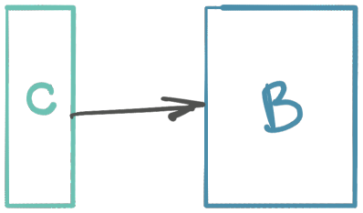
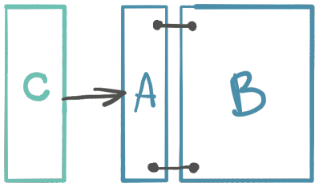
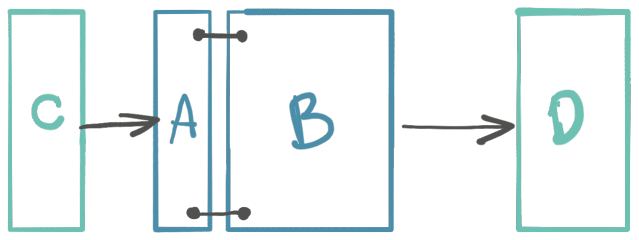
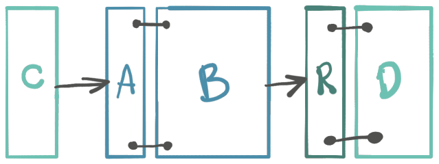
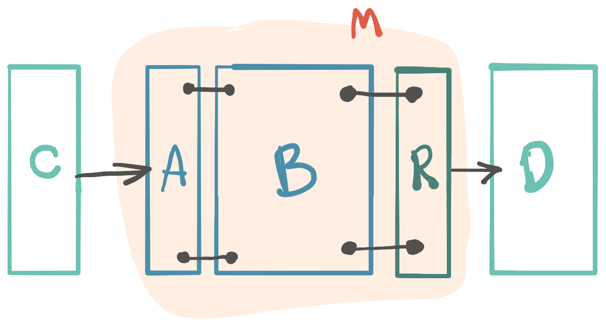

Iz života programera.

<!--more-->

Ne postoji jasna ili bar kompletna definicija modula u softverskoj struci, verovatno zato što se čini da je pojam  inherentno jasan. To je nekakav kod koji bi trebalo da ima visoku koheziju (nije obavezno, ali maši poentu u suprotnom), a baš labavu uvezanost sa ostatkom sveta.

Za mene znači sledeće:

1. Moduo ima definitivnu granicu u **compile-time** prema ostatku sveta. (Moduo ne pušta nikoga unutra.)
2. Moduo definiše komunikaciju sa svetom. (Moduo priča sa svima.)

## Build moduli

Da prvo napravimo razliku između pojma `moduo` i onoga što nazivam `build-moduo` (nemam bolje ime).

Build-moduo je celina definisana isključivo kroz alate za kompajliranje. To su, na primer, multi-project u sbt ili gradle, ili moduli u maven-u. Build-moduo je kod koji rezultuje jedan artefakt, jedna compile-time jedinica.

Moduo (onaj o kome pišem) se ne preslikava nužno na jedan build-moduo. Moduo mogu da čine više build-modula, tj. artifakta.

## Školski primer

Ovo je aplikacija; tkzv. bekend/servisni/biznis sloj:

{.center}

Dodajemo API, kontrolere. Oni ne rade mnogo više od registrovanja ruta i pozivanja servisa. Ima smisla razdvojiti kontrolere u zasebnu celinu. Kohezija kontrolera je velika (slično se sličnom raduje), a biznis sloj ne treba da zanima kako biva pozivan.

{.center}

Razdvojili smo `C` (kontrolere) i `B` (biznis) u dva build-modula.

Idemo dalje.

Kontroler ne treba da ima uvid u internu implementaciju biznis sloja. Sve što kontroler treba da zanima je skup operacija (glagola) koje može da koristi (domenski vokabular), te da ih izvršava po svom nahođenju. Ovde to nije slučaj: `C` kod može da koristi bilo šta javno iz `B`. Izgovor "to nikada ne bih uradio" je naivan. Ne radi se o eksplicitnoj nameri, već o slučajnom nepravilnom korišćenju usled nepažnje, nemanja vremena, nepoznavanja koda itd. Važi ona šaljiva (?) poslovica: ako nešto može da se koristi kako ne treba, programer će ga u jednom trenutku upotrebiti kako ne treba. **Softverski projekat bi trebalo da što manje zavisi od pažnje programera**.

Dakle, iako su `C` i `B` razdvojeni u compile-time i dalje ne postoji definitivna granica. Sve iz `B` može da se prelije u `C`. Stavka #1 je narušena.

Ništa lakše, kažu udžbenici. Izbacićemo interfejse servisa u zaseban sloj `A`. Time `B` postaje implementacija `A`. `C` komunicira samo sa `A`, ne znajući ništa o `B`:

{.center}

Idemo dalje.

Biznis sloj radi sa bazom. Baza bi trebalo da je tehnički detalj. Ne želimo da pišemo kod prema načinu kako radi baza, već takav kod da bazu uvek možemo zameniti. Namerno ovako pišem, izazivam: svako zna da nikada nećemo menjati bazu u projektu. Zapravo, pišemo takav kod koji je toliko labavo uvezan sa bazom da, nemajući bolji i kraći primer, samo kažemo da se ona može zameniti kada god. Konkretna zamena baze nije u fokusu. Labavo uvezivanje jeste. Da nacrtamo i to:

Poučeni prethodnim, ne želimo da bilo šta vezano za implementaciju baze prodre u servisni sloj:

Biznis `B` ne vidi bazu `D` i priča sa njom samo preko `R`, interfejsa prema bazi. Da li je sada sve ok?

Idemo dalje.

## Možda ovako?

Ovakvo rešenje mi nije u redu - bolje, reći, nije potpuno. Ispunjava samo prvu tačku, jer jasno razdvaja celine. Problem je sa drugom tačkom. Biznis logika `B` mora da priča sa svetom. 

Komunikacija je uvek **dvosmerna**. Komunikacija je opisana vokabularom. Kako postoji vokabular usmeren na stranu korišćenja: "kako da me svet koristi", tako mora da postoji vokabular usmeren na suprotnu stranu: "šta mi je potrebno od sveta."

Razlika je značajna. Prvo: `B` nije implementacija `A`, već je `A` opis domenskog vokabulara. Zatim, `R` pripada biznis logici `B`, a ne bazi `D`. `R` je opis onoga šta treba biznis logici.

To je već moduo.

Ovakav moduo se može već odvajati, deliti na sitnije, zameniti. Još nešto krasi ovakav moduo: mogućnost da bude čist, sastavljen samo od čistih funkcija, bez efekata.

Nije ovo neka mudrost - ako se dobro sećam, hex arhitektura upravo priča o ovome - a primećujem dozu nerazumevanja šta gde kome pripada i čemu služi... a i crtalo mi se.
