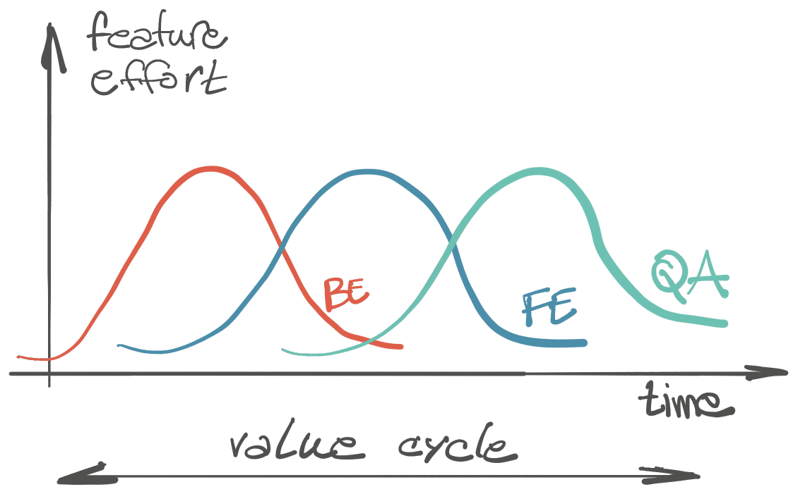

Razvoj se ne dešava svuda odjednom sve u isto vreme.

Zabeleška uočenog obrasca.

<!--more-->

Timovi rade na komponentama koje su zavisne jedna od druge. Ova relacija takođe _utiče_ na način razvoja. Kada se ne obrati pažnja, nastaje pometnja koja usporava razvoj - i to na dva mesta.

Prvo takvo mesto je tokom razvoja. Primer: bekend (BE) je napravio novi skup API-ja. Frontend (FE) tim ga potom koristi za izradu svog dela zahteva. Šta radi bekend za to vreme? Uobičajeni odgovor je da radi dalje, na sledećem tiketu, sledećoj funkcionalnosti. Osim ako ne radite u okruženju koje izuzetno poklanja pažnju _pripremi_ za razvoj (da, fikcija), dešava se da je potrebno dodatno raditi na komunikaciji FE-BE u vezi implementiranog. Nije sve dokumentovano, objašnjeno; možda nije jasna sekvenca poziva ili nije urađena kako treba FE strani, ili treba promena zarad bolje interakcije na stranici, ili prosto API ne radi u svim slučajevima... To prouzrokuje konflikt na strani BE; javlja se zahtev za dodatnim razvojem koji nije uključen u plan, a trenutni posao nije završen. Najveća pometnja je prekidanje trenutnog toka razvoja i učestalo mentalno "skakanje" nazad u već urađeno. Tražene dorade ne možemo ostaviti za sledeći ciklus, jer trebaju sada.

Drugo mesto gde nastaje pometnja je rešavanje grešaka. Kada se detektuje neispravnost, prijavi se i dostavlja timovima na način koji upućuje da svi odjednom treba da jerešavaju. Opis defekta je često takav da se tiče samo korisnikove interakcije (što je ok); kada takav tiket "padne" među timove nastaje komunikaciona pometnja. BE timu ništa nije jasno, FE tim naslućuje problem i opet vraća tiket BE, tim koji radi upstream servis tim tek nema ideju šta se dešava, prave se novi tiketi, a Slek gori.

## Tokovi razvoja, deo dva

Tok razvoja vrednosti (zahteva) treba da prati smer zavisnosti, od `upstream` ka `downstream`. Pažnja: ne znači waterfall. Radi se najvredniji, najvažniji deo funkcionalnosti prvo. Neka je to i opis APIja sa izmišljenim podacima. Jednom kada je gotov, fokus se preusmerava na sledeći tim u nizu. Rad u prethodnom timu se ne završava, već se usmerava na detalje, ostavljajući prostora za svaku zahtevanu doradu.

Rešavanje problema prati obratni smer: od `downstream` ka `upstream`. Svaki tim obrađuje istu grešku, te mora da je i pripremi za sledeći tim u toku razvoja. Korisnička upotreba na FE treba da se pretoči u niz API poziva ka BE. Svaki tim analizira i dokumentuje grešku u svoje vreme, ne istovremeno.

Deluje zdravorazumski, ali ne videh na delu.