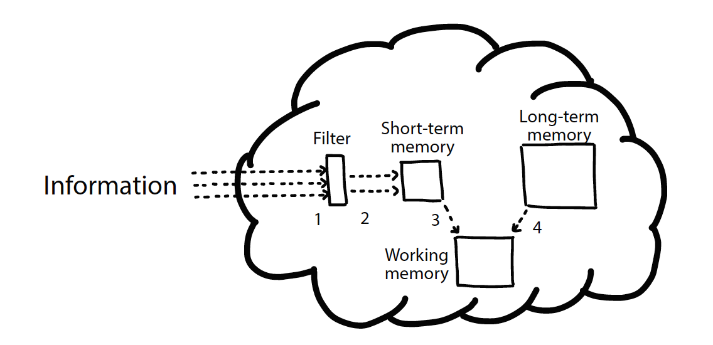

Dođeš do nekih uvida, dosađuješ ljdima o tome, a potom dobiješ potvrdu od relevantne strane. Dobar osećaj.

<!--more-->

[Nedavno sam pisao](https://oblac.rs/no-else-no-cry/) o `else`/`return` konstrukciji i različitim tumačenjima šta je "ispravnije" pisati. Da se podestimo, reč je o ovakvom pseudo-kodu:

```plaintext
if condition?
  return foo
return bar
```

U međuvremenu, došao sam do knjige "Strukturno programiranje" (Dahl, Dijkstra, Hoare, 1972.), koja po koricima više liči na Knjigu Mormona, tom dva. Kako bilo, naučio sam još nešto o ovom kodu. Naime, on _nije_ struktuiran (time ni elegantan). Jednostavan način da se uoče strukture je da se zamaskiraju unutrašnji blokovi:

```plaintext
if condition?
  ...
return bar
```

Namera koda je sada _nejasna_. Ha!

## Bolji primer

Sledeće dve funkcije:

```plaintext
def isLeapYear (year) {
  if (year % 400 == 0)
    return true
  if (year % 100 == 0)
    return false
  if (year % 4 == 0)
    return true
  return false
}
```

i

```plaintext
def isLeapYear (year) {
  if (year % 400 == 0)
    return true
  else if (year % 100 == 0)
    return false
  else if (year % 4 == 0)
    return true
  else
    return false
}
```

Poučeni prethodnim člankom rekli bi da je prvi primer "bolji" (bar je popularniji). Hajde sada da osmotrimo strukturu:

```plaintext
def isLeapYear (year) {
  if (year % 400 == 0)
    ...
  if (year % 100 == 0)
    ...
  if (year % 4 == 0)
    ...
  return false
}
```

i

```plaintext
def isLeapYear (year) {
  if (year % 400 == 0)
    ...
  else if (year % 100 == 0)
    ...
  else if (year % 4 == 0)
    ...
  else
    ...
}
```

Drugi primer je _jasniji_: nema nedouimica kao u prvom. Ha! Ovo nisam očekivao.

## Knutova osećanja

Godine 1973. D. Knuth piše osvrt na pomenutu knjigu koji započinje sledećim:

> Of course, I don't agree 100 percent with everything you said -- this is inevitable whenever artistic or aesthetic judgments are involved -- so I'd like to jot down some of my current feelings on these issues in hopes of further clarifying and perhaps strengthening the ideas.

_Aesthetic_ & _feelings_. Hm???

## Premotavanje na 2021.

Nije li ovo premnogo mozganja oko samo `else`/`return`? Kako to da stvari nisu jasnije ni posle pola veka razvoja softvera? Otkuda i dalje konsultujemo osećanja oko toga šta je dobar kod?

Vraćam se na moj odgovor. Veći deo programiranja je _razumevanje_ napisanog koda. Dobar kod je onaj koji se lakše razume (ne znači i da je taj kod ispravan.) Ovo je _aksioma softverskog razvoja_. Na nju se nastavlja sledeće: ako je razumevanje odlika dobrog koda, hajde da razumemo šta je to razumevanje. Kako to čovek razume napisano?

Amaterskim istraživanjem zaključujem da je razumevanje u vezi sa kapacitetom kognitivnih procesa naših bića. Imamo limit, imamo propusnu moć, imamo bafer. Ovaj ugao značajno menja pogled na razvoj. Mnoga pravila o dobrom kodu su samo posledica sposobnosti razmišljanja prosečnog ljudskog bića.

Kada to napišem na blogu, jedin adut iza koga mogu da stanem su decenije pisanja koda. To ne menja činjenicu da sve ovde napisano možete da okačite mački o rep. Kao što je i Knuth napisao, reč je o osećanjima. Ta nećemo valjda da pravila zasnivamo na rekla-kazala?

Nastavak ovog istraživanja započeto sa banalnim `else`/`return` je potom rezultovalo na neočekivan način. Ovaj put na knjizi iz 2021. Ako ima knjiga koju bih preporučio svima, to je ova. [Programmers brain](https://www.manning.com/books/the-programmers-brain) se bavi razumevanjem koda - tačnije, onim kako **razmišljamo** o kodu; ovaj put _na naučnoj osnovi_. Da ponovim: knjiga daje naučni uvid u način rada kognitivnih procesa mozga za slučaj pisanja i razumevanja koda. Drugim rečima, šta nauka kaže o tome kako mozak piše i razume kod!

## Kako razumemo?

Teško je opisati koliko sam željno progutao sve napisano u knjizi... Suština se poklapa sa mojim uvidima, od čega se uzbuđeno naježiš i poželiš još. Imaš i šta; knjiga nastavlja dalje gde sam zapeo i nudi sažetak naučnih razumevanja o razumevanju. Ovo nije predstavljanje knjige, te neću detaljno o sadržaju; evo samo najvažnijeg.

Postoje tri kognitivna procesa: STM (short-term, kratkoročna memorija), LTM (long-term, dugoročna memorija) i radna memorija.

Razumevanje se obavlja na sledeći način:



+ Informacije dolaze u mozak (1).
+ Informacije potom ulaze u STM (2).
+ Informacije prelaze iz STM-a u Radnu memoriju (3), gde se kombinuju s informacijama iz LTM (4).

**Dugoročna memorija (LTM)**, prvi kognitivni proces koji se koristi tokom programiranja. Bez ponavljanja, informacije imaju poluživot od oko `10` sati - ponavljanjem se vek trajanja produžava. Čuva informacije o programskom jeziku, bazi koda koja je pri ruci, domenu, kako ste rešili prethodne probleme itd.

**Kratkotrajno pamćenje (STM)**, privremena memorija za kratko zadržavanje dolaznih informacija. Kapacitet `2` do `6` stavki, ne duže od `30` sekundi.

**Radna memorija**, gde se događa "razmišljanje". Koristi se kada mentalno "izvršavamo" kod, tj. razumemo što se događa. Takođe ograničeni kapacitet, do `6` stavki. _Radna memorija je mesto gde se informacije obrađuju dok razmišljamo o njima._

Dalje, razmišljamo u "delovima" (chunk). Što više informacija imamo sačuvano o određenoj temi, to je lakše efikasno podeliti informacije u delove. Delovi služe kao prečice u razmišljanju, jer umanjuju kognitivni napor razumevanja.

Konačno - što se više suočavamo sa različitim kodom i ponavljamo; mi učimo. Punimo i održavamo LTM da bi koristila radnoj memoriji. Gradimo delove razumevanja.

Odjednom mi sve ima smisla. I zašto imamo obrasce, i zašto su koding intervjui debilni, i zašto i sa iskustvom pišeš loš kod, i šta je navika, i odakle pravila o čistom kodu... Da mogu, bavio bih se ovom temom svo preostalo vreme. Vidim da se naša programerska okruženja (alatke) moraju modifikovati zarad boljeg razumevanja. Ono što sada imamo je i dalje samo linearni tekst. Treba nam kognitivno sintaksno bojenje, mrežno uvezivanje, a ne hijerarhijsko, merenje kognitivne opterećenosti... Eh.

----

Sledeća stanica je: **apstrakcija**. Ah!