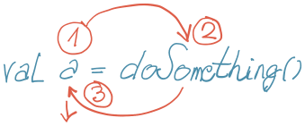
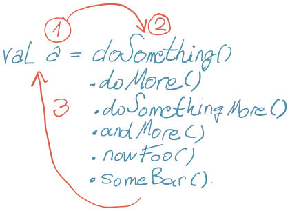
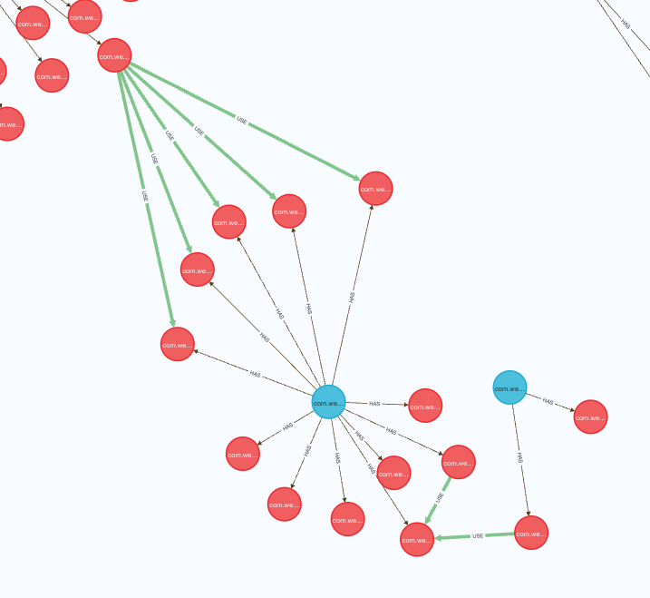

Neskuvane i nepovezane ideje, koje imaju naznaku smisla.

<!--more-->

## Kratkoživeće promenljive

Kratkoživeće promenljive su one koje postoje u kratkoj oblasti (kraća od same funkcije) i privremeno čuvaju referencu na rezultat koji će ubrzo biti upotrebljen.

Prvi problem je kognitivno opterećenje usled odloženog izvršavanja. Izraz: `val a = funkcija()` nas tera da prvo 'zaključamo' u radnoj (ljudskoj) memoriji ime varijable `a`, da bi se tek onda posvetili onome važnijem: funkciji. Potom vraćamo pažnju nazad na `a`, jer ga prenosimo dalje u novi red:



Nezgoda je i kada imamo kakav dugačak niz poziva; tokom celog lanca izvršavanja je jedinica radne memorije zauzeta, a povratak nazad (korak 3) je duži:



Neki jezici imaju način da nastaviš sa izvršavanjem bez potrebe da se deklariše kratkoživeća promenljiva:

```kt
doSomething()
  .doMore()
  .doSomethingMore()
  .foo()
  .bar()
  .let { doWith(it) } // <-

```

(Bilo bi lepše da je ključna reč ili simbol.)

U funkcionalnim jezicima se ređe koriste kratkoživeće varijable, upravo jer postoje kontejneri (monade) koje dozvoljavaju neprekinutu transformaciju apliciranjem funkcija na sadržaj.

Sada nema kognitivnog pamćenja i povratka nazad (korak 3). Postoji drugi problem - ponekada ne možeš lako spoznati šta se dešava "u sredini" lanca poziva, već svaki put moraš mentalno poći od početka lanca do mesta od interesa, da bi ga razumeo.

Ako je to sve tako, zašto onda sledeći kod:

```kt
val book = findBookById(bookId)
val library = findLibraryById(book.libraryId)
return LibraryBook(book, library)
```

ne zapisujemo ovako:

```kt
book            findBookById(bookId)
library         findLibraryById(book.libraryId)
                LibraryBook(book, library)
```

Drugim rečima, zašto ne postoje _kolone_ u kodu (ko je rekao Fortran:)? Leva kolona je zadužena za 'sporedne' stvari, a glavna, centralna kolona samo za izvršavanja i izraze. Mogli bi i da imamo implicitna imena varijabli:

```kt
     findBookById(bookId)
     findLibraryById(findBookById.result.libraryId)
     LibraryBook(findBookById.result, findLibraryByIdResult)
```

Možda je vreme da sors prestane da bude samo jednodimenzionalan tekst. Fascinantno je kako ovaj važan aspekt zapisivanja nije evoluirao! Svakako su naši kompajleri i IDE više nego sposobni da nas podrže u tome.

🤷‍♂️


## `Book` ne postoji

Modelujte sledeći biznis zahtev:

> Biblioteka sadrži knjige za iznajmljivanje. Drugi deo knjiga je za prodaju.

Ako si napravio `Book` klasu sa `price` poljem (opcionim!?), nešto nije u redu.

Klasa **ne** modeluje realne pojmove. Klasa definiše samo **jednu od apstrakcija** realnog pojma. Apstrakcija odstranjuje nepotrebno, umanjuje; posledica je generalizacija.

Bilo bi strava kada bi postojao način da apstrakcija bude (obavezan?) deo imenovanja. Tačnije, da _kontekst_ u kome apstrakcija važi ima svoje ime.

Drugim rečima, nikada da nemaš samo `Book` data tip, već je uvek imenovan da jasno označava kontekst u kome apstrakcija važi. Dolazimo do ograničenja imenovanja: jedino šta umemo da uradimo je da PascalCase-ujemo imenice u nadi da ćemo ih razumeti. Da li je `KontestKlasa` ili `KlasaKontekst` ili je `KontekstDrugaKlasa`... brljavo, nerazumljivo. PascalCase mora da evoulira.

Paketi bi bili _možda_ okej, kada bi se koristili kako treba. Međutim, često je namespace izjednačen sa paketom; još jedna sveprihvaćena glupost koju treba u korenu satreti, zajedno sa podudarnom hijerarhijom na disku (?!) Kako bilo, paket bi _možda_ mogao da bude ime konteksta, ali bi bilo obavezno (?) koristiti ga: `renting.Book` i `selling.Book` bi bila dva različita data tipa. Ime konteksta je jedno, nema hijerarhije.

🤷‍♂️


## Zašto ne vezivati funkcije za podatke?

+ metode nisu čiste.
+ dobar deo funkcija prima više tipova. Kako odlučiti kojim podacima ih prodružiti?
+ dobar deo funkcija prima više tipova. Zašto praviti statičko uvezivanje dva tipa samo zato što postoji funkcija koja ih oba koristi?
+ kako ne postoji jedna apstrakcija, da li onda ponavljaš metode na svakom obliku pojma?

🤷‍♂️

## Konteksno programiranje

Ukoliko imaš data tip koji koristi uobičajene, generalne tipove, nešto nije u redu. Ne ovo:

```kt
data class Book(val name: String)
```

već:

```kt
data class Book(val name: BookName)
```

Što je bogatiji sistem tipova, to bolje. Možda je čak i bolje da postoji više domenskih data tipova, nego manje.

Ovde se otvara mogućnost za nešto što sam nazvao _kontekstnim programiranjem_ (nemam bolje ime.) Zamislimo sledeću pseudo-funkciju:

```kt
fun makeReport(name: ReportName, from: ReportFromDate) {
  val report: Report = foo(name)
  val summary: ReportSummary = bar(report)
  if (!inRange(report, from)) return None
  return ReportSummary(report, summary)
}
```

Lepa konsekvenca je da argumenti mogu da budu potpuno _implicitni_:

```kt
fun makeReport(ReportName, ReportFromDate) {
  foo
  bar
  if (!inRange) None
  else ReportSummary
}
```

Potpun fokus na glagole; ne trebaju nam argumenti!

+ overloading ne postoji
+ tela funkcija _moraju_ biti kratka; kako bi se izbegli duplikati tipova
+ autocomplete radi samo na dostupnim tipovima u trenutnoj liniji
+ potencijalni problem sa nasleđivanjem (svakako ga treba izbegavati)
+ fallback je moguć

🤷‍♂️

## Pronalaženje granica

Zamislite monolit - ili, drugim rečima, nekakav sasvim uobičajen projekat, u kome je sav sors u jednom modulu. Sada, želimo da monolit 'isečemo' po granicama. To je, verovatno, jedna od najtežih stvari. Razmišljam o alatu/proceduri koja bi pomogla. Sledi primer.

Čitao sam nedavno jedan mali Java projekat. Uočio sam 2-3 klase koje su, prema svojoj nameri, mogle da se potpuno izdvoje u zaseban modul, jer su radile nešto sasvim drugo od ostatka koda. Zapitao sam se: da li bi ovakav slučaj mogao da se utvrdi nekakvom mašinskom analizom koda?

_Površnom_ pretragom nisam pronašao nešto što bi mi pomoglo (ili radilo). Da bih uštedeo na vremenu, napravio sam alatku (zove se "Rendgen" i možda završi na Githubu) koja:

+ parsira sors kod;
+ moduli, paketi, klase i metode upisuje kao čvorove u Neo4J bazu;
+ postoje dve relacije (za sada): `has`, koja ukazuje gde je šta deklarisano (paket ima klase, klasa ima metode itd.); i `use`, koja povezuje sve metode pozvane tokom izvršavanja neke metode. Praktično preklapamo hijerarhiju sa call-graphom.

Rezultat je sledeći:



Crveni čvorovi su metode (funkcije), plave su klase, a moduli i paketi su isključeni iz prikaza (verovatno i nisu potrebni.) Zelena relacije je `use`, siva je `has`.

Prikazani deo grafa je taj koji bih da detektujem kao potencijalnu granicu. Čak je i vizuelno jasno: zaseban podskup čvorova koji se isključivo koristi od ostatka sistema. Bilo bi zanimljivo napraviti algoritam koji bi pronalazio ovakve podskupe.

🤷‍♂️