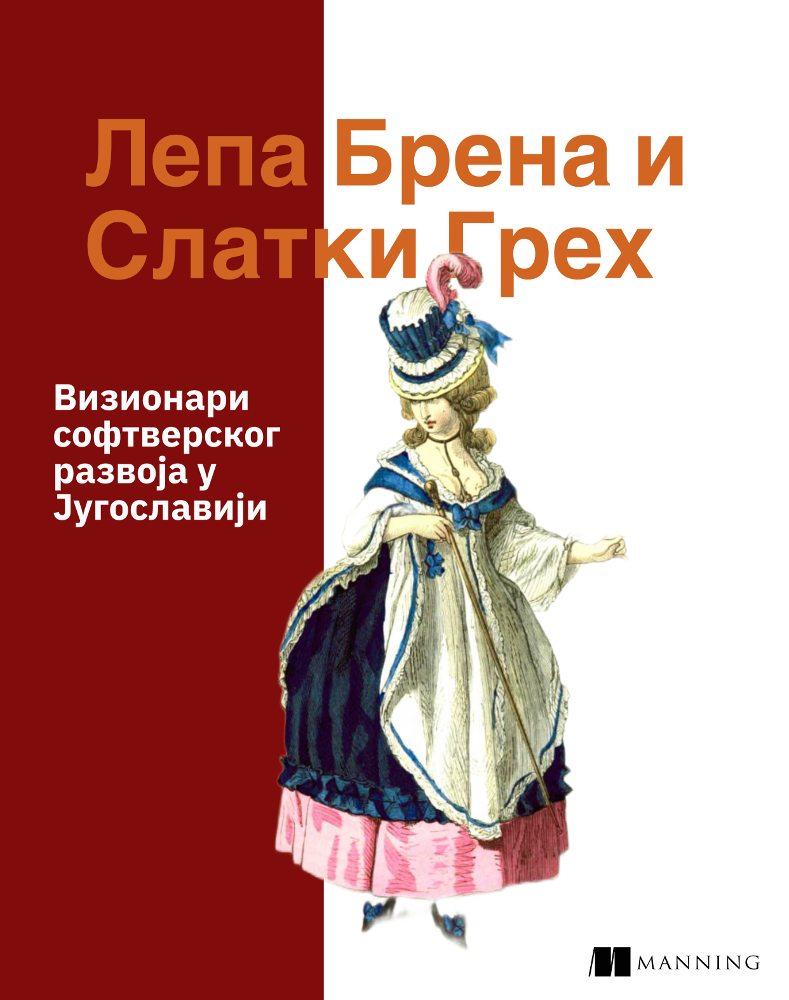

Fahreta Jahić je bila tek osmogodišnja klinka kada se održala prva konferencija softverskih inženjera u Garmischu, živopisnom nemačkom planinskom gradiću.

<!--more-->

Malo je poznato da se Fahreta u slobodno vreme bavila tehnologijama; svoje muzičko umeće je nadahnuto prelila na ništa manje nego softversko inženjerstvo. Smeo potez, vanredno neuobičajen za to vreme. Između nastupa po hotelima i restoranima Juge, Fahreta je polako dolazila do sve većih uvida u razvoj softvera koji su bili daleko ispred svog vremena. Nemajući kome da ih podeli, a na predlog Milovana Ilića, uradila je ono što joj je išlo od ruke - tačnije, od glasnih žica - i utkala svoje ideje u tekstove svojih najpopularnijih pesama.

## Sitnije, Cile, Sitnije

> Sitnije, Cile, sitnije
> nauči me najhitnije
> sitnije, Cile, sitnije
> pokaži mi najbitnije

Fahreta ovde sasvim jasno govori o mikroservisima, servisnoj arhitekturi. Postavlja pravilo za granicu konteksta: mikroservis mora da obavlja _najbitnije_ stvari. U suprotnom, nije odgovarajuća granulacija apstrakcije komponente; mora se dalje refaktorisati, _usitniti_.

Mikroservis mora da bude raspoloživ odmah, sve vreme. Mikroservis je efemeran: može se restartovati, zameniti i nadograditi bez uticaja na ostatak sistema; _najhitnije_.

Neosporan je izuzetan fokus na usitnjavanju. Smatra se da je Fahreta ovde otišla i dalje od servisne arhitekture i da upućuje na svakodnevni razvoj koda. Programski kod takođe treba da bude usitnjen: klase iscepkane na metode, metode da su što kraće... Kontraverzno je što tek mnogo kasnije nešto vrlo slično zapisuje Robert Cecil Martin, zvani "tečo", u svojim poznatim knjigama.

## Čik pogodi

> Čik, čik
> čik pogodi
> šta mi treba
> šta mi godi

Za Fahretu razvoj softvera nije samo pisanje koda. Iste godine kada Ken Schwaber počinje da ukazuje na Skram, pojavila se pesma koja sumira izvesne prakse agilnih metodologija.

Pitanje u refrenu pesme je zapravo upućivanje na korisničke zahteve koji će biti implementirani. Da budemo precizniji - na vrednosti koje razvoj softvera treba da isporuči: ono što nam _treba_ (da softver radi ispravno) i ono šta nam _godi_ (udoban UI i UX su obavezan deo proizvoda.)

Ipak, genijalnost ove pesme leži u definisanju iteracija razvoja! Time što je u pitanju refren koji se učestalo _ponavlja_, Fahreta stavlja u prvi plan iterativni softverski razvoj, koji u svakoj iteraciji mora da odgovori na potpuno ista pitanja.

Ostaje nepoznato da li je Fahreta isključivo verovala u inkrementalni razvoj. Ostatak pesme to, možda, nagoveštava: tekst obećava sve moguće _darove_ ukoliko se prati iterativni proces proizvodnje vrednosti. Neki od progresivnijih glasova u agilnoj zajednici tvrdi da pesma čak nosi nagoveštaj Kaizen filozofije.

## Mile Voli Disko

> Mile voli disko, disko
> a ja kolo šumadinsko
> da budemo blisko, blisko
> harmonika svira disko

Nema mesta nedoumici: Fahreta je velika pristalica funkcionalnog razvoja. Pesma govori o kompoziciji funkcija. Disko i kolo su tipovi koje treba _blisko_ uvezati, to se postiže morfizmom, tj. funkcijom. Simbolično, _harmonika_ predstavlja konstruktor tipova: drži jedan tip (`Muzika[Disko]`), pa onda kroz `flatMap` radi transformacija koja daje novi tip (`Muzika[Kolo]`).

Finalna strofa nagoveštava da je kompozicija mehanizam koji zadovoljava različite "želje" - nisu li to i dalje tipovi programskog jezika? Direktan put od `A` (disko klub) do `C` (poselo) ide preko `B` (Brena.)

## Hajde da se volimo

> To, to, to je to
> hajmo svi da igramo
> to, to, to je to
> hajde da se volimo

Ova Fahretina pesma pravi svojevrstan razdor u IT zajednici.

Jedni smatraju da je pesma ironična osuda preduzetničkog života, u kome je energično guranje (engl: hustle) sve šta postoji. Bitno je da se _igra_ dalje, i samo dalje. Cilj je da se dođe do proizvoda koga korisnici _vole_, time njegova vrednost postaje enormna. Kao da se naslućuje nastanak socijalnih mreža u ostatku pesme ("šta radi rodbina" - nije li ovo pitanje za Facebook? "napila se, napila" - nije li ovo video za TikTok?)

Drugačiji pogled vatreno brane kolege iz ljudskih resursa (HR). Čak je i osamdesetih važilo da su softverski stručnjaci pomalo povučeni. Kolege iz ljudskih resursa tvrde da ova pesma govori o zajedničkom radu u timu, u kome bi svi zajedno trebalo da _igramo_ kako već svira. Jedino zajedno možemo doći dotle da se zaista i _volimo_ u poslovnom okruženju, što u prenesenom značenju stavlja funkcionalan tim na prvo mesto; a to je ultimativni cilj svake HR kancelarije. Pomalo romantična analiza, ali svakako na mestu.

# Čačak, Čačak

> Čačak, Čačak
> šumadijski rock'n roll
> to je život moj i tvoj
> oj Moravo, oj

Za kraj ostavljamo pesmu koja objašnjava polimorfizam i nasleđivanje.

`Čačak` je tipa `Grad`. Ujedno je i `RockNRoll`. Ujedno je i `Život`. Međutim, potrebno je da se malo dublje zamislimo; stvari nisu tako jednostavne.

Ispada da je `RockNRoll` samo interfejs koji `Čačak` implementira. S druge strane, "_to je_" jasno implicira na nasleđivanje: `Čačak` nasleđuje `Život`. To u kodu izgleda nekako ovako:

```java
public class Čačak extends Život implements RockNRoll {
}
```

Ovo je danas opštevažeće razumevanje ove pesme, kakvo je navedeno i u univerzitetskim udžbenicima. Dužni smo da se osvrnemo i na nadogradnju ovog razmišljanja.

Nemali broj stručnjaka smatra da je `Život` zapravo `trait` (_moj i tvoj_). Smatra se da nema razloga praviti zajednički interfejs za `Život`; oni mogu biti potpuno različiti u kontekstu izvršavanja koda pesme. Nude sledeću implementaciju:

```scala
trait MojŽivot:
  def foo: String

trait TvojŽivot:
  def bar: Int

abstract class Muzika[T](region: Region):
  override def toString = s"$region rock'n'roll"

class Čačak extends MojŽivot, TvojŽivot,
    Muzika[RockNRoll](Regions.Šumadija):
  val oj = region.river
```

Ovakva implementacija je svakako potpunija; ali zahteva naprednije programske jezike; čak Skalu 3 da bi se mogla iskazati. Ukoliko je ovaj pristup korektan (a sve je više pristalica koji naginju ovakvoj ili sličnoj implementaciji), to onda dokazuje da je Fahreta Jahić bila vanredan, vanvremenski vizionar softverskog razvoja.

---

Tekst je preuzet iz knjige: "Lepa Brena i Slatki Greh"; obavljena u izdavačkoj kući Manning:


{.center}