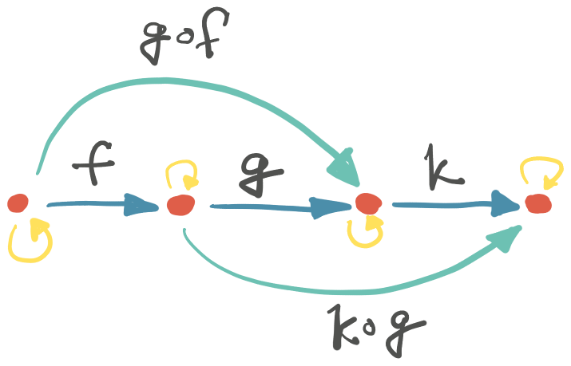
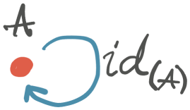
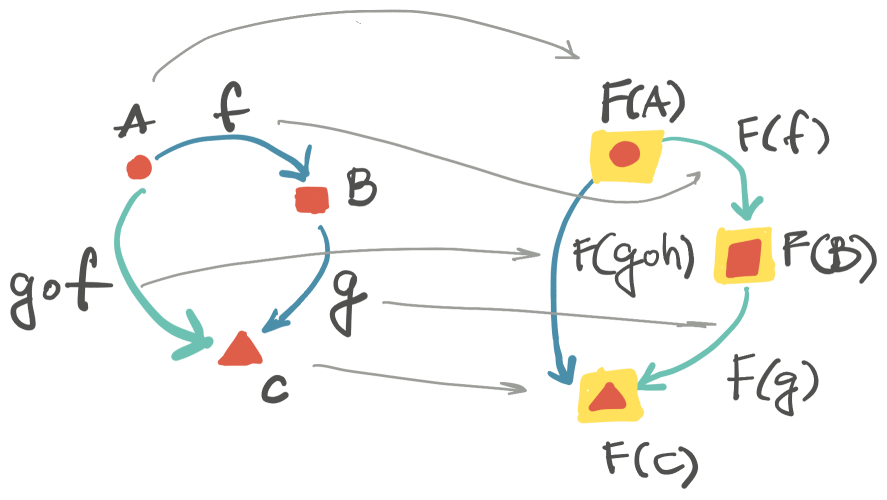
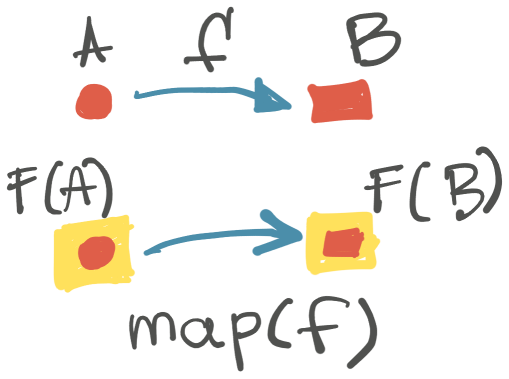
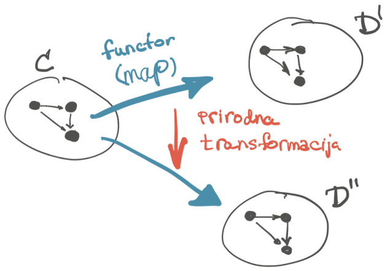
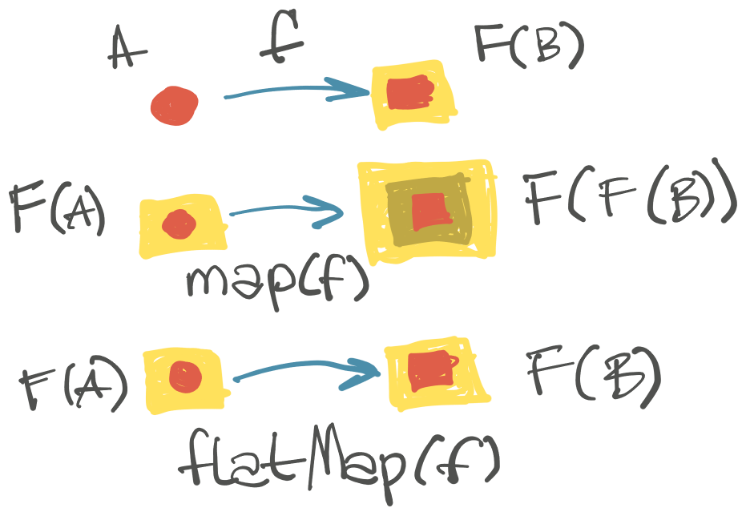

Iz beležnice programera: dal’ se kaže oštro "Monad" ili pak "Monada", još onako razvučeno, po vojvođanski, uz štrudlu sa makom?

<!--more-->

Ovo je nekakav pregled par pojmova iz teorije kategorija primenjenih na programske jezike (funkcionalno programiranje) potrebnih da se razume šta je monad. Postoji puno sličnih sadržaja; nadam se da ovim donosim jedan praktičan pogled. Voleo bih da znam više, ali tako je - kako je; i ovo malo možda bude od pomoći, pa makar i ne bilo sve tačno.

---

Monad je minimalna apstrakcija kompozicija funkcija. Zato ima smisla razumeti njegovu definiciju:

> Monad je monoid u kategoriji endofunktora.

Teorija kategorija je generalna teorija koja se najviše bavi relacijama, tj. odnosima između objekata. Reč je o apstraktnoj, tkzv. "čistoj" matematici: ne zanimaju nas konkretni brojevi, već relacije, odnosi, relacije relacija... Takvo apstraktno razmišljanje je našlo primenu u svim granama nauke. A gde je apstrakcija, tu ima mesta za filozofiju :)

Legenda:

+ ⭐️ - objašnjenje koncepta, pojma i sl.
+ 🤦‍♂️ - dopunski deo za štrebere koji izlazi van teme.
+ 🔥 - laičko objašnjenje. Nikakva formalna definicija, a često ni tačna; ali je _meni_ pomoglo.

## Kategorija

⭐️ **Skup** je nekakva kolekcija različitih stvari, koji se nazivaju _elementi_ skupa. Elementi skupa mogu biti bilo šta. Skup može biti prazan. Elementi skupa mogu biti i drugi skupovi.

⭐️ **Algebarska struktura** je praktično skup koga čine:

+ jedan ili više elemenata,
+ operacije nad elementima, tipično binarne,
+ konačan broj identiteta.

Takav neprazan skup je, praktično, algebarska struktura; kao i sve ovde ostale kasnije navedene.

⭐️ **Kategorija** je algebarska struktura koju čine _objekati_ i _morfizami_. Pored toga, u kategoriji vladaju dva _zakona_.

⭐️ **Objekti** kategorije mogu biti šta god, postojeće ili zamišljeno: brojevi, avioni, kamioni, cveće, skupovi, matrice.

⚠️ Objekti iz teorije kategorija nisu u vezi sa OOP, samo dele isto ime. Zaboravimo na objekte iz OOP! Amen.

⭐️ **Morfizmi** su relacije između objekata. Morfizmi se nazviju i "strelicama" (engl.: _arrow_). Morfizam je mapiranje između dva objekta kategorije. Nemaju svi parovi objekata kategorije morfizam između njih.

Ako su `A` i `B` objekti iz kategorije `C`, onda se njihova relacija, tj. morfizam `f` piše kao:

```plaintext
f: A → B
```

🔥 Teorija kategorija se više bavi morfizmima nego objektima!

⭐️ **Kompozicija**. Za kategoriju nije dovoljno da samo postoje relacije, tj. morfizmi. Da bi se formirala kategorija, _mora_ postojati način kompozicije morfizama.

Kompozicija se označava kružićem `∘` koji se čita: "posle". Za svaki par morfizama `f:A→B` i `g:B→C`, _mora_ postojati morfizam `h` koji je njihova kompozicija i povezuje `A` i `C`:

```plaintext
h = g ∘ f : A → C
```

Kažemo da je `f` u kompoziciji sa `g`; čitamo da je `g` posle `f`.


{.center}

Dakle, ne samo da moraju postojati odnosi (relacije, funkcije, morfizmi, strelice) između objekata kategorije, nego moraju biti takvi da se svaki par povezanih morfizma može zameniti jednim morfizmom koji je njihova kompozicija.

Kompozicija `∘` je binarna operacija dva morfizma.

⭐️ **Zakoni kategorije**. Opisanom kompozicijom morfizama vladaju dva zakona (dve aksiome). To su pravila koja operacije u algebarskoj strukturi moraju da poštuju.

⭐️ **Zakon identiteta**: za svaki objekat u kategoriji mora postojati morfizam _identiteta_ (ili samo, _identitet_.)

Identitet je morfizam koji preslikava objekat u samog sebe. Za svaki objekat `A` u kategoriji mora da postoji identitet morfizam: `id/A:A→A` takav da:

```plaintext
id/A ∘ f = f = f ∘ id/A
```

Kako god kombinovali morfizam sa identitetom, morfizam se ne menja.


{.center}

Ovo je način da se predstavi "nula" kompozicije, tj. _operacija koja ne radi ništa_. (Kao što je to slučaj sa, na pr., nulom i sabiranjem.)

⭐️ **Zakon asocijacije**: kompozicije su asocijativne. Za svaka tri morfizma `f`, `g`, i `h` važi:

```plaintext
h ∘ g ∘ f = (h ∘ g) ∘ f = h ∘ (g ∘ f)
```

Kojim god redom da izvršavamo kompoziciju `∘`, rezultat ostaje isti. Zato nam zagrade nisu neophodne i izostavljaju se u pisanju.

---- 

🚀 Sada je kategorija potpuno definisana.

## Kategorija: sažetak

⭐️ **Klasa** u matematici je kolekcija skupova koji se svaki jedinstveno može odrediti nekom osobinom koju dele svi članovi tog skupa. Skup `{2, Plavo}` ne može da pripada klasi. Skupovi `{2,8}` i `{Plavo, Crveno, Žuto}` bi mogli da čine jednu klasu.

🤦‍♂️ U kategoriji `C` se nalaze:

+ objekti - koji pripadaju klasi `ob(C)`.
+ morfizmi - koji pripadaju klasi `hom(C)`. Kada se napiše `hom(A,B)` to formira `hom` klasu svih morfizama od `A` do `B`.
+ Binarna operacija `∘` koja se naziva "kompozicija morfizama", koja za svaka tri objekta `A`, `B` i `C` imamo definisano:  

  ```plaintext  
  ∘: hom(B,C) x hom(A,B) → hom(A,C)  
  ```  
  Ova binarna operacija se još pokorava zakonima: asocijativnost i identitet.

## Primer kategorije: WWW

Da li su internet stranice (WWW) kategorija?

+ objekti su stranice ✅
+ morfizmi su linkovi; strana A ima link ka strani B ✅
+ da li postoji kompozicija? Ako A linkuje na B, B na stranu C, da li postoji link A na C? Ne. ❌

Internet stranice (WWW) _nisu_ kategorija. Da generalizujemo: bilo koji graf _nije_ kategorija.

Međutim, ako promenimo šta je morfizam u WWW grafu, stvari se menjaju. Ako morfizam: "direktan link" zamenimo sa "putanjom" (koju čine 0..N linkova), stvari postaju drugačije. Putanja je prosto mogućnost da se sa stranice A linkovima dođe na stranicu B. Tada WWW zapravo postaje kategorija:

+ postoji kompozicija: ako postoji putanja od A do B i od B do C, onda postoji putanja od A do C. ✅
+ identitet postoji: putanja do samog sebe. ✅
+ asocijativnost je na mestu. ✅

⭐️ Ovakva kategorija se naziva i slobodnom ("free category"), jer se konstruiše nad slobodnom spajanju linija direktnog grafa, tj. nad putanjama.

## Primer kategorije: Nasleđivanje programerskih tipova

Hajde da definišemo kategoriju nad tipovima u programu:

+ objekti su tipovi u programskom jeziku: `Int`, `String`, `Book`... ✅
+ morfizam je relacija "isSubclass". Na primer, `Int > Number`. ✅
+ kompozicija: postoji. Primer:  `Int > Number > Object` ✅

Tipovi u programskom jeziku čine kategoriju.

## Kratko o tipovima u programskom jeziku

Tip u programskom jeziku određuje _skup_ svih mogućih vrednosti koje su tog tipa. Na primer, `Number` predstavlja skup svih mogućih brojeva koji se mogu predstaviti u programskom jeziku. Ovaj skup uključuje i `Int`, koji je podskup samo celih brojeva.

I funkcije u programskom jeziku imaju tip. Tip `String→Int` je skup svih mogućih parova vrednosti `String, Int` (po već nekom pravilu.)

Tipovi u programskom jeziku zato mogu da tvore klasu u teoriji kategorija.

🔥 Tipovi u programskom jeziku su samo vrednosti. Zato se mogu kombinovati. Zato kada je funkcija "first-class citizen" ona predstavlja takođe vrednost.

## Kategorije u programiranju: Scal/Hask

Pokazalo se da se kategorija može oformiti i u programskom jeziku. Svaki programski jezik ima svoju kategoriju. Tako se u Haskelu takva kategorija naziva "Hask", u Skali "Scal".

Objekti kategorije programskog jezika čine svi tipovi tog jezika. Na primer: `Int`, `String`, `Book`; ali i `List[Book]`, `Map[Int, Double]`.

Morfizmi odgovaraju funkcijama. Morfizam `f` je funkcija koja prima objekat (tip) A i vraća objekat (tip) B:

```scala
def f(a: A): B
```

Morfizmi takođe imaju tip u programskom jeziku, na pr. `(A):B`.

Kompozicija postoji:

```scala
def f(a: A):B
def g(b: B):C
def h(a: A):C = g(f(A))
```

Asocijativnost takođe radi.

Morfizam identiteta je funkcija koja vraća nepromenjenu ulaznu vrednost:

```scala
def identity(a: A):A = a
```

🚀 Kategorija programskog jezika je time definisana.

## Dva sveta

🔥 Programske strukture koje slede su nekakvi **kontejneri** vrednosti.

Sve objekte iz kategorije programskog jezika (dakle, sve tipove) možemo podeliti u dve celine:

+ u jednoj su "obični" tipovi: `Int`, `Book`.
+ u drugoj su tipovi koji sadrže druge, kontejneri: `List[Int]`, `Option[Book]`, itd.

Kontejner nosi vrednost(i). Kontejner je kutija u koju stavljamo vrednost. Kontejner je nekakav kontekst za vrednosti koje nosi. Najvažnije, kontejnera _ne zanima_ šta sadrži, šta to nosi. Zanima ga samo mogućnost da _primenjuje_ morfizme na sadržaj. Zato su nam kontejneri interesantni.

(Šredinger je stavio mačku u kutiju `Maybe` :)

Nije dovoljno da samo primenjujemo funkcije (morfizme) na sadržaj kontejnera. Neophodno je da te kontejnere takođe nekako kompozujemo. Nadalje pričamo o tome.

Kontejner u programskom jeziku možemo uopšteno označiti i ovako: `F[_]`.

Ova dva "sveta" su zapravo dve kategorije! Jednu, "običnu", smo upoznali.

## Funktor

⭐️ **Funktor** je funkcija koja preslikava jednu kategoriju (algebarsku strukturu) u drugu i održava njenu strukturu. Za dve kategorije `C` i `D`, funktor je funkcija `F:C→D` koja:

+ preslikava sve objekte iz `C` u `D`
+ preslikava sve morfizme iz `C` u `D`
+ održava kompoziciju: `F(g ∘ f) = F(g) ∘ F(f)`
+ održava identitet: `F(id/A) = id/F(A)`


{.center}

🤦‍♂️ **Kovarijant** funktor označava smer `C→D`. Postoji i **kontravarijant** funktor od tkzv. "obrnute kategorije" ka `D`. Primetite nazive: da li podsećaju na generičke parametre u programiranju?

⭐️ **Endofunktor.** Kategorije `C` i `D` ne moraju biti različite: funktor može da preslikava kategoriju u samu sebe. Takav funktor se naziva endofunktor. Za funktor se kaže da je _homomorfizam kategorije_ (jer održava njenu strukturu).

U kategoriji programskog jezika svi funktori su ujedno endofunktori; preslikavaju kategoriju samu u sebe.

## Funktor u programiranju

⭐️ **Type constructor** je generička definicija programerskog tipa. `List` nije tip, ali `List[String]` jeste tip. `List` je konstruktor tipova; obeležava se `List[_]`. Konstruktor tipa je ujedno i funkcija, jer `A→List[A]`.

Opšti konstruktor tipa se može zapisati i kao: `F[_]`.

⭐️ U programiranju funktor je konstruktor tipova koji zadovoljavaju određeni kriterijum. Tip koji funktor konstruiše kao konstruktor tipova, dakle, mora da implementira `map`/`fmap` funkciju, koja radi preslikavanje sadržaja.

Ukratko:

+ funktor (konstruktor tipova) preslikava `A` u `F[A]`.
+ `map` preslikava sadržaj, na pr. iz `F[A]` u `F[B]`. 
+ zadržane su osobine kompozicije i identitet.

⭐️ Funkcija `map(f:A→B)` primenjuje morfizam na vrednost koju funktor nosi. Funkcija `map()` "**podiže**" (engl.: _lift_) morfizam iz "običnog" sveta u svet "kontejnera" i primenjuje ga na vrednost.


{.center}

Funkcija `map(f)` je takođe morfizam za funktore!

⭐️ Kako izgleda `Functor` trait u Skali:

```scala
trait Functor[F[_]] {
  def map[A, B](fa: F[A])(f: A => B): F[B]
}
```

🤦‍♂️ `F` je ujedno i **efekat** (ili kontekst). `List` je, dakle, i funktor i efekat. Efekat ne mora da bude funktor.

Efekat služi da se apstrahuje različito ponašanje. Tako efekat `Option` enkapsulira baratanje sa nepostojećim vrednostima.

Da se podsetimo: `List` nije tip. `List[String]` je tip, ali više nije funktor (nema konstruktor tipova).

🔥 Sažetak. Funktor je konstruktor tipova koji su kontejner, nose vrednost. Tip koji funktor pravi ima `map()` kojom podiže funkciju iz kategorije u svoj svet. `map()` primenjuje funkciju na vrednost koju kontejner sadrži, čime je menja.

## Monoid

⭐️ **Polugrupa** je neprazan skup (algebarska struktura) koji ima asocijativnu binarnu operaciju `*` (oznaka, nije množenje). Operacija `*` vraća elmenat iz istog skupa.

⭐️ **Monoid** je polugrupa koja još ima element identiteta `id`, koji za svaki element iz grupe `x` zadovoljava:

```plaintext
id * x = x * id = x
```

`id` je jedinični element koji u binarnoj operaciji sa bilo kojim drugim elementom iz polugrupe vraća taj element neizmenjen.

🤦‍♂️ Monoid je takođe kategorija (wtf:). Monoid kao kategorija ima samo jedan objekat - pomenuti skup elemenata. Morfizmi u toj kategoriji su binarne operacije. Ona preslikavaju skup u samog sebe.

Svaka binarna operacija u skupu je ujedno i morfizam za taj skup. `2 + 5` postaje `2.add(5)`. Morfizam `add(5)` preslikava skup u sebe samog (`2` u `7`.)

⭐️ Monoid je apstrakcija kombinovanja dva elementa skupa.

Zahvaljujući asocijativnosti, ovakva apstrakcija dozvoljava, na primer, paralelno izvršavanje operacije `*` nad skupom. Na primer, u monoidu sa celim brojevima `1`, `2`, `3` i `4`, možemo _u isto vreme_ (paralelno) kombinovati prvi par (`1+2=3`) i drugi par (`3+4=7`), a potom rezultate (`3+7`).

Monoid dozvoljava "divide-and-conquer" strategiju, inkrementalnu akumulaciju, paralelizam...

## Monoid u programiranju

⭐️ U programiranju monoid je tip koji implementira funkciju `foldLeft`/`reduce`.

```scala
def foldLeft[B](z: B)(op: (B, A) ? B): B
```

`Fold` je binarna operacija koja kombinuje dve vrednosti u jednu. Da bi se tako nešto primenilo na, recimo, `List[Int]` treba nam i početna, nulta vrednost. Kada su u pitanju brojevi, to je obično `0` (za operaciju sabiranja) ili `1` (za operaciju množenja). Ova vrednost je identitet `id`.

Monoid ne mora da sadrži samo iste tipove. Rekli smo da je monoid skup (što je vrlo širok pojam); element mogu biti i, na pr.: `Int` i `String`.

⭐️ Monoid se formalno zapisuje kao triplet: `(S, *, id)`: skup, operacija, identitet.

Primeri monoida:

+ (`Int`, `+`, `0`)
+ (`Int`, `*`, `1`)
+ (`String`, `+`, `""`)

⭐️ Monoid u programiranju je tip koji sadrži binarnu asocijativnu funkciju i element identiteta.

🔥 Sažetak. Monoid je osobina nekog kontejnera: definiše kombinovanje dve vrednost (`foldLeft`) i postojanje nultog-elementa za kombinovanje (identitet).

## Prirodne transformacije

Vratimo se kratko nazad. Počeli smo sa kategorijom objekata koji se mapiraju jedan na drugi. Funktor je dao mogućnost mapiranja sadržaja i preslikavanja kategorija. Postoji sledeći, viši nivo apstrakcije: mapiranje funktora. Dakle:

+ strelice/morfizmi preslikavaju objekte jedan u drugi unutar kategorije.
+ funktori preslikavaju kategorije.
+ **prirodne transformacije** preslikavaju funktore.


{.center}

Primer prirodne transformacije: metoda `head()` na `List[T]` vraća `Option[T]`. Reč je dakle o morfizmu: `List[T]→Option[T]`.

⭐️ Prirodne transformacije su morfizmi za funktore (relacija za relacije) koji čuvaju unutrašnju strukturu. Da li to izgleda da možemo da napravimo kategoriju endofunktora?

## Monad (korak #1)

⭐️ **Monad** se definiše kao triplet `M = (F, unit, flatMap)`.

+ `F` je neki endofunktor `F:C→C`
+ `unit` je prirodna transformacija od identity funktora `Id:C→C` na naš funktor `F`. Dakle: `unit:Id→F`. Ona "upakuje" tip u monad.
+ `flatMap` je prirodna transformacija: `T∘T→T`. Ovde je `T∘T` kompozicija endofunktora; to je kontejner u kontejneru. `flatMap` zna da otpakuje ugnježdene strukture. Ona dozvoljava ulančavanje monada.

Podseća na monoid? To je zato što i jeste.

## Monad (korak #2)

⭐️ Ako je `C` bila kategorija tipova, neka je `End(C)` _kategorija endofunktora_:

+ objekti: endofunktori. ✅
+ morfizmi su prirodne transformacije endofunktora. ✅
+ kompozicije prirodnih transformacije postoji. Nisam baš razumeo kako, ali kapiram da se prenosi usled očuvanja struktura. ✅
+ identit endofunktor: `unit/lift/pure`. ✅

🚀 **Monada** je monoid u kategoriji endofunktora.


## Monad u programiranju

🔥 Slično funktoru, monad je kontejner za vrednost. Funktor ume da kombinuje morfizme.
Monad sada ume da kombinuje funktore; to je nešto što nismo umeli ranije.

Primer:

```scala
// naš objekat kategorije
class User(name: String) {
  override def toString(): String = "<" + name + ">"
}

// dobavlja korisnika
def fetchUser(id: Int): Option[User] =
  if (id == 2) None else Some(User("user" + id))

// kompozicija
val users = List(1,2,3).map(id => getUser(id))
```

Rezultat je `List[Option[User]]` sa 3 elementa, kontejneri u kontejneru. To nije ono šta želimo.

Potrebno je da transformišemo kontejner `List` tako što ćemo _kombinovati_ elemente - funktore. Kombinovanje funktora nam omogućava monad.

⭐️ Funkcija `flatMap()` radi upravo to - mapira, pa potom "izravnjava" sadržaj kontejnera:

```scala
val users = List(1,2,3).flatMap(id => getUser(id))
```

Rezultat sada je `List[User]` sa 2 elementa.



Funkcija `flatMap()` zapravo pretvara `F[F[_]]` u `F[_]`.

⭐️ Funkcija `unit()` daje i ono poslednje šta nedostaje: "podizanje" vrednosti u monad, kontejner: `A→M[A]`

⭐️ Monad u Skali može da izgleda ovako:

```scala
trait Monad[M[_]] {
  def unit[A](a: => A): M[A]
  def flatMap[A,B](ma: M[A])(f: A => M[B]): M[B]
}
```

⭐️ Monad je ujedno i funktor. Zanimljivo da metodu `map` funktora možemo da dobijemo kao:

```scala
def map[A, B](ma: M[A])(f: A => B): M[B] =
  flatMap(ma)(x => unit(f(x)))
```

Šta ovde radimo? Izvršimo mapiranje ulaza (`f(x)`), ali kako vrednost nije u kontejneru moramo je "podići" sa `unit()`. Ovu kompoziciju definišemo kao funkciju, koja je sada argument za `flatMap`.


## Trivija za kraj

Ime "monad" je spoj "monoid" i "triad": "monoid" jer je monoid u kategoriji endofunktora, "triad" jer pakuje tri stvari: endofunktor sa dve prirodne transformacije.

Obećao sam filozofiju: teorija kategorija se ne bavi mnogo vrednostima. Može se doći do shvatanja da nije važna vrednost objekta, već da je objekat definisan samo svojim relacijama. Da ponovim: _nešto_ je definisano samo svojim relacijama, a ne onime što zapravo _jeste_! To govori Yoneda lema. Da li to znači da je postojanje definisano samo ostvarenim interakcijama?

Idemo dalje.

(Kog sam andraka ovo i pisao...)