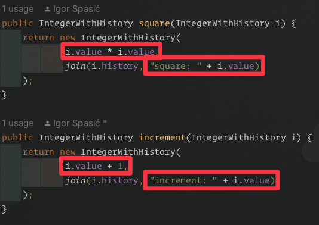

Ništa ti, sinak, ono sa monadama ne razumem. Oš li mi, ovaj, ti to malo pojasniti? Pratim kurs "Postani Java Pevac Ekspert - za 21. dan kukurikanja"; još koje jutro i gotov sam! Hajde sinak, neću ni reč reći, sve ću te slušati, ja kada ćutim onda ćutim, ništa ne govorim, ja sam lepo vaspitan, jednom umalo nisam umro od gladi jer nisam hteo da kažem da sam gladan...

<!--more-->

\- (uzdah) Hajde, Sofronije, da probamo primer koji sam jednom video u onom YT kokošinjcu. Ovako nekako ide.

Zamisli da imamo dve funkcije:

```java
public Integer square(Integer i) {
  return i * i;
}
public Integer increment(Integer i) {
  return i + 1;
}
```

Ove funkcije možeš da kombinuješ, na primer:

```java
increment(square(3)); // 3*3+1=10
```

Sada zamisli da ti je kvočka Mileva zatražila da prati šta se dešava tokom računanja, kako bi proverila da je sve kako treba.

\- Vala baš, sinak, ta Mileva samo zrna broji vasceli dan. Dobro, kako ćemo da to uradimo?

\- Treba da promenimo funkcije, Sofronije; treba da nam vrate više toga nazad. Uvodimo nam novi tip koji će da nosi podatke nazad iz funkcija. Na primer ovako:

```java
public class IntegerWithHistory {
  public final Integer value;
  public final String[] history;
  // ctor...
}

public IntegerWithHistory square(Integer i) {
  return new IntegerWithHistory(
    i * i,
    new String[] {"square: " + i}
  );
}
public IntegerWithHistory increment(Integer i) {
  return new IntegerWithHistory(
    i + 1,
    new String[] {"increment: " + i}
  );
}
```

\- Ček, ovaj, ček malo, sinak. Pa kako ćemo sada da kombinujemo funkcije, sto mu petlova?

\- Bravo Sofronije, dobro si primetio! Moramo da promenimo i ulazni tip u funkcije:

```java
public IntegerWithHistory square(IntegerWithHistory i) {
  return new IntegerWithHistory(
    i.value * i.value,
    join(i.history, "square: " + i.value)
  );
}
public IntegerWithHistory increment(IntegerWithHistory i) {
  return new IntegerWithHistory(
    i.value + 1,
    join(i.history, "increment: " + i.value)
  );
}
```

Sada je kombinovanje moguće:

```java
IntegerWithHistory i =
  increment(square(
    new IntegerWithHistory(3, new String[] {}))
);
System.out.println(i.value);
System.out.println(Arrays.toString(i.history));
```

\- Ček, ovaj, sinak, pa zar pravimo objekat `IntegerWithHistory` za svaki broj sa kojim hoćemo da radimo?

\- Pravimo, Sofronije, nego šta. Ali nećemo stalno tako pisati, svakako, nego pravimo funkciju za to. Neka se zove `wrap()`. Najviše ima smisla dodati je u sam tip `IntegerWithHistory`:

```java
public class IntegerWithHistory {
  public final Integer value;
  public final String[] history;
  // ctor
  public static IntegerWithHistory wrap(Integer i) {
    return new IntegerWithHistory(i, new String[] {});
  }
}
//...
IntegerWithHistory i = increment(square(IntegerWithHistory.wrap(3)));
```

Okej, to je bilo lako. Sofronije, pazi sada: zagledaj se u ove dve funkcije `square` i `increment`, da li nešto primećuješ?

\- Kao da su, ovaj, baš slične?

\- Tako je. Hajde da označimo šta je različito:


{.center}

Ako bi ove različite blokove nekako mogli da prosledimo kao argumente funkciji, ostala bi samo jedna funkcija!

\- Znam, ovaj, znam, daj meni da uradim, sinak! Vidi kako:

```java
public IntegerWithHistory calculate(
    IntegerWithHistory i,
    Function<Integer, Integer> operation,
    String operationName) {
  return new IntegerWithHistory(
    operation.apply(i.value),
    join(i.history, operationName + ": " + i.value)
  );
}
```

\- Vrlo blizu, Sofronije, ali ne. Sad ti treba puna pažnja; batali zafrkavanje tog kera i gledaj ovamo.

Već imamo strukturu `IntegerWithHistory` koja nam čuva vrednost i nekakav tekst - hajde da to zapišemo ovako: `{Integer, String}`. S druge strane, treba nam _funkcija_ za vrednost i taj isti tekst: `{Function<Integer,Integer>, String}`. Kako da iz prvog dobijemo ovo drugo?

```Plaintext
{Integer, String} -> {Function<Integer,Integer>, String}
```

Tako što ćemo `Function<Integer, _>` da izvučemo iz drugog dela izraza i prebacimo ga u prvi :))) Šalim se malo, ali i ne. Drugim rečima, treba nam funkcija: `Function<Integer, IntegerWithHistory>`:

```java
Function<Integer, IntegerWithHistory> increment =
  i -> new IntegerWithHistory(i + 1, "increment: " + i);
Function<Integer, IntegerWithHistory> square =
  i -> new IntegerWithHistory(i * i, "square: " + i);
```

Na ovaj način smo definisali i transformaciju vrednosti (tj. operaciju) i statičan tekst. Time dva potrebna argumenta za funkciju `calculate` postaju jedan:

```java
public IntegerWithHistory calculate(
    IntegerWithHistory i,
    Function<Integer, IntegerWithHistory> operation) {
  final IntegerWithHistory a = operation.apply(i.value);
  return new IntegerWithHistory(
    a.value,
    join(i.history, join(i.history, a.history))
  );
}
```

> 🔥 Ovaj korak je najvažniji.

Koristi se ovako:

```java
IntegerWithHistory i = calculate(
  calculate(IntegerWithHistory.wrap(3), square),
  increment);
```

\- Auuu, sinak, moraću malo da, ovaj, da razmislim o svemu. Vidim šta si uradio, jasno mi je. Nego, jel smo gotovi? Mileva me zove u kokošinjac na čaj, ostala je sama.

\- Hajde još da prebacimo `calculate()` u `IntegerWithHistory`. To je bar lako:

```java
public static class IntegerWithHistory {
  public final Integer value;
  public final String[] history;
  // ctor

  public static IntegerWithHistory wrap(Integer i) {
    return new IntegerWithHistory(i);
  }

  public IntegerWithHistory calculate(Function<Integer, IntegerWithHistory> operation) {
    final IntegerWithHistory a = operation.apply(value);
    return new IntegerWithHistory(
      a.value,
      join(history, join(history, a.history))
    );
  }
}
```

Gledaj kako sada izgleda program:

```java
val increment = i -> new IntegerWithHistory(i + 1, "increment: " + i);
val square = i -> new IntegerWithHistory(i * i, "square: " + i);

IntegerWithHistory i = wrap(3).calculate(square).calculate(increment);
```

Nije li sjajno!?

\- Baš jeste, dečače, sto mu gromova, da ovo samo vidi Dejvid Kroket! Nego, sinak, gde su ti tu te monade druškane, šta me sada zamajavaš sa ovim računanjima?

\- Sofronije, upravo smo napravili monadu: `IntegerWithHistory`. Funkcija `wrap` je `unit()`. Funkcija `calculate` je `flatMap()`. Napravili smo kontejner za broj koji nosi dodatni kontekst oko njega - istoriju.

\- Auuu, petla ti... Ovaj, dečko, a imaš li još onih mudrijaških knjiga?