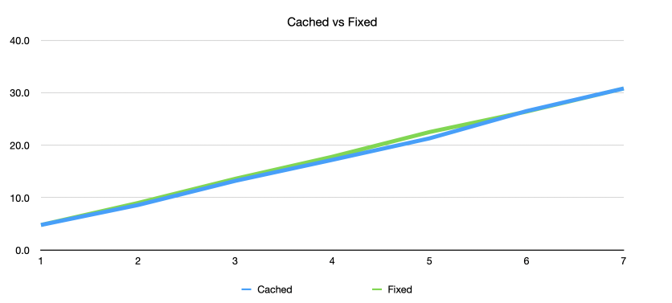
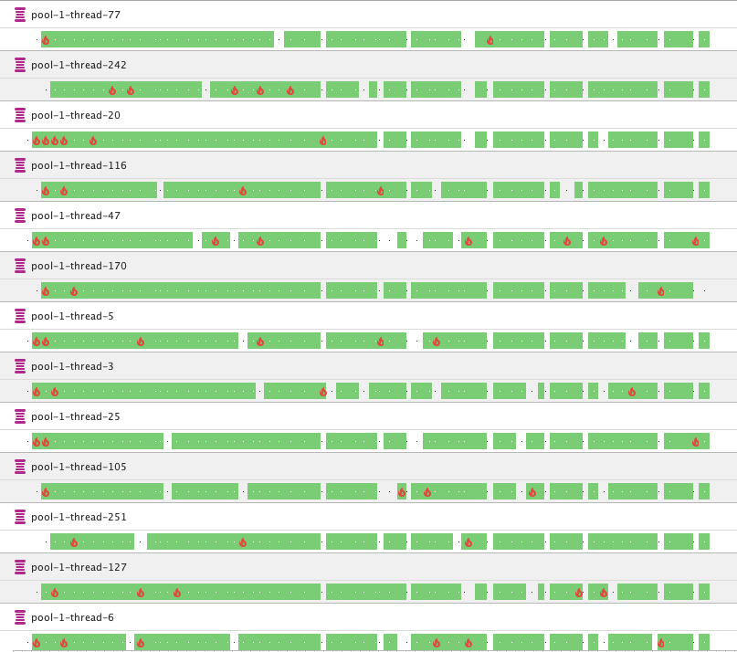
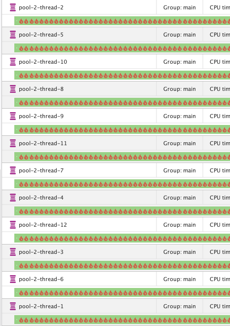
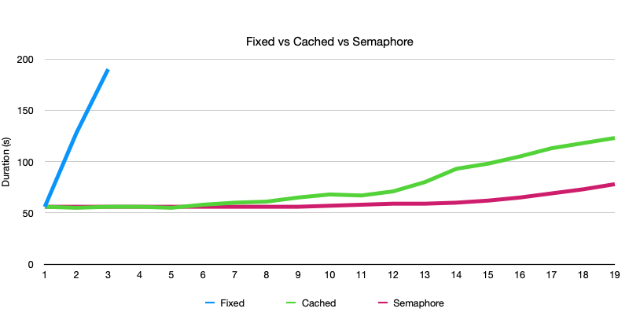

Eksperimentalno programiranje.

<!--more-->

CPU jezgra u mom računaru ima koliko i majmuna: `12` - toliko paralelnih poslova može da se izvršava. Koliko bi onda niti trebalo da koristimo za paralelnu obradu poslova u programu?

Jedan od saveta koji se često ponavlja je da nam ne treba više niti od ukupnog broja procesora. Ovaj savet nije netačan. Ipak, nije dovoljno precizan.

## Intenzivan posao

Zamislimo nekakav _intenzivan_ proračun koji traje par sekundi. Nazvan je "intenzivan", jer se celokupna snaga jednog jezgra CPU koristi za posao. Na primer, takav jedan posao može biti izračunavanje decimala broja **π** manje efiksanim algoritmom. 

Na mom računaru proračun `13000` decimala π traje koju desetinku duže od `3` sekunde (u daljem tekstu: `3s`). To će biti naš intenzivan posao kojim ćemo upošljavati niti.

## Odjednom ili zaredom?

Hajde da uvedimo konstantu `CPU#` za broj jezgra na računara. Sam broj jezgra nam nije važan, jer ćemo se baviti umnošcima ove konstante.

Logična je pretpostavka: `CPU#` jezgra mogu da obrade isto toliko intenzivnih poslova u isto vreme. Kako je u mom slučaju `CPU# = 12`, dakle `12` poslova mogu da se obrade u isto vreme.

Svaki posao pojedinačno traje `3s`, pa zaključujemo da će `CPU#` poslova da se obradi za isto `3s` sekunde ukoliko ih izvršimo paralelno.

👩‍🔬 (Merenje.)

Rezultat merenja potvrđuje pretpostavku: `CPU#` poslova izvršenih u paraleli traje koliko i jedan. Tačnije - nešto duže nego samo jedan posao: `4.8s`. To je OK: sistem radi još koješta, te i treba očekivati da izvestan deo vremena odlazi na thread pool, čekanje da sve niti završe posao, alociranje više memorije za toliko decimala, ali i na druge niti koje postoje u VM itd.

Idemo dalje. Hajde da povećamo broj poslova na neki umnožak `N` broja `CPU#`. Imamo dve opcije:

+ da napravimo `N*CPU#` niti koje sve rade u isto vreme (_neograničeni_ thread pool, tkzv. "cached"), ili
+ da napravimo samo `CPU#` niti koje će obrađivati poslove jedan za drugim (_fiksni_ thread pool).

Šta će biti brže? Koji thread pool će pre završiti? Da li će neko ispasti u ovom krugu... 🤦‍♂️ ok, zaneo sam se malo.

👩‍🔬 (Merenje.)

Brzina izvršavanja je u oba slučaja _ista_. Povećavanjem broja niti preko broja dostupnih jezgra **ne možemo** ubrzati intenzivne poslove. Grafik je kranje dosadan:


{.center}

Ipak, nije sve isto.

## Šta nit radi kada ne može da radi?

Hajde da izvršimo `100xCPU#` intenzivnih poslova. Izvršavanja će u oba slučaja trajati slično, kao što smo videli (izmereno oko `7.5min`.)

Kada koristimo neograničeni thread pool, pravimo čak `1200` niti odjednom. Oni ne stižu da rade sve vreme. JVM dodeljuje CPU vreme nitima, pa kako ih je puno, oni prosto ne stižu da odrade posao. To izgleda ovako:


{.center}

Sve niti su u `RUNNABLE` stanju (zeleno); _pokušavaju_ da izvrše kod. Međutim, izvršavanje koda se dešava tek kada se niti dodeli vreme - predstavljeno vatricama na gornjoj slici. Tokom čitavog vremena između vatrica (između trenutaka kada se programski kod izvršava), nit je neupotrebljiva iako je u `RUNNABLE` stanju. Ovo stanje se naziva "izgladnjivanje" niti (thread starvation): niti se izvršavaju, ali ne čine progres.

Kada koristimo fiksan thread pool, samo `CPU#` (`12`) niti radi sve vreme punom snagom:


{.center}

Razlika je opterećenje sistema. `1200` niti koje rade čini da preostale niti u sistemu rade **podjednako sporo**; jer se CPU vreme sada deli između svih niti. Dakle, samo ako intezivan posao nije eksluzivan za program, ovaj pristup će usporiti rad drugih delova aplikacije. Izgladnjavanje se dešava svim nitima u sistemu, ne samo ovima iz ogleda. Da ponovim, CPU vreme se deli na `100+` niti.

Kada radi samo `12` niti, to nije slučaj. One rade punom parom, ali ostaje vremena da sistem opsluži druge niti, ukoliko je potrebno. CPU vreme se deli na `12+` niti.

## Koliko traje zamena niti?

_Context switching_ je izbor aktivne niti kojoj se dodeljuje neko CPU vreme da odradi deo posla. Pri tome se dešava svašta nešto u sistemu; što takođe traje. Efekat je da veći broj niti znači i veći broj context switchinga, što znači i dodatno usporavanje.

Da li je zaista tako? Ako podignemo na pr. `6000` niti koje samo spavaju, da li će uticati na rad preostalog dela programa?

👩‍🔬 (Merenje.)

Ispostavlja se da je context switch **zanemarljiv**. Nisam dobio nikakvo merljivo usporenje sa uvođenjem velikog broja spavajućih niti. Sigurno da nekada ranije to nije bio slučaj; no danas su procesori moćniji.

Zašto `6000` niti? Zato što moj računar fizički ne može da kreira, na primer, `10000` niti.

## Šta nit radi kada ne radi?

Intenzivan posao je idealan posao. U realnom programu, veći deo vremena nit zapravo _čeka_: na bazu da vrati podatke, na soket da dobije odgovor. Vreme dok nit čeka je izgubljeno, neupotrebljeno vreme.

Hajde da naš idealan posao pretvorimo u _realan_ posao: posle svakih `100` iteracija proračuna cifara π, spavamo `500ms`. Time se izvršavanje od `3s` produžava na nekih `55s`; sada realan posao traje nekih `18` puta duže od idealnog.

Da vidimo sada kako se sistem ponaša kako povećavamo broj realnih poslova. Iste dve opcije su nam na raspolaganju: neograničeni thread pool koji pravi po nit za posao i fiksni thread pool sa `CPU#` alociranih niti.

Šta će raditi brže? Ko će pobediti? Ko ostaje, a ko se vraća kući... 🤦‍♂️ opet, uh.

👩‍🔬 (Merenje.)



**PLAVA**. Fiksni thread pool sa `CPU#` niti u ovom ogledu ne vredi puno: izvršava poslove od `55s` jedan za drugim, bez obzira što veći deo vremena niti spavaju. Vreme izvršavanja se linearno uvećava, slično prethodnom ogledu.

**ZELENA**. Neograničeni thread pool se sada ponaša potpuno drugačije - i pobeđuje. Pošto veći deo vremena nit spava, računar stiže da za to vreme obradi deo proračuna u drugim nitima, ako mu se ponude. Zato, na primer, sa `2 x CPU#` poslova, ima sasvim dovoljno vremena da se obrade svi proračuni za vreme dok niti spavaju, tako da se ukupno vreme obrade _ne menja_! U periodima spavanja od `500ms` jedne niti, procesor će imati sasvim dovoljno vremena da završi deo proračuna nekog drugog posla. Odnos spavanja i rada je `18:1`; teoretski možemo da "naguramo" čak `18x` više poslova i popunimo sve periode spavanja. Zato, kako se uvećava broj niti, vreme izvršavanja se praktično ne menja, jer ima dovoljno pauza da računar obavi sve paralelne proračune.

Zašto vreme izvršavanja ipak raste kada se broj poslova uveća, od `x10` pa naviše? I dalje ima dovoljno pauza da se svi proračuni obave, zar ne? Zato što je izvršavanje posla stohastičko, nedeterminisano. Što je manje pauza (kako broj poslova raste), to će se više aktivnih poslova slučajno preklopiti, a kako je broj niti veliki, to će dovesti do sve dužih izgladnjivanja.

## Saobraćajac za niti

Da li možemo da poboljšamo performanse? Da li možemo da uvedemo red u stohastički proces izbora posla?

Da, vrlo lako. Ustanovili smo da procesor ne može izvršavati više od `CPU#` idealnih poslova u isto vreme. Hajde da uvedemo **semafor** koji ima `CPU#` brojača (ili dozvola.) Takav semafor dopušta samo `CPU#` dozvola, ostale blokira. Hajde sada da u naš realan posao uvedemo semafor: pre spavanja otpuštamo dozvolu, a nakon spavanja zahtevamo novu.

Efekat je sledeći: iako imamo `N x CPU#` poslova i isto toliko niti (pošto i dalje koristimo neograničeni thread pool), dozvoljavamo _samo_ `CPU#` poslova u isto vreme! Time sprečavamo izgladnjivanje niti, čime bi trebalo da ubrzamo vreme obrade.

Da li ćemo uspeti? Da li će ubrzanje biti značajno? Ili je pretpostavka pogrešna?

👩‍🔬 (Merenje.)

**CRVENA**. Kako se uvećava broj poslova, proračuni se sada _pravilnije raspoređuju_ za vreme spavanja. Sada je garantovano da nikada ne radi više od `CPU#` niti u isto vreme, ikao je ukupan broj niti mnogostruko veći. Rezultat govori za sebe.

Otkuda i dalje postoji blago povećanje trajanja obrade sa povećanjem poslova? Prosto, ne uspevamo apsolutno tačno napakovati poslove u periode dok neka nit spava.

Zanimljivo: nikada nigde nisam video da iko radi ovakvu optimizaciju.

## Manje niti, manje niti

Poslednji ogled sa semaforom i dalje pati od problema viška niti. Iako samo `CPU#` niti radi u isto vreme (zahvaljući semaforu) i dalje postoji nit za svaki posao. Broj niti na sistemu je limitiran, čime se ujedno ograničava ukupan broj realnih poslova koji se mogu efikasno obraditi.

Jedno rešenje je ograničavanje prethodno neograničenog thread poola. Takav pool bi imao nekakav softverski limit, a višak zadataka bi se čuvao u kakvom redu.

Logično je zapitati se: ako nam samo `CPU#` niti radi, zašto uopšte i moramo da pravimo nit za svaki posao? Možemo li nekako pametnije da napakujemo poslove, bez da pravimo tolike niti?

Može.

Sve do sada nam je posao "spavao" (`Thread.sleep()`), čime je zadržavao nit za sebe. Hajde sada da promenimo ponašanje. Umesto da spavamo, mi ćemo prosto odložiti izvršavanje. To znači da se naš realan posao mora napisati drugačije: da postoji način da se korak posla poziva zasebno. U slučaju našeg proračuna, potrebno je da se petlja pretvori u rekurziju.

Izmenjeni posao se sada može zakazati u novom tipu thread poola: zakazivačkom (_scheduled_). Reč je o nekakvom nizu poslova koji se okidaju u određenom vremenskom trenutku - a sve ih opslužuje samo jedna nit.

Da ponovim: umesto da pravimo nit za posao, mi ćemo poslove da isparčamo u korake koji se zakazuju unapred. Niti više ne spavaju, već se dodeljuju koracima posla. Jedan ceo posao će biti obrađen kroz više niti.

Smanjili smo broj ukupnih niti na samo `CPU#` - dok broj poslova sada može da bude proizvoljno veliki.

Kakve su performanse ovakvog sistema? Da li je ovakva komplikovana promena opravdana performansama? Da li...

👩‍🔬 (Merenje.)

Razultat je gotovo identičan thread-poolu sa semaforima! Za razliku od malo pre, sada postoji samo `CPU#` niti za proizvoljan broj poslova. Lepo.

(Da li smo to na pragu otkrivanja virtuelnih niti? :)

## Formula

Nije dovoljni reći da je optimalan broj niti za obradu poslova jednak broju jezgra. Neophodno nam je da znamo koliko nit spava, a koliko radi. Taj odnos se naziva _utilitizacija_: procenat vremena koji nit provede radeći.

```plaintext
broj_niti = CPU# / utilitizacija 
```

U našem ogledu, utilizacija je `1/18 = 0.054`, pa je optimalan broj niti `222` što je približno `18 x CPU#`.

Za razliku od gornjih ogleda, ne postoji jednostavan, determinističi način za određivanje utilitizacije. Najbolje je prosto meriti upotrebu niti (u Javi je to moguće kroz `ThreadMXBean`.)

Ni ovo nije dovoljno. Bitna je i vremenska raspodela kada poslovi rade. Može se dogoditi da se svi poslovi, bez obzira na utilitizaciju, probude i počnu da rade u istom trenutku. U našem primeru, to je `222` poslova. Rezultat je izgladnjivanje niti i usporavanje.

Ilustracija: čest anti-pattern je da se značajan broj poslova zakaže za isti trenutak. Na jednom poslu je 3rd party biblioteka zakazivala stotinjak health-checkova svakih 5 sekundi. To je dovodilo do značajnog povećanja saobraćaja na internoj mreži u kratkom vremenu (spike). Ovakav anti-pattern se rešava prostim odlaganjem zakazanih poslova za neko slučajno vreme.

Formula bi mogla da bude:

```plaintext
max broj_niti = CPU# / utilitizacija
broj_niti koji radi u istom trenutku <= CPU#
```

---

[Sors](https://github.com/igr/tw). Idemo dalje.